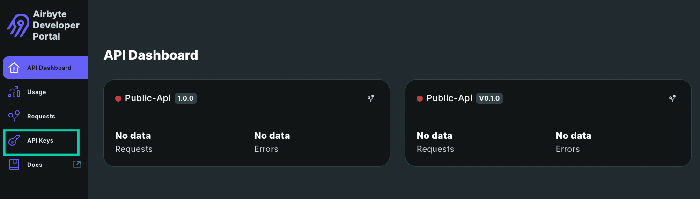
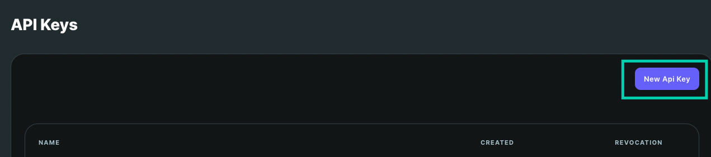
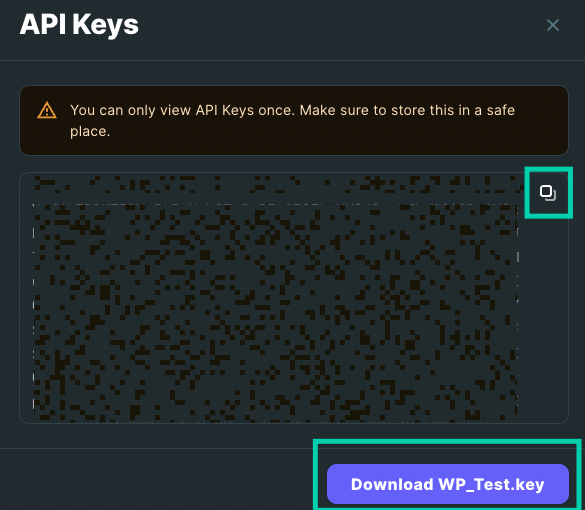
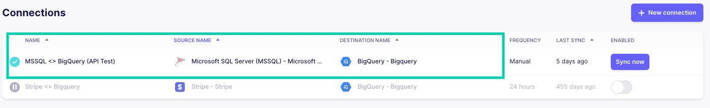
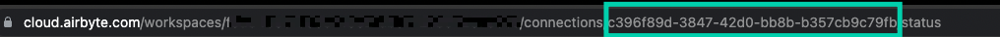

# Airbyte Authorization
In order to get started with the Airbyte Blueprints, you will need an API token to get programmatic access. Additionally, dependning on the blueprint, you will need a Connection ID or Job ID for the syncs you wish to trigger or verify respectively.

## Generating an Airbyte API Token
1. Login to the [Airbyte Developer Portal](https://portal.airbyte.com)
2. Navigate to the **API Keys** section

3. Select **New Api Key**

4. Name your API key and click Generate. 
5. Make sure to either copy the key or download it


## Getting Connection ID's
1. Log in to your [Airbyte Cloud instance](https://airbyte.com/)
2. CLick on the connection you would like to sync

3. The Connection ID can be acquired from the URL:


## Getting Job ID's 
1. The job ID will be returned after triggering a sync via the API. The response will look something like this:
```json
{
  "jobId": 1234,
  "status": "running",
  "jobType": "sync"
}
```
