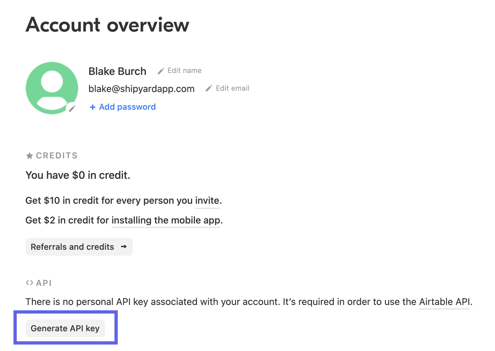
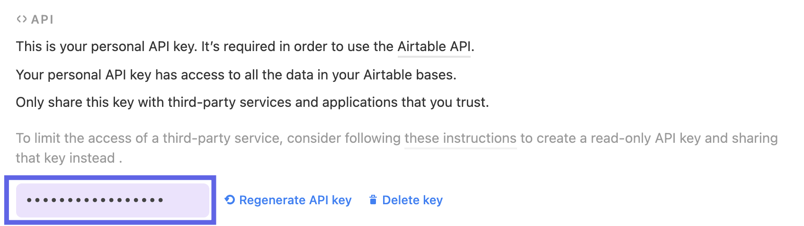

# Airtable Blueprints

## Authorization

### Overview

In order to get started with the Airtable Blueprints, you will need an API Key with programmatic access. Additionally, you'll need the names/IDs of the Base, Table, and View you would like to access.

#### Generating an Airtable API Key

1. Login to your [Airtable](https://aws.amazon.com/console/)  
2. Navigate to your [account overview](https://airtable.com/account) page.
3. Select Generate API Key

4. Click into the purple area to reveal your API Key. Copy this somewhere safe!

#### Getting Base, Table, and View IDs

Navigate to the Base/Table you would like to access with Shipyard. Once there, extract the IDs directly from the URL. Airtable builds all of it's URLs as `https://airtable.com/{base_id}/{table_id}/{view_id}`

For example, in the following URL https://airtable.com/apprAb54fnzSbGPqV/tbltgrZ2A5vbSOuDs/viwaqiREptRiFI5un

**Base ID**: apprAb54fnzSbGPqV
**Table ID**: tbltgrZ2A5vbSOuDs
**View ID**: viwaqiREptRiFI5un

Alternatively, you can use the Table Name and the View Name found in the UI, although it is less recommended since the name can change without warning.

## Download Table or View to CSV Blueprint

### Overview

Quickly export data from a single table on an Airtable base to a CSV. 

Only one table or view of data can be downloaded at a time, since CSVs are flat files.

Content of the downloaded file can be further refined by providing a view. Otherwise, the entire contents of the table will be downloaded.

### Variables

| Variable Name | Required? | Description |
|:---|:---|:---|
| **Base ID** | ✔️ | The ID of your Airtable base. Found in the URL of your base and starts with `app`|
| **Table Name or ID** | ✔️ | Can be the Name (case sensitive) or the ID of the table. The ID can be found in the URL and always starts with `tbl`.|
| **View Name or ID** | ➖ | Can be the Name (case sensitive) or the ID of the view. The ID can be found in the URL and always starts with `viw`.|
| **Include Record IDs?** | ✔️ | If checked, an additional column named `airtable_record_ids` will be created in the CSV containing each row's unique Airtable Record ID. This is recommended if data ever needs to be reloaded back into Airtable in the future. |
| **Local File Name** | ✔️ | Name of file to be generated with the results. Should be `.csv` extension. |
| **Local Folder Name** | ➖ | Folder where the file should be downloaded. Leaving blank will place the file in the home directory. |
| **API Key** | ✔️ | API Key associated with a user that has access to the specified Base, Table, and View listed. Will usually start with `key`.|

## Helpful Links

[Airtable Python Client](https://pyairtable.readthedocs.io/en/latest/)
[Airtable API](https://www.airtable.com/api)