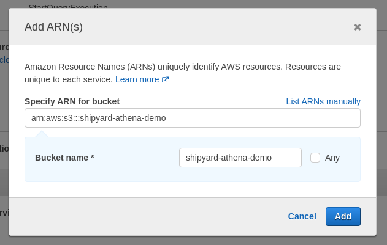
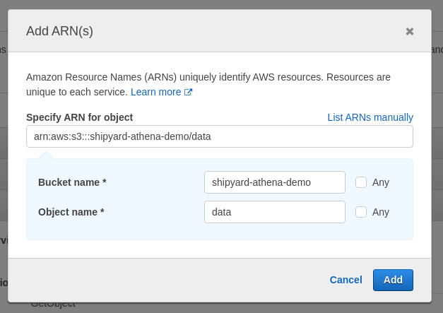
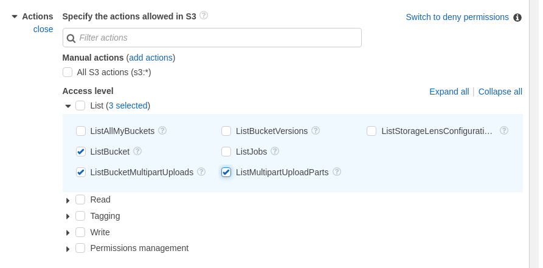
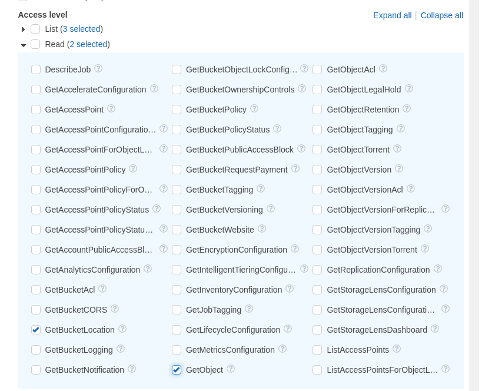
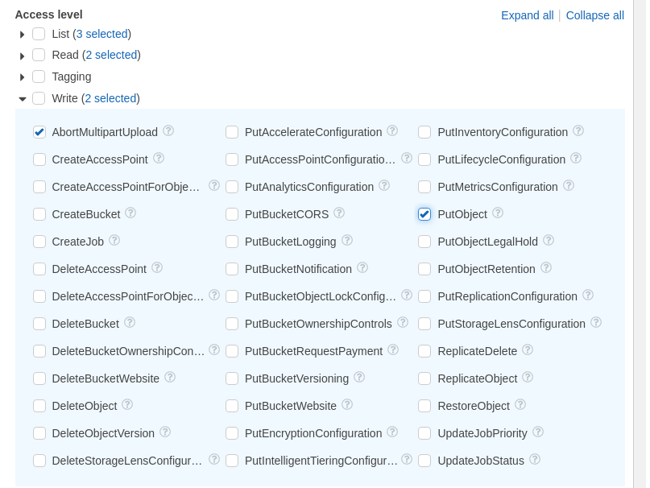
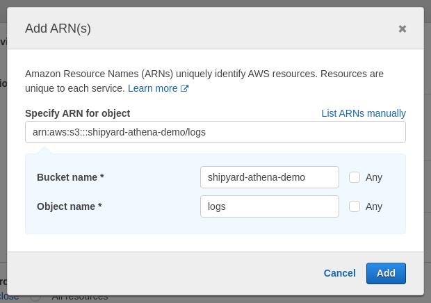
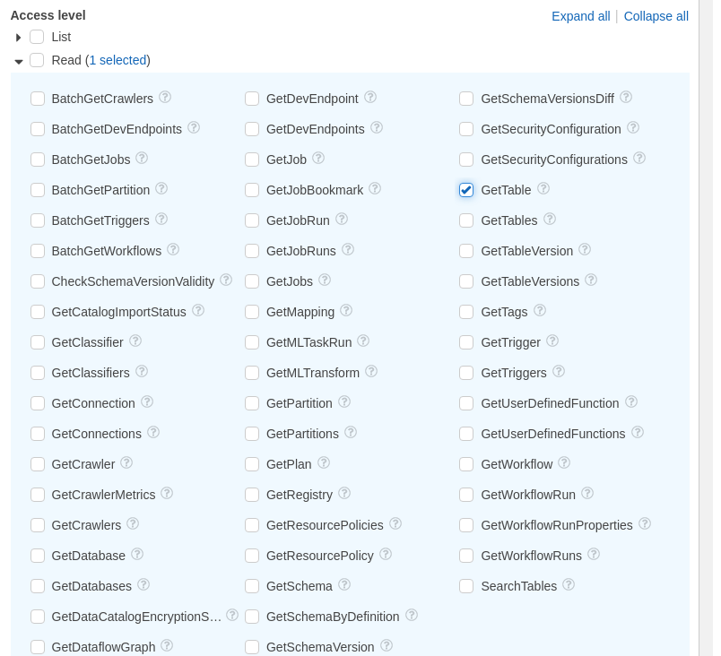

# Amazon Athena Blueprints

## Authorization

### Overview

In order to get started with the Athena Blueprints, an IAM user with the required AWS permissions and programmatic access is required.

### Steps

1. Login to your [AWS Management Console](https://aws.amazon.com/console/)  
2. Search for and go to the IAM service page  
	  
3. Select "Policies" on the left sidebar  
	  
4. Click the blue "Create policy" button  
5. Select the "Visual editor" tab  
6. Add required Athena permissions  
	a. On the "Service" dropdown, search for and select "Athena"  
		  
	b. On the "Actions" dropdown  
		i. Under "Read" select "GetQueryExecution"  
		ii. Under "Write" select "StartQueryExecution"  
		  
	c. On the "Resources" dropdown, click "Add ARN"  
		i. Add your region ID and workgroup name or select "Any" for both options - this example, the region has been set to `"*"` and the workgroup set to `"primary"`  
		  
	d. Skip the "Request Conditions" dropdown  
	e. Click "Add additional permissions" to add the next set of permissions  
7. Add required S3 permissions (several separate groups are needed for S3)  
	a. On the "Service" dropdown, search for and select "S3"  
	b. On the "Actions" dropdown  
		i. Under "List" select "ListBucket"  
	c. On the "Resources" dropdown, click "Add ARN"  
		i. Add a bucket for source data in our example the bucket is "shipyard-athena-demo"  
		  
	d. Skip the "Request Conditions" dropdown  
	e. Click "Add additional permissions" to add the next set of permissions  
8. Add required S3 permissions (several separate groups are needed for S3)  
	a. On the "Service" dropdown, search for and select "S3"  
	b. On the "Actions" dropdown  
		i. Under "Read" select "GetObject"  
	c. On the "Resources" dropdown, click "Add ARN"  
		i. Add a bucket location for source data in our example we're using the "shipyard-athena-demo" bucket with an optional "data" folder  
		  
	d. Skip the "Request Conditions" dropdown  
	e. Click "Add additional permissions" to add the next set of permissions  
9. Add required S3 permissions (several separate groups are needed for S3)  
	a. On the "Service" dropdown, search for and select "S3"  
	b. On the "Actions" dropdown  
		i. Under "List" select "ListBucket", "ListBucketMultipartUploads", and "ListMultipartUploadParts"  
		ii. Under "Get" select "GetObject" and "GetBucketLocation"  
		iii. Under "Write" select "AbortMultipartUpload" and "PutObject"  
		  
		  
		  
	c. On the "Resources" dropdown, click "Add ARN"  
		i. Add bucket location and optional folder example "shipyard-athena-demo" and "logs"  
		  
	d. Skip the "Request Conditions" dropdown  
	e. Click "Add additional permissions" to add the next set of permissions  
10. Add required Glue permissions  
	a. On the "Service" dropdown, search for and select "Glue"  
	b. On the "Actions" dropdown  
		i. Under "Read" select "GetTable"  
		  
	c. On the "Resources" dropdown, click "Add ARN"
		i. Select "Any in this account" or add specific catalog, database, and table values - in our example we use "Any in this account" for all three (the "Any in this account" has not been selected since this overrides the example account ID with the Shipyard account ID)  
		  
	d. Skip the "Request Conditions" dropdown  
11. Click "Next: Tags"  
12. Click "Next: Review"  
13. Add policy name  
14. Click "Create policy"  
15. Attach to an IAM User with programmatic access  
16. Add the IAM user's access key ID and secret access key into the corresponding fields on the Blueprint  
	i. These values can be generated for any IAM User with programmatic access in the "Users" page  

### Notes

- AWS resource on [IAM and Athena](https://docs.aws.amazon.com/athena/latest/ug/security-iam-athena.html)
- Example [IAM policy](https://docs.aws.amazon.com/athena/latest/ug/udf-iam-access.html)
- Full IAM JSON using example values (from the steps outlined in the previous section)

```
{
    "Version": "2012-10-17",
    "Statement": [
        {
            "Sid": "VisualEditor0",
            "Effect": "Allow",
            "Action": [
                "athena:StartQueryExecution",
                "athena:GetQueryExecution",
                "s3:ListBucket",
                "glue:GetTable"
            ],
            "Resource": [
                "arn:aws:athena:*:111111111111:workgroup/primary",
                "arn:aws:s3:::shipyard-athena-demo",
                "arn:aws:glue:*:111111111111:catalog",
                "arn:aws:glue:*:111111111111:table/*/*",
                "arn:aws:glue:*:111111111111:database/*"
            ]
        },
        {
            "Sid": "VisualEditor1",
            "Effect": "Allow",
            "Action": "s3:GetObject",
            "Resource": "arn:aws:s3:::shipyard-athena-demo/data"
        },
        {
            "Sid": "VisualEditor2",
            "Effect": "Allow",
            "Action": [
                "s3:PutObject",
                "s3:GetObject",
                "s3:ListBucketMultipartUploads",
                "s3:AbortMultipartUpload",
                "s3:ListBucket",
                "s3:GetBucketLocation",
                "s3:ListMultipartUploadParts"
            ],
            "Resource": [
                "arn:aws:s3:::shipyard-athena-demo/logs",
                "arn:aws:s3:::shipyard-athena-demo"
            ]
        }
    ]
}
```

## Execute Query Blueprint

### Overview

The **Amazon Athena - Execute Query** Blueprint allows users to run arbitrary queries against Athena.

### Variables

| Variable Name | Description |
|:---|:---|
| **Database** | [REQUIRED] The name of the [Athena database](https://docs.aws.amazon.com/athena/latest/ug/understanding-tables-databases-and-the-data-catalog.html) the run the query against |
| **Query** | [REQUIRED] The [SQL-style](https://docs.aws.amazon.com/athena/latest/ug/ddl-sql-reference.html) query to run against the Athena database |
| **S3 Log Bucket Name** | [REQUIRED] The S3 bucket to output the query logs into |
| **S3 Log Folder Name** | The optional subdirectory within the S3 bucket to store query logs |
| **Access Key ID** | [REQUIRED] The access key ID for programmatic IAM user used to download the file - see **Authorization** above for more information |
| **Secret Access Key** | [REQUIRED] The secret access key for programmatic IAM user used to download the file - see [**Authorization**](#authorization) above for more information |
| **Region** | [REQUIRED] The AWS region for the S3 bucket and IAM user |

## Store Query Results as CSV Blueprint

### Overview

The **Amazon Athena - Store Query Results as CSV** Blueprint allows users to run arbitrary queries against Athena and store the CSV output in the Shipyard Vessel.

### Variables

| Variable Name | Description |
|:---|:---|
| **Database** | [REQUIRED] The name of the [Athena database](https://docs.aws.amazon.com/athena/latest/ug/understanding-tables-databases-and-the-data-catalog.html) the run the query against |
| **Query** | [REQUIRED] The [SQL-style](https://docs.aws.amazon.com/athena/latest/ug/ddl-sql-reference.html) query to run against the Athena database |
| **S3 Log Bucket Name** | [REQUIRED] The S3 bucket to output the query logs into |
| **S3 Log Folder Name** | The optional subdirectory within the S3 bucket to store query logs |
| **Local File Name** | [REQUIRED] The name of the log file is stored under in Shipyard |
| **Local Folder Name** | The optional subdirectory the log file output is stored under in Shipyard |
| **Access Key ID** | [REQUIRED] The access key ID for programmatic IAM user used to download the file - see **Authorization** above for more information |
| **Secret Access Key** | [REQUIRED] The secret access key for programmatic IAM user used to download the file - see [**Authorization**](#authorization) above for more information |
| **Region** | [REQUIRED] The AWS region for the S3 bucket and IAM user |

## Helpful Links

[Amazon Athena Help Docs](https://docs.aws.amazon.com/athena/index.html)
