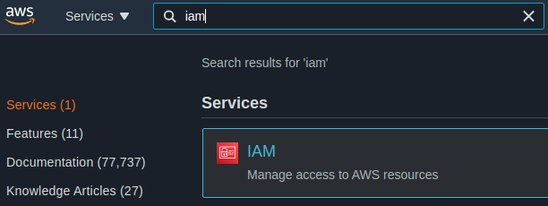
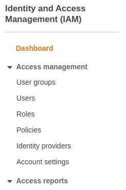
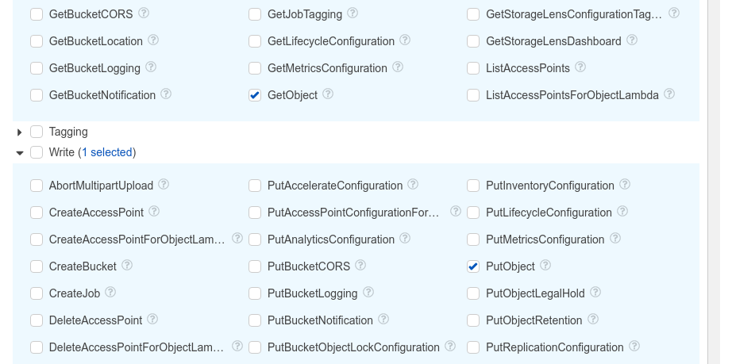
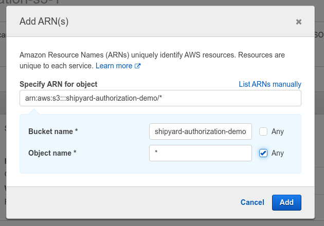

# Amazon S3 Blueprints

## Authorization

### Overview

In order to get started with the S3 Blueprints, an IAM user with the required AWS permissions and programmatic access is required.

### Steps

1. Login to your [AWS Management Console](https://aws.amazon.com/console/)  
2. Search for and go to the IAM service page  
	  
3. Select "Policies" on the left sidebar  
	  
4. Click the blue "Create policy" button  
5. Select the "Visual editor" tab  
6. Add required S3 permissions  
	a. On the "Service" dropdown, search for and select "S3"  
	b. On the "Actions" dropdown  
		ii. Under "Get" select "GetObject"  
		iii. Under "Write" select "PutObject"  
		  
	c. On the "Resources" dropdown, click "Add ARN"  
		i. Add bucket location example "shipyard-authorization-demo"  
		  
	d. Skip the "Request Conditions" dropdown  
7. Click "Next: Tags"  
8. Click "Next: Review"  
9. Add policy name  
10. Click "Create policy"  
11. Attach to an IAM User with programmatic access  
12. Add the IAM user's access key ID and secret access key into the corresponding fields on the Blueprint  
	i. These values can be generated for any IAM User with programmatic access in the "Users" page  

### Notes

```
{
    "Version": "2012-10-17",
    "Statement": [
        {
            "Sid": "VisualEditor0",
            "Effect": "Allow",
            "Action": [
                "s3:PutObject",
                "s3:GetObject"
            ],
            "Resource": "arn:aws:s3:::shipyard-authorization-demo/*"
        }
    ]
}
```

## Download Files Blueprint

### Overview

The **Amazon S3 - Download Files** Blueprint allows users to fetch files from S3 into Shipyard.

### Variables

| Variable Name | Description |
|:---|:---|
| **Bucket Name** | [REQUIRED] The target S3 bucket the target file is stored in |
| **S3 Folder Name** | The optional subdirectory path the file is stored under in S3 |
| **S3 File Name Match Type** | [REQUIRED] The method by which Shipyard should look for the file name in S3 |
| **S3 File Name** | [REQUIRED] The name for the target file stored in S3 |
| **Local Folder Name** | Where Shipyard should store the downloaded file |
| **Local File Name** | [REQUIRED] What the downloaded file should be named in Shipyard |
| **Access Key ID** | [REQUIRED] The access key ID for programmatic IAM user used to download the file - see [**Authorization**](#authorization) above for more information |
| **Secret Access Key** | [REQUIRED] The secret access key for programmatic IAM user used to download the file - see [**Authorization**](#authorization) above for more information |
| **Region** | [REQUIRED] The AWS region for the S3 bucket and IAM user |

## Upload Files Blueprint

### Overview

The **Amazon S3 - Upload Files** Blueprint allows users to send files Shipyard into S3.

### Variables

| Variable Name | Description |
|:---|:---|
| **Bucket Name** | [REQUIRED] The target S3 bucket the target file will be stored in |
| **Local Folder Name** | The optional subdirectory path the file is stored under in Shipyard |
| **Local File Name Match Type** | [REQUIRED] The method by which Shipyard should look for the file name in Shipyard |
| **Local File Name** | [REQUIRED] The name for the target file stored in Shipyard |
| **S3 Folder Name** | Where Shipyard should store the uploaded file in S3 |
| **S3 File Name** | [REQUIRED] What the uploaded file should be named in S3 |
| **Access Key ID** | [REQUIRED] The access key ID for programmatic IAM user used to upload the file - see [**Authorization**](#authorization) above for more information |
| **Secret Access Key** | [REQUIRED] The secret access key for programmatic IAM user used to upload the file - see [**Authorization**](#authorization) above for more information |
| **Region** | [REQUIRED] The AWS region for the S3 bucket and IAM user |
| **Extra Variables** | Extra arguments that may be passed to the S3 operation |

## Helpful Links

[Amazon S3 Help Docs](https://docs.aws.amazon.com/s3/) [Boto3 Documentation](https://boto3.amazonaws.com/v1/documentation/api/latest/index.html)
