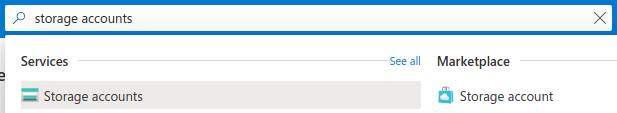
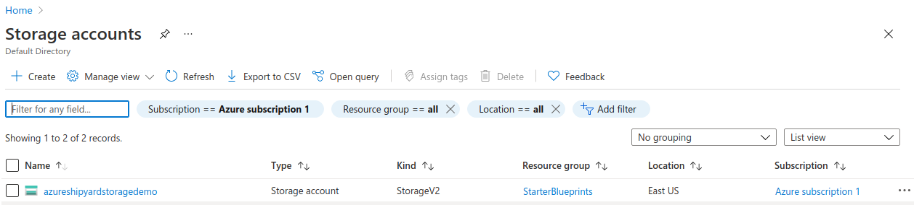
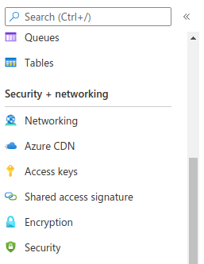
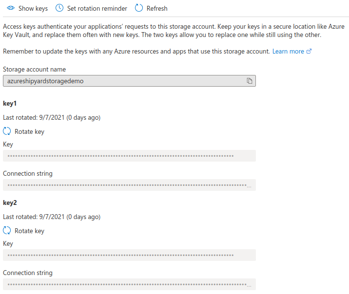

# Azure Blob Storage Authorization

## Overview

In order to get started with the Azure Blueprints, an access key connection string tied to the Azure Blob Storage you want to access is required.

## Access Key Connection String

1. Login to your [Azure Portal](https://portal.azure.com/)  
2. Search for and click on "**Storage accounts**"  
	  
3. Select the desired storage account from the table  
	  
4. Scroll down left sidebar to the "**Security + networking**" section and click "**Access keys**"  
	  
5. Click the "Show keys" button at the top of the access keys page  
	  
6. Click the "**copy**" icon for the "**Connection string**" text field under the `key` option  
7. Store the "Connection String" value somewhere safe. It will be used for all Azure Blob Storage Blueprints.
