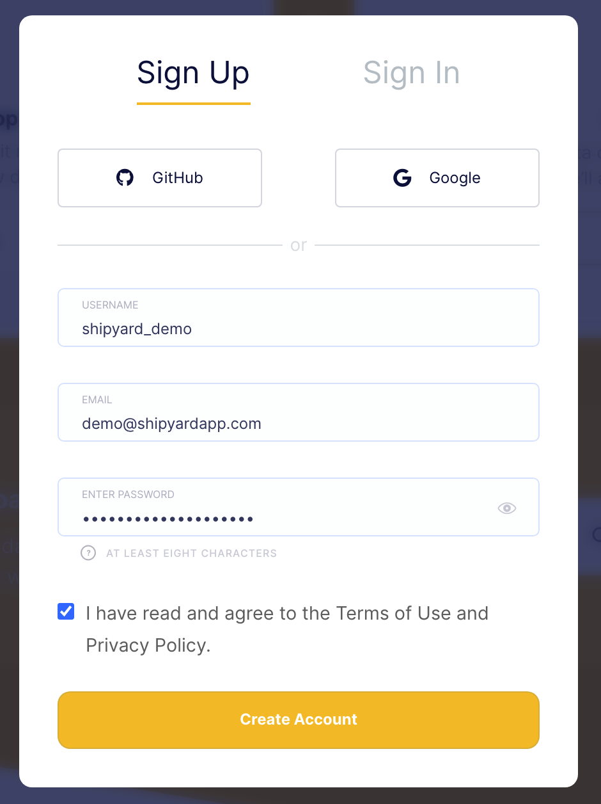
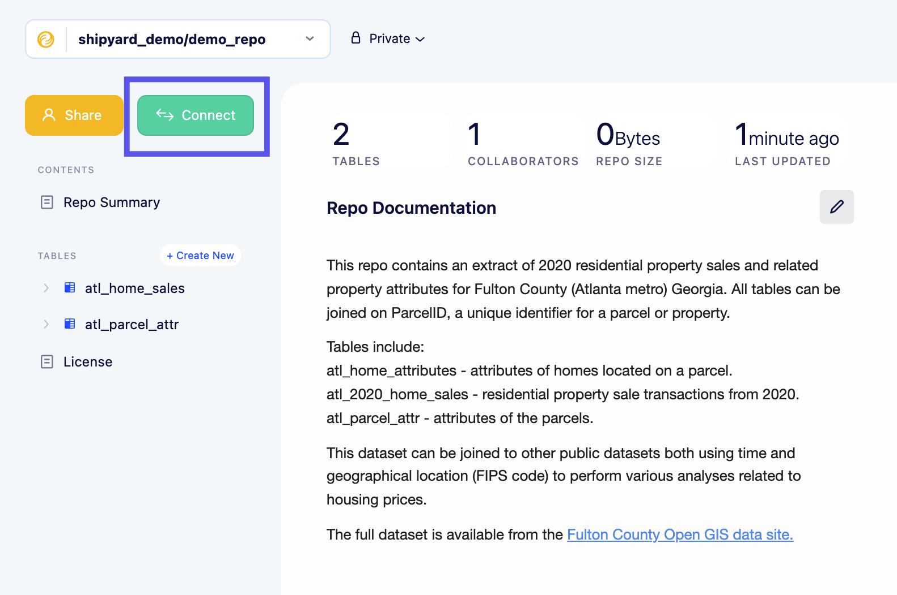
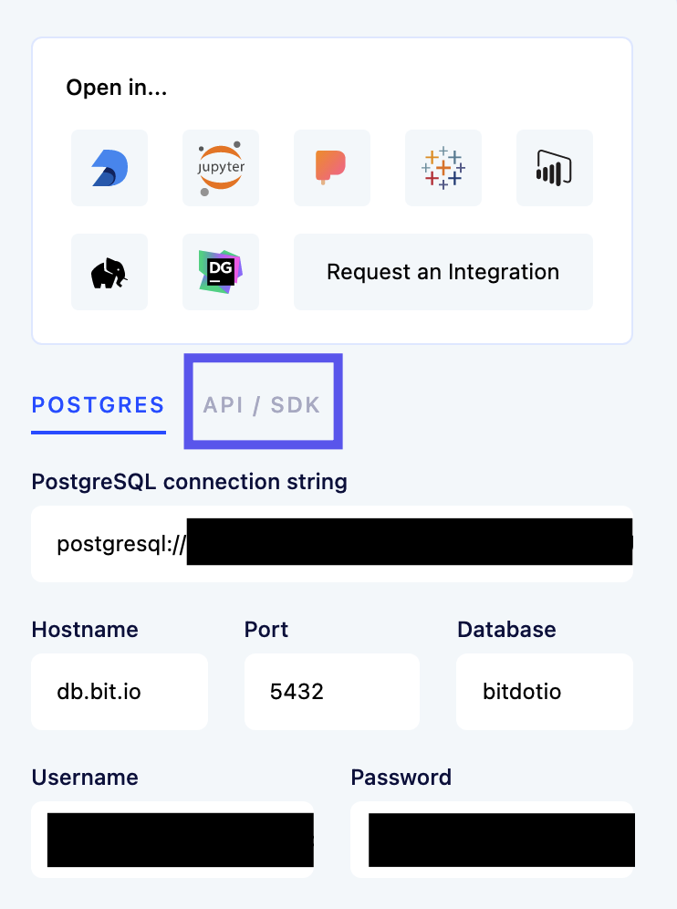
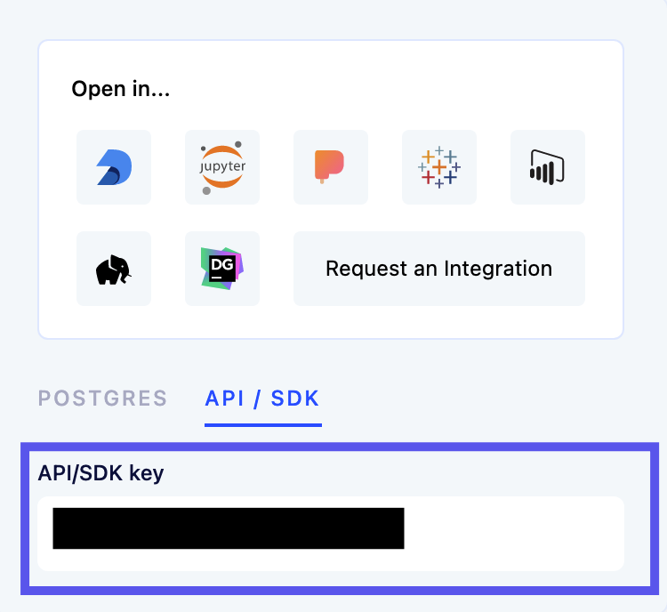

# Bit.io Authorization

In order to get started with the bit.io Blueprints, you will need to create a bit.io account and use the generated API Key for your user.

## Create a bit.io Account
1. Navigate to [bit.io](https://bit.io/) and click the Sign Up button.
2. Fill in all of the required details.

3. Skip the process of inviting other users.

## Getting a bit.io API Key
1. Navigate to [bit.io](https://bit.io/) and click the Sign In button.
2. On the main page, click the **Connect** button on the left side of the screen.

3. On the box that appears, click **API/SDK**.

4. Copy the API/SDK key and store it in a safe location. This will be used for all bit.io Blueprints.
