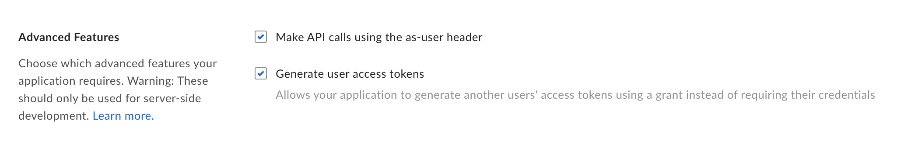

# Box Authorization
Box requires multiple steps for authentication.

1. You must first set up a Developer account.
2. With the new Developer account, you need to set up an Application with credentials.
3. Once the app is created, you'll need an admin to approve the application.
4. Once the application is approved, you'll need it to be invited to the relevant folders.

## Setting up Your Box Developer Account
1. Register your Box Account for a [Developer Account](https://developer.box.com/).
2. Navigate to your [Developer Account settings](https://app.box.com/account/developer).

3. Scroll down to the 2-Step Verification section. Click **Set up**
4. Select your preferred method for 2FA. We recommend using an authenticator app. Click **Next**.

5. Set up 2FA in your app of choice. Provide the Authentication code, then click **Submit**.

**_NOTE:_**
Setting up 2-Step Verification is key to creating a Service Account for your application. Don't skip this step!

## Creating a Box Developer App + Credentials
1. Go to the [Developer console](https://app.box.com/developers/console).
1. Click "**Create New App**"

4. Click "**Custom App**"

5. Select **Server Authentication (with JWT)**, name your app, and click **Create App**

6. Check to verify that you're on the Configuration tab for your new app. If not, navigate there.

6. Scroll down to the section called Application Scopes. Make sure **Write all files and folders stored in Box** is selected.

11. Click **Save Changes** at the top of the page.

6. Scroll down to the section called OAuth 2.0 Credentials. Copy the **Client ID** and store this for later.

7. Scroll down to the section called Advanced Features. Make sure both of these items are checked.

8. Scroll down slightly and select **Generate a Public/Private Keypair**.

**_NOTE:_**
You may first be prompted for your 2FA code. If so, enter the code and try generating a Public/Private Keypair again.

1. A file should be downloaded to your computer that contains your app credentials in JSON format. This will be used for every Box Blueprint on Shipyard, so store this somewhere safe.
2.  Click **OK**.

If this step was successful, the screen should update to look something like this.

## Giving Your Box Developer App Access to the Enterprise

### Submitting the Box Developer App for Approval
1. Go to the [Developer console](https://app.box.com/developers/console) and select your app.
2. Switch to the **Authorization** Tab

3. Click the **Review and Submit** button.

4. Fill out an App Description and click **Submit**.

5. The screen should now update to look something like this.

### Approving the Box Developer App in the Admin Tab
At this point, an Admin for your Enterprise will need to take the following steps.  

1. Navigate to the [Admin panel](https://app.box.com/master) for Box.
2. Click **Apps** on the sidebar.  

3. Click on the **Custom Apps** tab.

4. Highlight the application name that was submitted.
a. Click the 3 dots icon to access more menu options.
b. Click **Authorize App**.

6. Click **Authorize**.

7. You should now see your application shown in the table below.

## Inviting your Box App to your Folders
1. Navigate to the [Developer Console](https://app.box.com/developers/console)
2. Select your app.
3. Scroll down to the Service Account Info section. Copy the email listed as a Service Account ID. It will be formatted as `AutomationUser_AppServiceID_RandomString@boxdevedition.com`

4. Go to the main [Box application](https://app.box.com/folder/0).
5. Move your mouse over the folder you want to share. Click the **Share** button on the right.

6. Paste your Service Account ID email into the Invite People section. Ensure that you are inviting the email as an Editor. Click **Send**.

7. The folder will now show as Blue to indicate it is shared!

