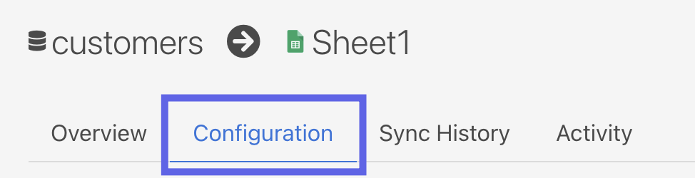
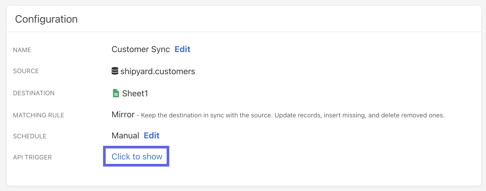
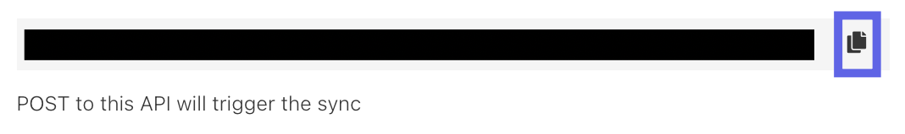
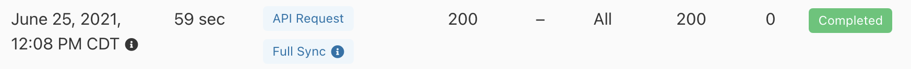
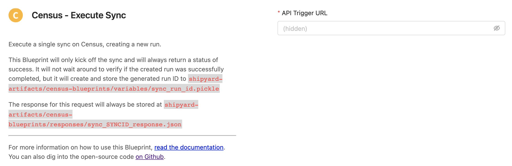
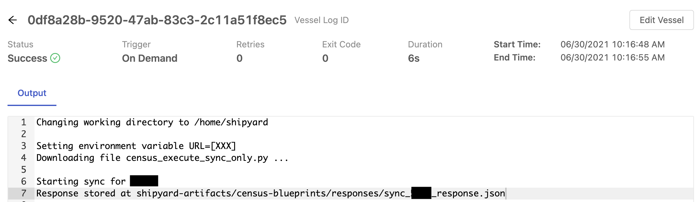
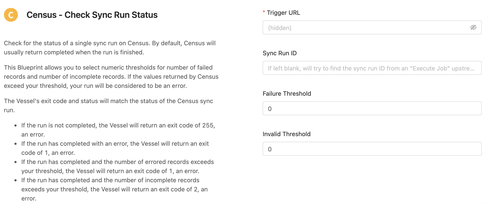
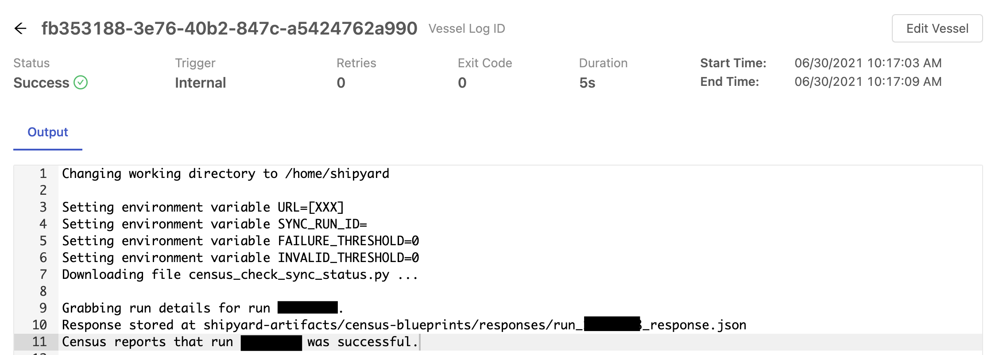
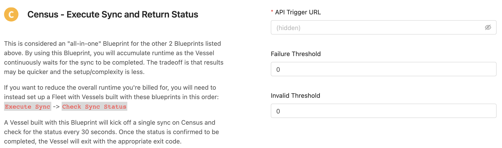
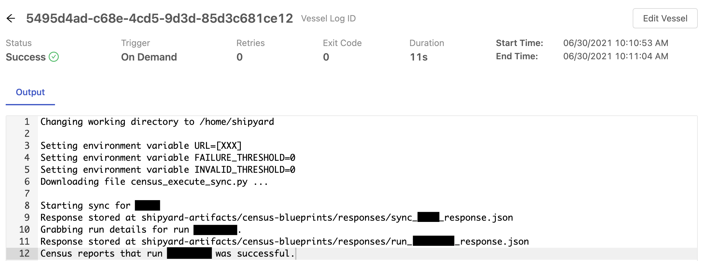

# Census Blueprints
Cesnsus Blueprints help data teams orchestrate their Census reverse ETL jobs with other tools in their data stack. Our Census Blueprints make it easy to execute a job and check for the status of that job with customized thresholds for acceptable errors. We've included an all-in-one Blueprint, as well as each step in a modular fashion so you can flexibily determine how you would like to interact with Census.

Every Blueprint listed on this page stores the JSON response of the API calls and other files under the following folder structure:
`shipyard-artifacts/census-blueprints/`

Sub-folders can be any of the following:
- responses
- variables

## Authorization

### Overview
To get started with any Census Blueprints, you will need to find the API Trigger URL associated with an individual sync. This URL is a secure way for Shipyard to access Census and will be required for **every** Census Blueprint.

### Getting Census API Trigger URL
1. Navigate to your organization's syncs page on [Census](https://app.getcensus.com/syncs).
2. Select the sync you would like to automate on Shipyard.
3. Click the **Configuration** tab.

4. Under API Trigger, click **Click to Show**

5. Click the copy button for the revealed URL.

Store this URL somewhere safe - you'll need it for any Census Blueprints that you use in Shipyard.

:::note
While not required, we recommend setting your sync schedule to manual and triggering it only from Shipyard. Otherwise, there could be some conflicting runs that arise.
:::

## Execute Sync Blueprint

### Overview

Execute a single sync on Census, creating a new run.

This Blueprint will only kick off the sync and will always return a status of success. It will not wait around to verify if the created run was successfully completed, but it will create and store the generated run ID to `shipyard-artifacts/census-blueprints/variables/sync_run_id.pickle`

The response for this request will always be stored at `shipyard-artifacts/census-blueprints/responses/sync_SYNCID_response.json`

### Variables

| Variable Name       | Description                                                                                                                                                                                                                                       |
| :------------------ | :------------------------------------------------------------------------------------------------------------------------------------------------------------------------------------------------------------------------------------------------ |
| **API Trigger URL** | Your unique API Trigger URL for a sync on Census. Because the URL contains sensitive API tokens, we show the url as `(hidden)` after saving. Instructions for how to get this URL can be found under the [authorization](#authorization) section. |

### Screenshots

## Check Sync Run Status

### Overview

Check for the status of a single sync run on Census. By default, Census will usually return completed when the run is finished. 

This Blueprint allows you to select numeric thresholds for number of failed records and number of incomplete records. If the values returned by Census exceed your threshold, your run will be considered to be an error.

The Vessel's exit code and status will match the status of the Census sync run. 

- If the run is not completed, the Vessel will return an exit code of 255, an error.
- If the run has completed with an error, the Vessel will return an exit code of 1, an error.
- If the run has completed and the number of errored records exceeds your threshold, the Vessel will return an exit code of 1, an error.
- If the run has completed and the number of incomplete records exceeds your threshold, the Vessel will return an exit code of 2, an error.
- If the run has completed and the number of errored and incomplete records are both below your threshold, the Vessel will return an exit code of 0, interpreted by Shipyard as Successful.

The response for this request will always be stored at `shipyard-artifacts/census-blueprints/responses/run_RUNID_response.json`

**Recommended Setup:**
1. A Vessel built with this Blueprint should be paired with [guardrail retries](../reference/settings/guardrails.md). This will allow the Vessel to continually check for status until a final result is found.
2. This Vessel should run immediately after a Vessel built with the _Census - Execute Job_ Blueprint. With this setup, you can leave the Sync Run ID field blank and this Vessel will check for the results of the recently created run.

:::note
This Blueprint asks for the Trigger URL which is shown in the UI, NOT the Sync Run URL. We generate the Sync Run URL off of the Trigger URL because this information is readily acccessible in the Census UI.
::: 

### Variables
| Variable Name         | Description                                                                                                                                                                                                                                       |
| :-------------------- | :------------------------------------------------------------------------------------------------------------------------------------------------------------------------------------------------------------------------------------------------ |
| **API Trigger URL**   | Your unique API Trigger URL for a sync on Census. Because the URL contains sensitive API tokens, we show the url as `(hidden)` after saving. Instructions for how to get this URL can be found under the [authorization](#authorization) section. |
| **Sync Run ID**       | The ID of a specific run you want to check status for. If left blank, it will try to find the sync run ID from an "Execute Sync" Vessel that ran upstream.                                                                                        |
| **Failure Threshold** | The number of failed or rejected records that you're willing to have in your sync. Defaults to 0, so any failed record results in an Errored status.                                                                                              |
| **Invalid Threshold** | The number of invalid records that you're willing to have in your sync. Defaults to 0, so any invalid record results in an Errored status.                                                                                                        |

### Screenshots

## Execute Sync and Return Status

### Overview
This is considered an "all-in-one" Blueprint for the other 2 Blueprints listed above. By using this Blueprint, you will accumulate runtime as the Vessel continuously waits for the sync to be completed. The tradeoff is that results may be quicker and the setup/complexity is less.

If you want to reduce the overall runtime you're billed for, you will need to instead set up a Fleet with Vessels built with these blueprints in this order:
`Execute Sync` -> `Check Sync Status`

A Vessel built with this Blueprint will kick off a single sync on Census and check for the status every 30 seconds. Once the status is confirmed to be completed, the Vessel will exit with the appropriate exit code.

The response for this request will always be stored at `shipyard-artifacts/census-blueprints/responses/sync_SYNCID_response.json` and `shipyard-artifacts/census-blueprints/responses/run_RUNID_response.json`.

### Variables
| Variable Name         | Description                                                                                                                                                                                                                                       |
| :-------------------- | :------------------------------------------------------------------------------------------------------------------------------------------------------------------------------------------------------------------------------------------------ |
| **API Trigger URL**   | Your unique API Trigger URL for a sync on Census. Because the URL contains sensitive API tokens, we show the url as `(hidden)` after saving. Instructions for how to get this URL can be found under the [authorization](#authorization) section. |
| **Failure Threshold** | The number of failed or rejected records that you're willing to have in your sync. Defaults to 0, so any failed record results in an Errored status.                                                                                              |
| **Invalid Threshold** | The number of invalid records that you're willing to have in your sync. Defaults to 0, so any invalid record results in an Errored status.                                                                                                        |  |

### Screenshots

## Helpful Links

[Census API Documentation](https://docs.getcensus.com/basics/triggering-syncs#sync-trigger-api)
