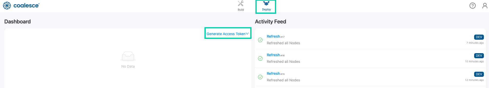
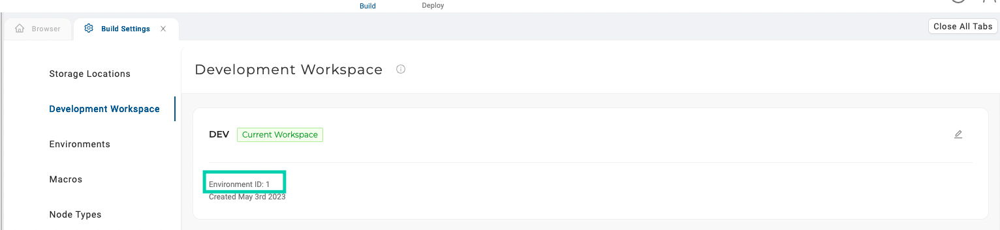

# Coalesce Authorization
An access token is required for Shipyard to interact with Coalesce. In order to acquire an access token, navigate to the **Deploy** tab and select **Generate Access Token**. Be sure to copy the value and save it for future runs. 

### Environment ID 
In order to grab the Environment ID, navigate to the **Build Settings** and then select **Development Workspace**. 

