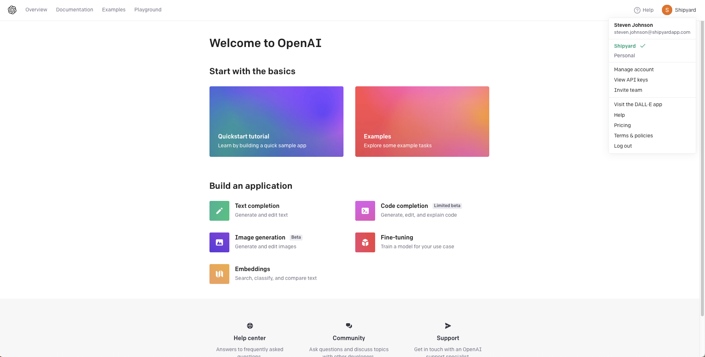
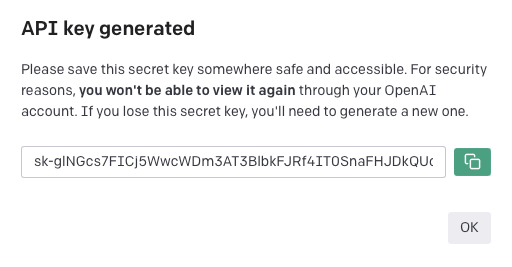

# Dall-E Authorization

To get started with any Dall-E Blueprints, you will need to create an API Key. This API Key is a secure way for Shipyard to access Dall-E and will be required for **every** Dall-E Blueprint.

## Creating a Dall-E API Key

1. Head over to [OpenAI's API homepage](https://openai.com/blog/openai-api).
2. Click **Sign Up**.
3. Sign in or create an OpenAI account. 
4. Once you are signed in, you will be redirected to [this page](https://platform.openai.com/overview).
5. Click in the top right corner to open the profile dropdown menu and click **View API Keys**.
   

6. Click **Create new secret key**. 
7. Click the green button to copy your API key and store it somewhere safe. This value will be used for every Dall-E Blueprint.

