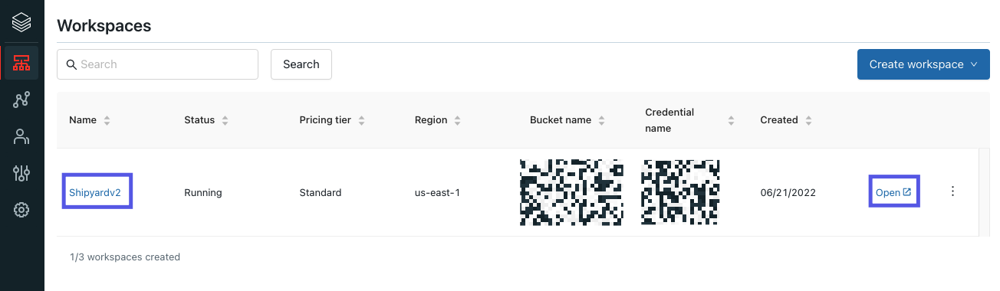
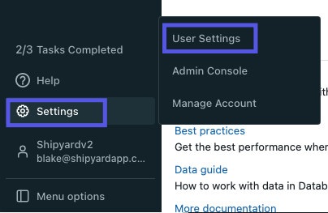
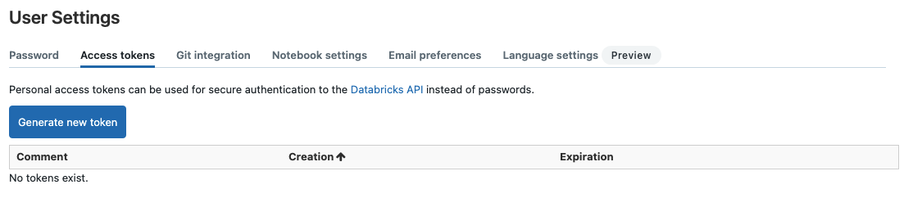
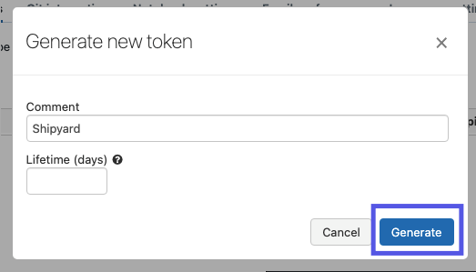
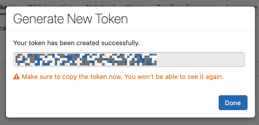

# Databricks Authorization

To get started with any Databricks Blueprints, you will need to create an Access Token and know your Instance URL. These pieces of information form a secure way for Shipyard to access Databricks and will be required for **every** Databricks Blueprint.

## Create a Databricks Access Token

1. Navigate to your [Databricks Workspaces](https://accounts.cloud.databricks.com/workspaces). Open whichever one you want to get an access token for.

2. On the sidebar, select the **Settings** icon and then **User Settings**.

3. Select the **Access tokens** tab at the top.

4. Click **Generate new token**.
5. Provide a descriptive name under **Comment** (like "Shipyard")
6. Remove the value under **Lifetime (days)** so that it's blank.
:::caution
While best practice is typically to have expiring API tokens that rotate, we recommend letting Shipyard tokens run indefinitely to prevent interruption to your Fleets.
:::
7. Click **Generate**.

8. Copy the newly created token and store it in a safe location. This is the access token value you will use for every Databricks Blueprint.

9. Click **Done**.

## Finding the Instance URL
The Instance URL is a part of every URL on Databricks. For example, if the full URL was `https://random-id-242.cloud.databricks.com/`, your Instance URL would be `random-id-242.cloud.databricks.com`.

## Helpful Links
[Managing Personal Access Tokens](https://docs.databricks.com/administration-guide/access-control/tokens.html)