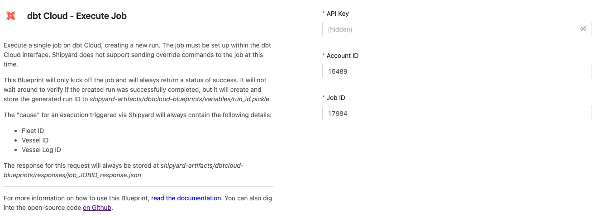
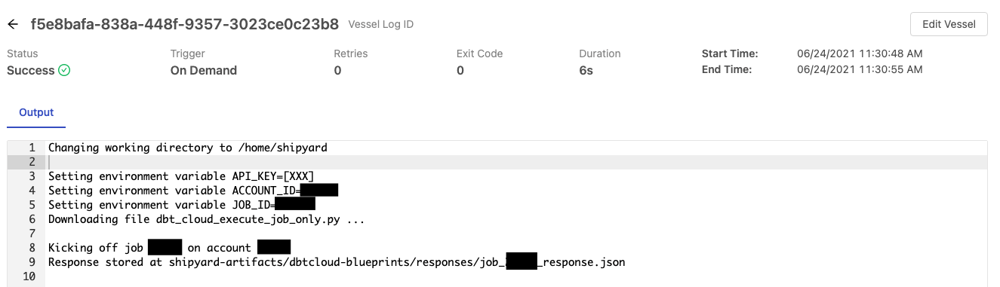
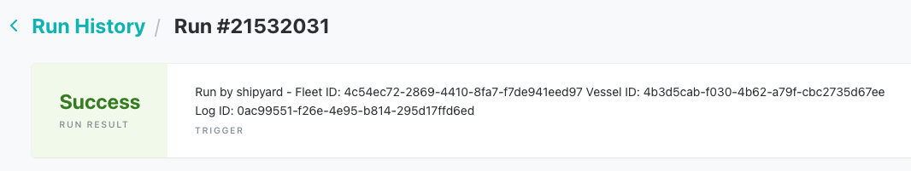
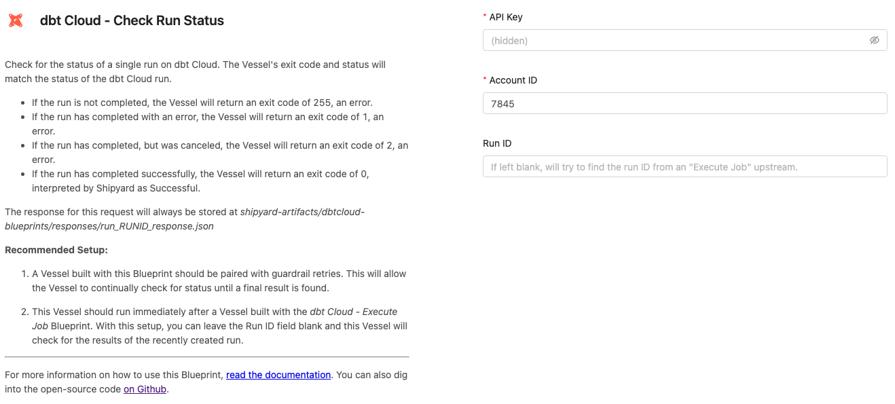
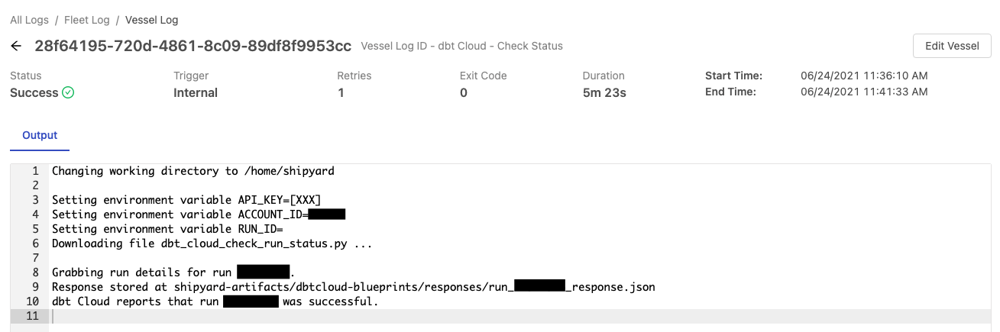
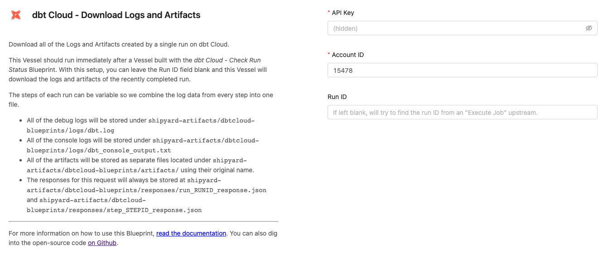
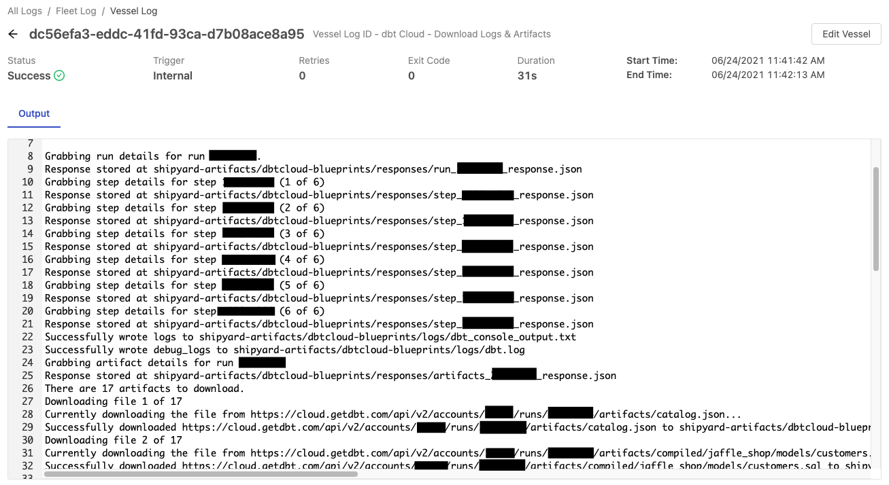
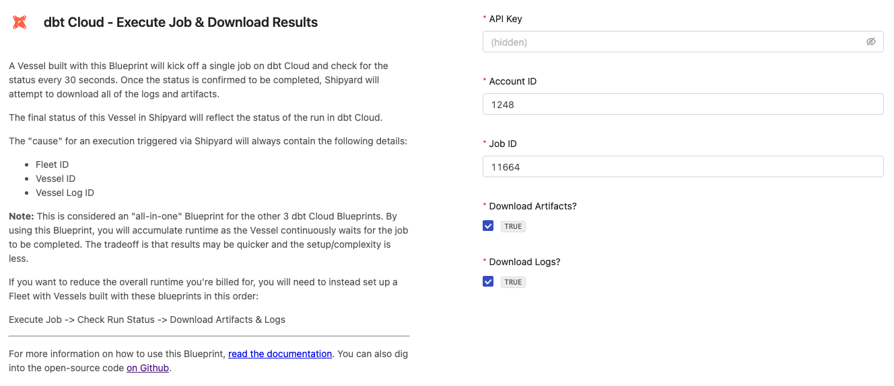
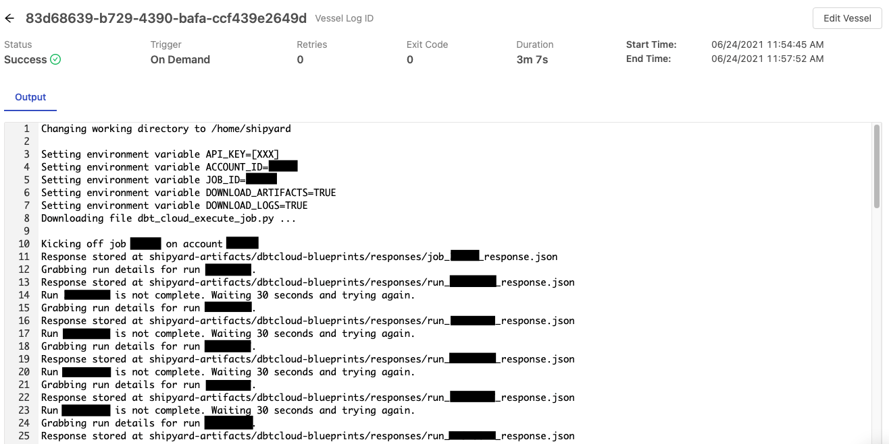

# dbt Cloud Blueprints
dbt Cloud Blueprints help data teams orchestrate their dbt Cloud jobs with tools in their data stack. Our dbt Cloud Blueprints make it easy to execute a job, check for the status of the job run, and download all generated log files and artifacts. We've included an all-in-one Blueprint, as well as each step in a modular fashion so you can flexibily determine how you would like to interact with dbt Cloud.

Every Blueprint listed on this page stores the JSON response of the API calls and other files under the following folder structure:
`shipyard-artifacts/dbtcloud-blueprints/`

Sub-folders can be any of the following:
- responses
- logs
- artifacts
- variables

If you would like to run **dbt Core** directly from Shipyard, rather than executing dbt on a separate platform, follow our [dbt Core Blueprint tutorial](../tutorials/dbt-blueprint.md).

## Authorization

### Overview
To get started with any dbt Cloud Blueprints, you will need to create an Service Token. This Service Token is a secure way for Shipyard to access dbt Cloud and will be required for **every** dbt Cloud Blueprint..

### Create a dbt Cloud Service Token
1. Navigate to your organization's instance of [dbt Cloud](https://cloud.getdbt.com)
2. Open the side navigation and select **Account Settings**

3. Select **Service Tokens** from the menu.
   

4. Select the option to create a **New Token**

5. Name your token something descriptive, like "Shipyard", and give it "Account Admin" privileges. Click **Save** once you're finished.

6. Copy the generated token to a Password Manager service or somewhere safe. This value will be used in every dbt Cloud Blueprint.

## Execute Job Blueprint

### Overview

Execute a single job on dbt Cloud, creating a new run. The job must be set up within the dbt Cloud interface. Shipyard does not support sending override commands to the job at this time.

This Blueprint will only kick off the job and will always return a status of success. It will not wait around to verify if the created run was successfully completed, but it will create and store the generated run ID to `shipyard-artifacts/dbtcloud-blueprints/variables/run_id.pickle`

The "cause" for an execution triggered via Shipyard will always contain the following details:
- Fleet ID
- Vessel ID
- Vessel Log ID

The response for this request will always be stored at `shipyard-artifacts/dbtcloud-blueprints/responses/job_JOBID_response.json`

### Variables

| Variable Name     | Description                                                                                                                                                        |
| :---------------- | :----------------------------------------------------------------------------------------------------------------------------------------------------------------- |
| **Service Token** | Your unique service token for dbt Cloud. Instructions for how to get this token can be found under the [authorization](#authorization) section.                    |
| **Account ID**    | Your unique Account ID, found in the URL of dbt Cloud. `https://cloud.getdbt.com/#/accounts/`**`ACCOUNT_ID`**`/projects/PROJECT_ID/dashboard/`                     |
| **Job ID**        | The ID of a specific job you want to run, found in the URL of dbt Cloud. `https://cloud.getdbt.com/#/accounts/ACCOUNT_ID/projects/PROJECT_ID/jobs/`**`JOB_ID`**`/` |

### Screenshots

## Check Run Status Blueprint

### Overview

Check for the status of a single run on dbt Cloud. The Vessel's exit code and status will match the status of the dbt Cloud run. 

- If the run is not completed, the Vessel will return an exit code of 255, an error.
- If the run has completed with an error, the Vessel will return an exit code of 1, an error.
- If the run has completed, but was canceled, the Vessel will return an exit code of 2, an error.
- If the run has completed successfully, the Vessel will return an exit code of 0, interpreted by Shipyard as Successful.

The response for this request will always be stored at `shipyard-artifacts/dbtcloud-blueprints/responses/run_RUNID_response.json`

**Recommended Setup:**
1. A Vessel built with this Blueprint should be paired with [guardrail retries](../reference/settings/guardrails.md). This will allow the Vessel to continually check for status until a final result is found.
2. This Vessel should run immediately after a Vessel built with the _dbt Cloud - Execute Job_ Blueprint. With this setup, you can leave the Run ID field blank and this Vessel will check for the results of the recently created run.

### Variables
| Variable Name     | Description                                                                                                                                                                                                                                                    |
| :---------------- | :------------------------------------------------------------------------------------------------------------------------------------------------------------------------------------------------------------------------------------------------------------- |
| **Service Token** | Your unique service token for dbt Cloud. Instructions for how to get this token can be found under the [authorization](#authorization) section.                                                                                                                |
| **Account ID**    | Your unique Account ID, found in the URL of dbt Cloud. `https://cloud.getdbt.com/#/accounts/`**`ACCOUNT_ID`**`/projects/PROJECT_ID/dashboard/`                                                                                                                 |
| **Run ID**        | The ID of a specific job you want to run, found in the URL of dbt Cloud. `https://cloud.getdbt.com/#/accounts/ACCOUNT_ID/projects/PROJECT_ID/runs/`**`RUN_ID`**`/`. If left blank, will try to find the run ID from an "Execute Job" Vessel that ran upstream. |

### Screenshots

## Download Logs and Artifacts Blueprint

### Overview
Download all of the Logs and Artifacts created by a single run on dbt Cloud.

The steps of each run can be variable so we combine the log data from every step into one file.

- All of the debug logs will be stored under `shipyard-artifacts/dbtcloud-blueprints/logs/dbt.log`
- All of the console logs will be stored under `shipyard-artifacts/dbtcloud-blueprints/logs/dbt_console_output.txt`
- All of the artifacts will be stored as separate files located under `shipyard-artifacts/dbtcloud-blueprints/artifacts/` using their original name.
- The responses for this request will always be stored at `shipyard-artifacts/dbtcloud-blueprints/responses/run_RUNID_response.json` and  `shipyard-artifacts/dbtcloud-blueprints/responses/step_STEPID_response.json`

**Recommended Setup:**

This Vessel should run immediately after a Vessel built with the _dbt Cloud - Check Run Status_ Blueprint. With this setup, you can leave the Run ID field blank and this Vessel will download the logs and artifacts of the recently completed run.

### Variables
| Variable Name     | Description                                                                                                                                                                                                                                                    |
| :---------------- | :------------------------------------------------------------------------------------------------------------------------------------------------------------------------------------------------------------------------------------------------------------- |
| **Service Token** | Your unique service token for dbt Cloud. Instructions for how to get this token can be found under the [authorization](#authorization) section.                                                                                                                |
| **Account ID**    | Your unique Account ID, found in the URL of dbt Cloud. `https://cloud.getdbt.com/#/accounts/`**`ACCOUNT_ID`**`/projects/PROJECT_ID/dashboard/`                                                                                                                 |
| **Run ID**        | The ID of a specific job you want to run, found in the URL of dbt Cloud. `https://cloud.getdbt.com/#/accounts/ACCOUNT_ID/projects/PROJECT_ID/runs/`**`RUN_ID`**`/`. If left blank, will try to find the run ID from an "Execute Job" Vessel that ran upstream. |

### Screenshots

## Execute Job & Download Results Blueprint

### Overview
This is considered an "all-in-one" Blueprint for the other 3 Blueprints listed above. By using this Blueprint, you will accumulate runtime as the Vessel continuously waits for the job to be completed. The tradeoff is that results may be quicker and the setup/complexity is less.

If you want to reduce the overall runtime you're billed for, you will need to instead set up a Fleet with Vessels built with these blueprints in this order:
`Execute Job` -> `Check Run Status` -> `Download Artifacts & Logs`

A Vessel built with this Blueprint will kick off a single job on dbt Cloud and check for the status every 30 seconds. Once the status is confirmed to be completed, Shipyard will attempt to download all of the logs and artifacts.

The final status of this Vessel in Shipyard will reflect the status of the run in dbt Cloud.

The "cause" for an execution triggered via Shipyard will always contain the following details:
- Fleet ID
- Vessel ID
- Vessel Log ID

### Variables
| Variable Name           | Description                                                                                                                                                        |
| :---------------------- | :----------------------------------------------------------------------------------------------------------------------------------------------------------------- |
| **Service Token**       | Your unique service token for dbt Cloud. Instructions for how to get this token can be found under the [authorization](#authorization) section.                    |
| **Account ID**          | Your unique Account ID, found in the URL of dbt Cloud. `https://cloud.getdbt.com/#/accounts/`**`ACCOUNT_ID`**`/projects/PROJECT_ID/dashboard/`                     |
| **Job ID**              | The ID of a specific job you want to run, found in the URL of dbt Cloud. `https://cloud.getdbt.com/#/accounts/ACCOUNT_ID/projects/PROJECT_ID/jobs/`**`JOB_ID`**`/` |
| **Download Artifacts?** | Determines if the artifacts from the run that was generated will be downloaded. Checked by default.                                                                |
| **Download Logs?**      | Determines if the logs from the run that was generated will be downloaded. Checked by default.                                                                     |

### Screenshots

## Helpful Links

[dbt Cloud API Documentation](https://docs.getdbt.com/dbt-cloud/api)
