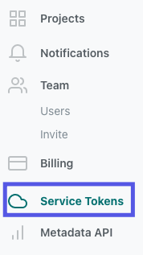
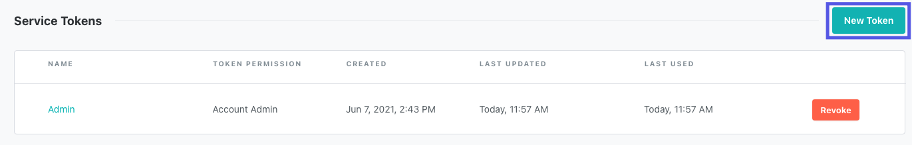
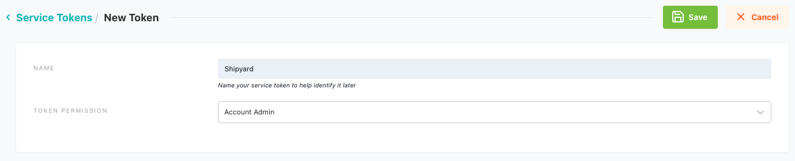
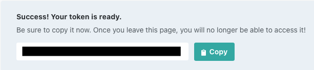

# dbt Cloud Authorization

To get started with any dbt Cloud Blueprints, you will need to create an Service Token. This Service Token is a secure way for Shipyard to access dbt Cloud and will be required for **every** dbt Cloud Blueprint..

## Create a dbt Cloud Service Token
1. Navigate to your organization's instance of [dbt Cloud](https://cloud.getdbt.com)
2. Open the side navigation and select **Account Settings**

3. Select **Service Tokens** from the menu.
   

4. Select the option to create a **New Token**

5. Name your token something descriptive, like "Shipyard", and give it "Account Admin" privileges. Click **Save** once you're finished.

6. Copy the generated token to a Password Manager service or somewhere safe. This value will be used in every dbt Cloud Blueprint.

