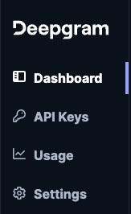
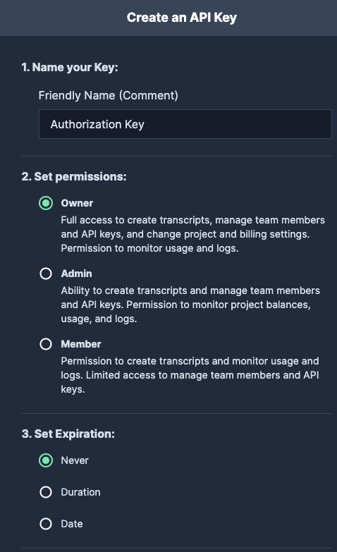

# Whisper Authorization

To get started with any Deepgram Blueprints, you will need to create an API Key. This API Key is a secure way for Shipyard to access Deepgram and will be required for **every** Deepgram Blueprint.

## Creating a Deepgram API Key

1. Log in to the [Deepgram Console](https://console.deepgram.com/).
2. Click **API Keys** on the sidebar. 

3. Click **Create a New API Key**.
4. Name your API key. Select the appropriate options for permissions and expiration date based on your organization's credential policies.

5. Click **Create Key**.
6. Copy the generated API Key and save it in your password manager to use in our Deepgram Blueprints.