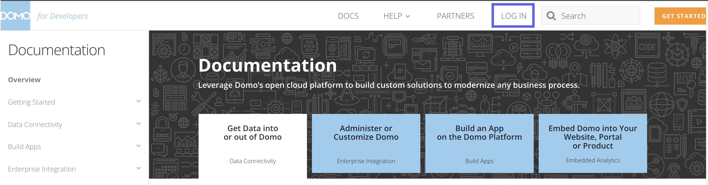
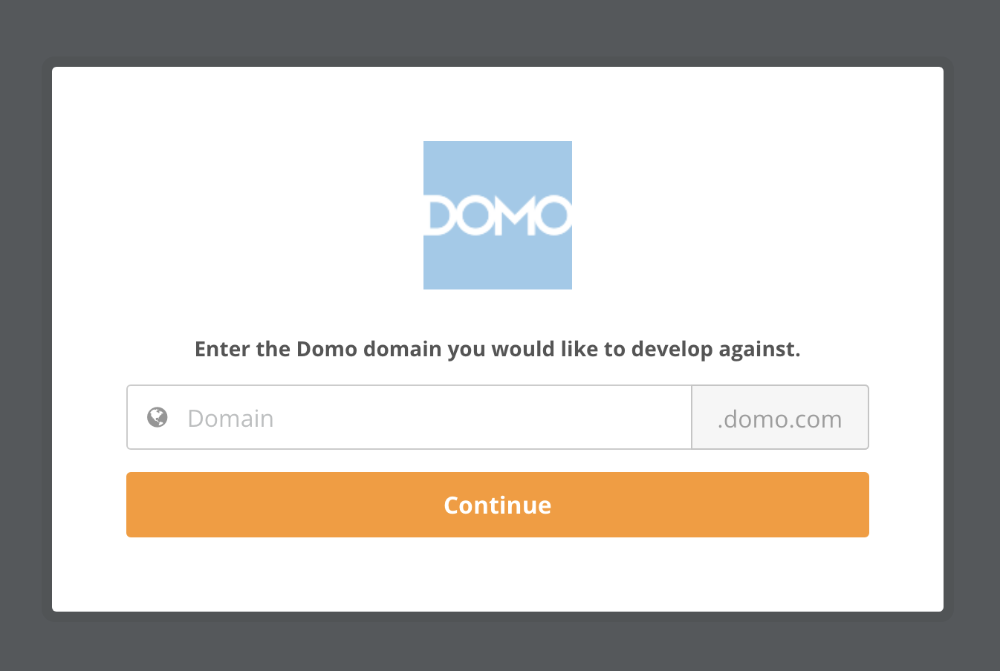
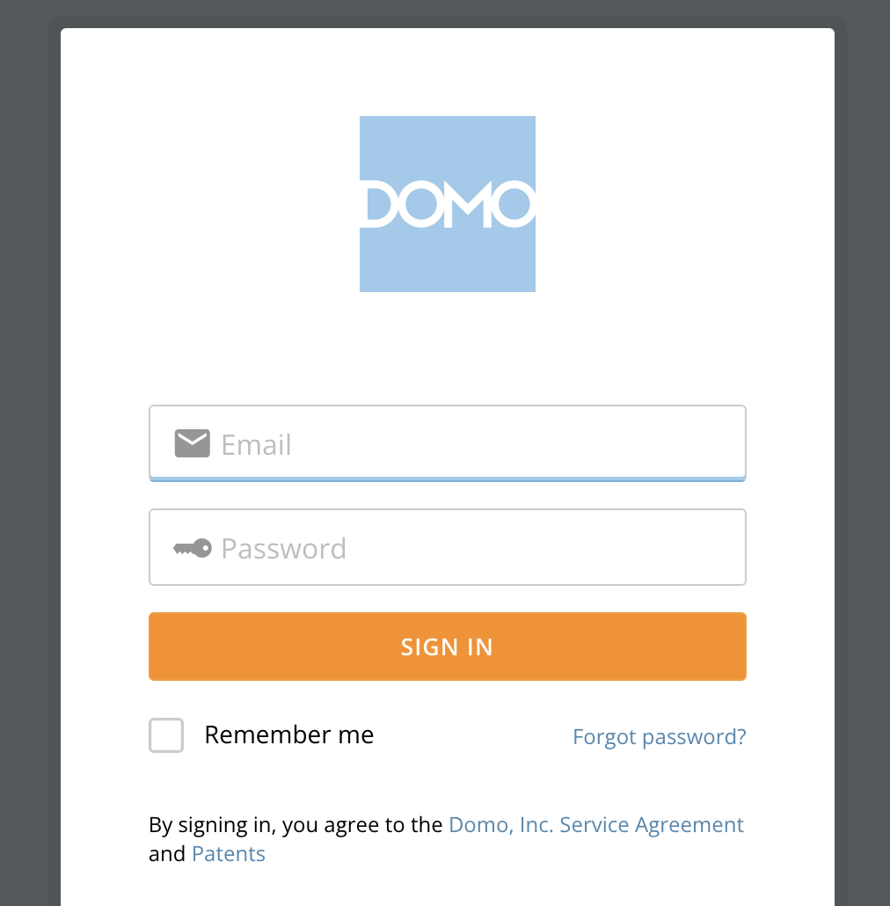
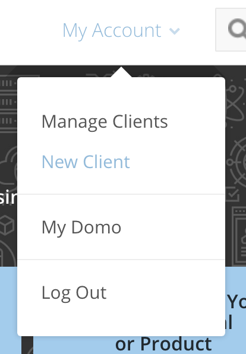
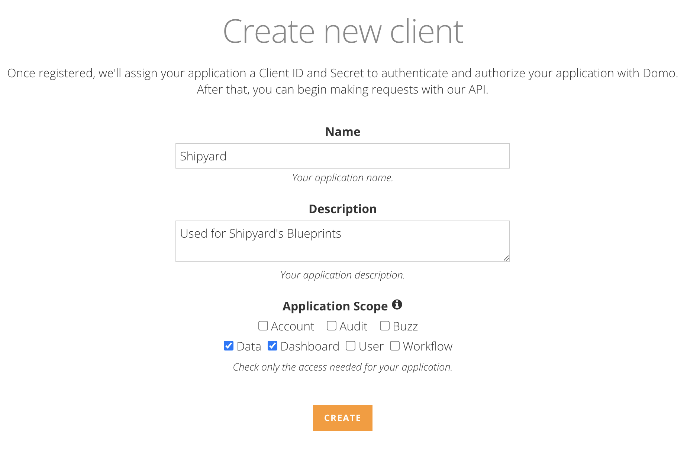
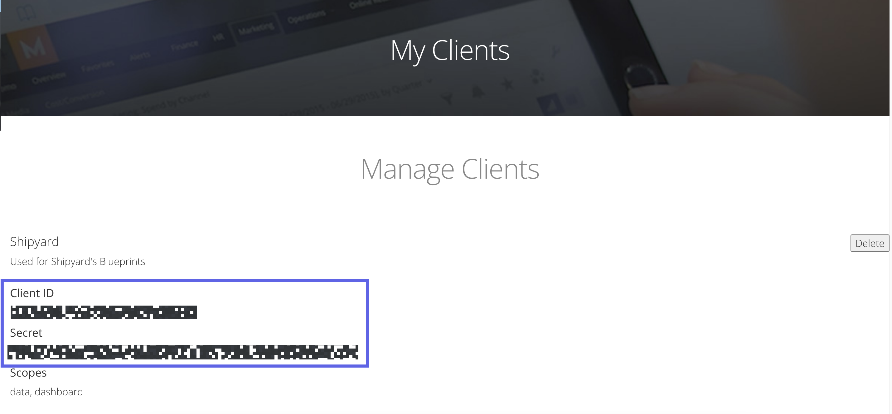
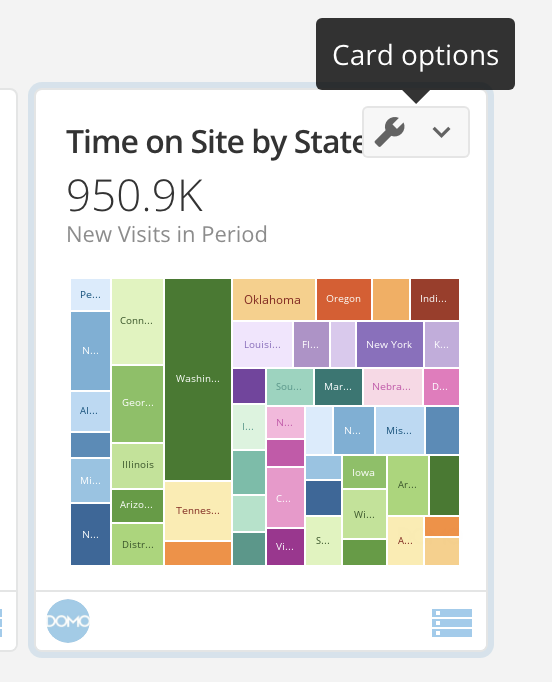
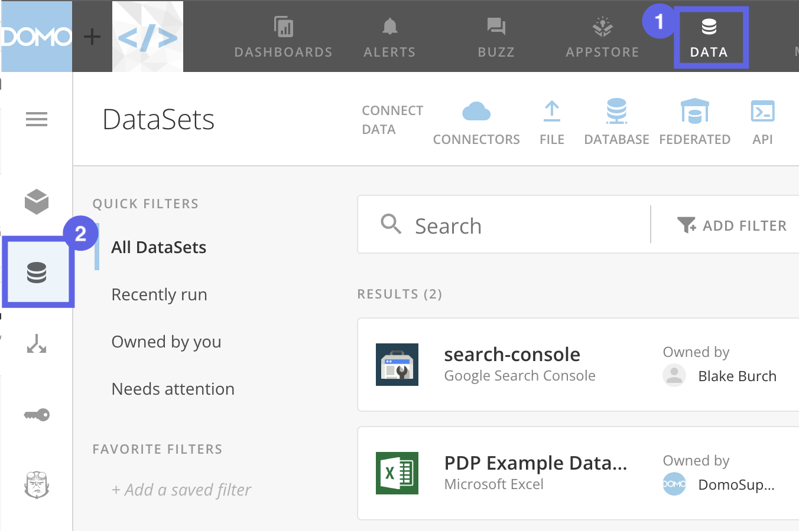

# Domo Authorization

## Create a Client ID and Secret Key

1. Navigate to the [Domo Developer Portal](https://developer.domo.com/)
2. Click **Log In** at the top.

3. Enter the Domo Domain that you use. 

4. Sign into your personal Domo account.

5. At the top, hover over **My Account** and click **New Client**

6. On the next screen, fill out the following details:
- Name as `Shipyard`
- Description as `Used for Shipyard's Blueprints`
- Select `Data` and `Dashboard` scopes.

7. Once complete, click **Create**. You'll be redirected to a new screen.
8. Store the **Client ID** and **Secret** found on this page.

## Finding the Domo Instance

Every URL on Domo is structured as https://DOMOINSTANCE.domo.com/

For example, if the full URL was https://shipyard-dev-123456.domo.com/explore, your Domo Instance would be `shipyard-dev-123456`.

## Finding the Card ID

When viewing a dashboard on Domo, hover over the card and click the **Card Options** button.

- If you select **Edit in Analyzer** you'll be taken to the Analyzer URL.
- If you select **Details** you'll be taken the the Card URL.

### In the Card URL

When viewing a card on Domo, the URL is structured as https://DOMOINSTANCE.domo.com/page/PAGEID/kpis/details/CARDID

For example, if the full URL was https://shipyard-dev-123456.domo.com/page/1381574491/kpis/details/1559003314, then your card ID would be `1559003314`

### In the Analyzer URL

When analyzing data on Domo, the URL can be structured as https://DOMOINSTANCE.domo.com/analyzer?pageId=PAGEID&cardid=CARDID

For example, if the full URL was https://shipyard-dev-123456.domo.com/analyzer?pageId=1381574491&cardid=1559003314, then your card ID would be `1559003314`

## Finding the Dataset ID

1. Go to the Datasets home page by clicking **Data** at the top and **DataSets** on the sidebar.

2. Click into one of the datasets.

### In the Dataset URL
When viewing a dataset on Domo, the URL can be structured as https://DOMOINSTANCE.domo.com/datasources/DATASETID/details/overview

For example, if the full URL was https://shipyard-dev-123456.domo.com/datasources/5cfaf249-0450-441e-8838-5b0949fcd8a6/details/overview then your dataset ID would be `1559003314`.