# Email Blueprints

## Authorization

### Google
In order to send an email from a Google account, you'll need to use an [application specific password](https://support.google.com/accounts/answer/185833?hl=en).

#### Create an Application Specific Password
1. Go to your [Google Account](https://myaccount.google.com/).

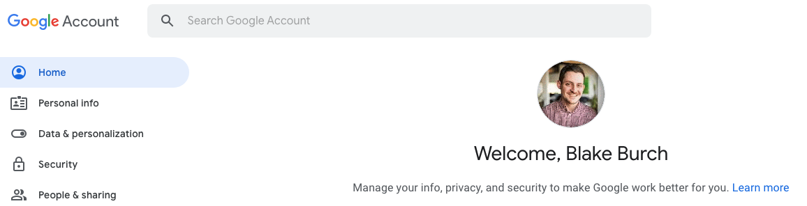

2. Select Security under the side bar. Under "Signing in to Google," select App Passwords. You may be asked to log in again.

If you don’t have this option, it might be because:
- 2-Step Verification is not set up for your account.
- 2-Step Verification is only set up for security keys.
- Your account is through work, school, or other organization.
- You turned on Advanced Protection.
3. At the bottom, click **Select app** and Custom. Name the app `Shipyard` or something easy to remember. Click **Generate**.

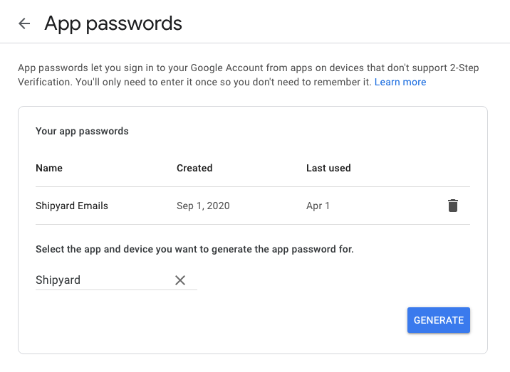

4. On the following screen, copy the app password, shown with a yellow background, to a secure location. This is the password that you'll need to use when sending emails from your Google account via Shipyard.

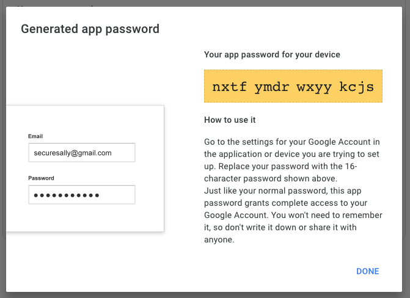

5. Click **Done** once you've saved the password. You'll never be able to see this password again.

#### Provide Inputs on Shipyard
We recommend the following settings for successfully sending an email with Google.

|Variable|Value|
|:--|:--|
|Send Method|TLS|
|SMTP Host|smtp.gmail.com|
|SMTP Port|587|
|Username|Your Google Account Email|
|Password|Your Application Specific Password|

### SendGrid

In order to send an email from SendGrid, you'll need to use a Sender Identity and an API Key.

#### Create a Sender Identity
1. Navigate to the [Sender Authentication](https://app.sendgrid.com/settings/sender_auth) page of your SendGrid account. 
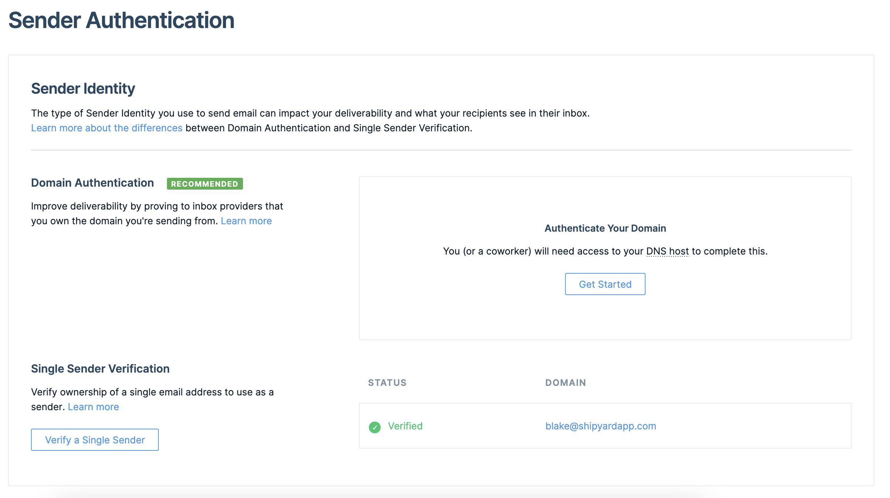
2. Follow the on-page instructions to either authenticate your domain, or verify a single sender address.

#### Create an API Key
1. Navigate to the [API Key](https://app.sendgrid.com/settings/api_keys) page of your SendGrid account.

2. Click **Create API Key**.

3. Name your API Key and select the level of access. At minimum, you will need Full Access to Mail Send. Click **Create & View** once finished.

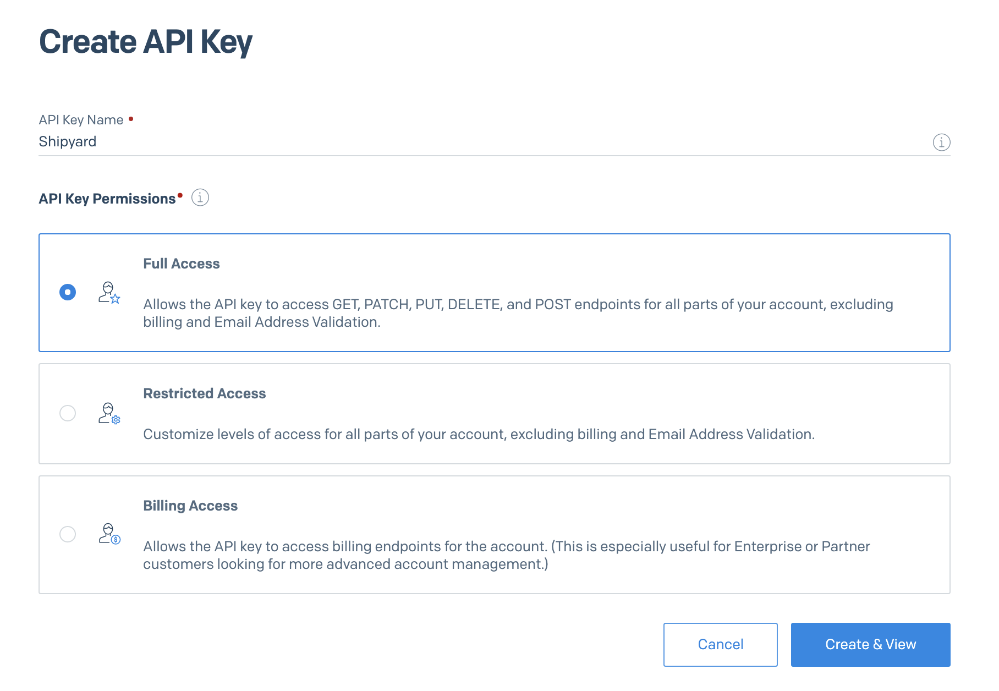
4. On the following screen, copy the API Key to a secure location. This is the password that you'll need to use when sending emails from your SendGrid account via Shipyard.

#### Provide Inputs on Shipyard
We recommend the following settings for successfully sending an email with Google.

|Variable|Value|
|:--|:--|
|Send Method|TLS|
|SMTP Host|smtp.sendgrid.net|
|SMTP Port|587|
|Username|apikey|
|Password|`<your-api-key>`|

:::note
The sender address should be the literal text `apikey`. The Password should be your actual api key (`SG.value`) NOT base64 encoded.
:::

### Outlook (Personal)

#### Provide Inputs on Shipyard

We recommend the following settings for successfully sending an email with Outlook.

|Variable|Value|
|:--|:--|
|Send Method|TLS|
|SMTP Host|smtp.office365.com|
|SMTP Port|587|
|Username|Your Microsoft Account Email|
|Password|Your Microsoft Account Password|

:::note
It's possible that you will run into authentication issues because Microsoft sees the attempted login as suspicious. You'll need to let Microsoft know to allow the login attempt.
:::

### Outlook (Office365 Business)

#### Enable SMTP Authentication
Follow [this guide](https://docs.microsoft.com/en-us/exchange/clients-and-mobile-in-exchange-online/authenticated-client-smtp-submission) to effectively allow for sending emails via SMTP.

#### Provide Inputs on Shipyard

We recommend the following settings for successfully sending an email with Outlook.

|Variable|Value|
|:--|:--|
|Send Method|TLS|
|SMTP Host|smtp.office365.com|
|SMTP Port|587|
|Username|Your Microsoft Account Email|
|Password|Your Microsoft Account Password|

:::note
It's possible that you will run into authentication issues because Microsoft sees the attempted login as suspicious. You'll need to let Microsoft know to allow the login attempt.
:::

### Amazon SES

#### Create an Identity
1. Navigate to the SES console within your AWS account.

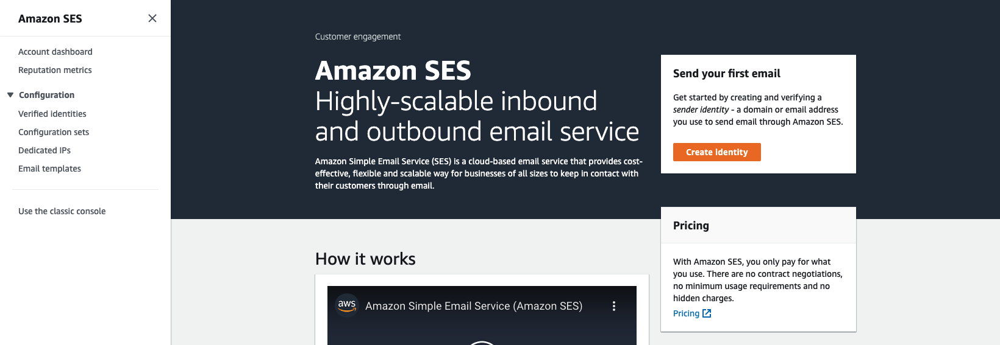

2. Click **Create Identity**
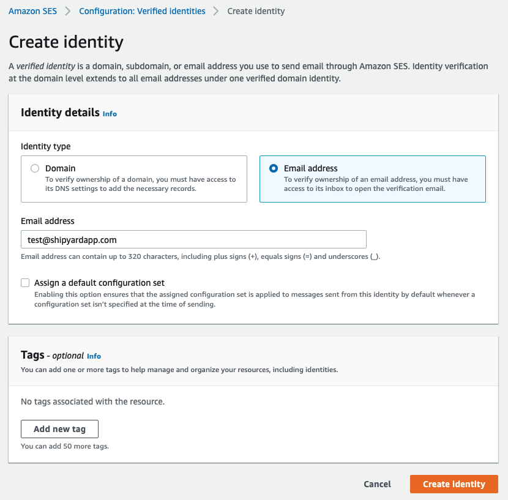
3. Create an identity by verifying a specific email address. You can also verify a domain if that suits your setup better.
   
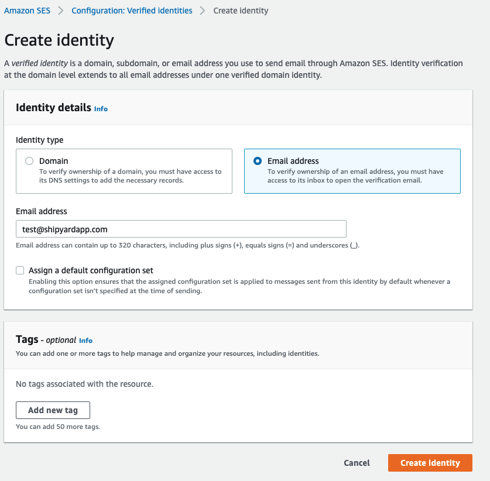

4. Navigate to your email and click the confirmation link to confirm that you have access to the right email.

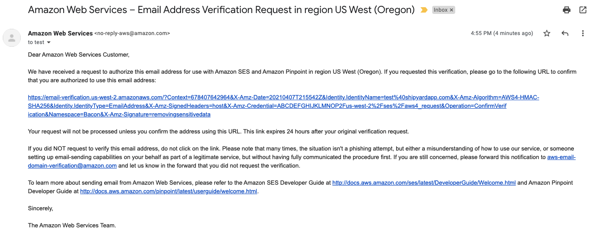

#### Create SMTP Credentials
1. Navigate to your Amazon SES Account dashboard and scroll to the bottom where it says Simple Mail Transfer Protocol (SMTP) settings.

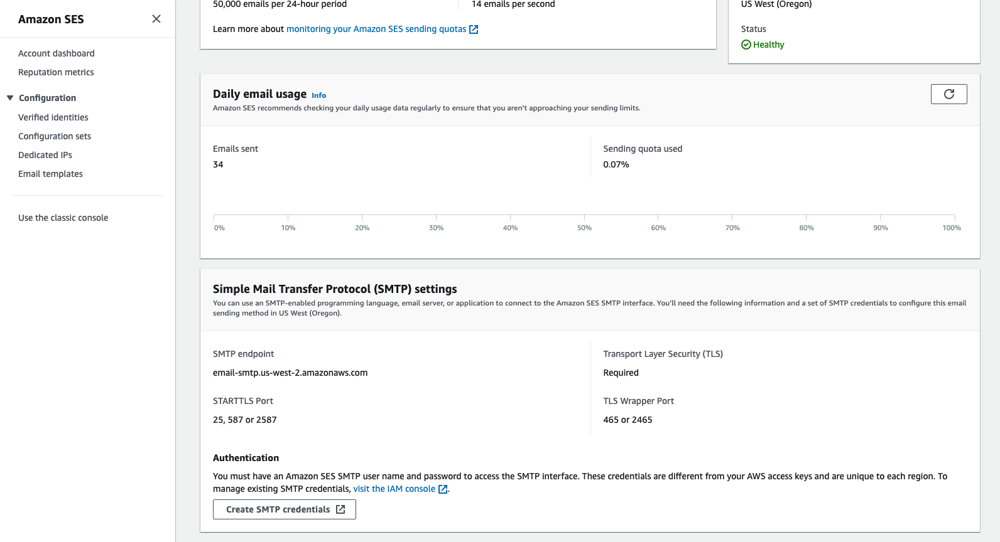

2. Click **Create SMTP credentials**.
3. Customize the IAM Username and click **Create** at the bottom.

4. Store the SMTP credentials somewhere secure.

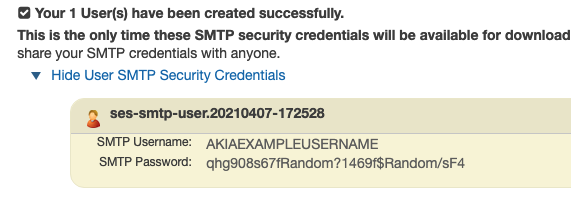

#### Provide Inputs on Shipyard

We recommend the following settings for successfully sending an email with Amazon SES.

|Variable|Value|
|:--|:--|
|Send Method|TLS|
|SMTP Host|email-smtp.us-west-2.amazonaws.com|
|SMTP Port|587|
|Username|SMTP Username|
|Password|SMTP Password|

:::note
If your SES instance is running in a region other than `us-west-2`, you'll want to use that region in the SMTP Host.
:::note

## Send Message Blueprint

### Overview

Send an email message to anyone in the world. 

A Vessel built with this Blueprint should never fail and will send a message every time it is run.

### Variables

|Variable Name|Required?|Description|
|:---|:---|:---|
|**Send Method**|✔️ | Determines how you want to send the email. Options are **TLS** and **SSL**. We generally suggest using **TLS** when possible.|
|**SMTP Host**|✔️ | The server where your email will be sent from. Usually formatted as `smtp.domain.com`|
|**SMTP Port**|✔️ |  The port from which your email will be sent. Commonly used ports are **25**, **465**, and **587**. We generally suggest using **587** with **TLS**.|
|**Username**| ✔️ | The username that your email provider uses to identify your access to send email.|
|**Password**|✔️ |  The password associated with your username.|
|**Sender Address**| ✔️ | The email address you want recipients to see when you send an email. We generally suggest keeping the sender address as your own email to ensure that you can appropriately receive replies. |
|**Sender Name**|➖ | The name you want users to see that the email is from. If left blank, the Sender Address will be used.|
|**To**|➖ | The email(s) that you want to send a message to. Can be comma-separated to include multiple email addresses.|
|**CC**|➖ | The email(s) that you want your message to be carbon copied (CCed) to. Can be comma-separated to include multiple email addresses.|
|**BCC**| ➖ |The email(s) that you want to be blind carbon copied (BCCed) to. Can be comma-separated to include multiple email addresses. Emails in this field will receive the email, but will not have their email exposed to all other recipients. |
|**Subject**|➖ | The subject of the email that you want to send. |
|**Message**| ✔️ |The body of the email, containing your main message. This field supports plain text as well as HTML.|
|**Include Shipyard Footer?**|➖ | Determines if a footer should be sent with the email that links back to the originating Vessel or Fleet.|

## Send Message Conditionally Blueprint

### Overview
Send a message via email conditionally by determining if a file exists or not. 

The [match type](https://www.shipyardapp.com/docs/reference/blueprint-library/match-type) selected greatly affects how this Blueprint works. If multiple files are found, the files will be compressed and zipped together.

Vessels built with this Blueprint should never fail, as the presence or lack or presence of the file only indicates whether or not the message should be sent. 

Works primarily when used as part of a Fleet, where a File can be generated or downloaded by an upstream Vessel.

### Variables
|Variable Name|Required?|Description|
|:---|:---|:---|
|**Send Method**|✔️ | Determines how you want to send the email. Options are **TLS** and **SSL**. We generally suggest using **TLS** when possible.|
|**SMTP Host**|✔️ | The server where your email will be sent from. Usually formatted as `smtp.domain.com`|
|**SMTP Port**|✔️ |  The port from which your email will be sent. Commonly used ports are **25**, **465**, and **587**. We generally suggest using **587** with **TLS**.|
|**Username**| ✔️ | The username that your email provider uses to identify your access to send email.|
|**Password**|✔️ |  The password associated with your username.|
|**Sender Address**| ✔️ | The email address you want recipients to see when you send an email. We generally suggest keeping the sender address as your own email to ensure that you can appropriately receive replies. |
|**Sender Name**|➖ | The name you want users to see that the email is from. If left blank, the Sender Address will be used.|
|**To**|➖ | The email(s) that you want to send a message to. Can be comma-separated to include multiple email addresses.|
|**CC**|➖ | The email(s) that you want your message to be carbon copied (CCed) to. Can be comma-separated to include multiple email addresses.|
|**BCC**| ➖ |The email(s) that you want to be blind carbon copied (BCCed) to. Can be comma-separated to include multiple email addresses. Emails in this field will receive the email, but will not have their email exposed to all other recipients. |
|**Subject**|➖ | The subject of the email that you want to send. |
|**Message**| ✔️ |The body of the email, containing your main message. This field supports plain text as well as HTML.|
|**Send Message Only When**| ✔️ |Determines what condition needs to be met for a message to send.    **File(s) Exist**  - Send the message only if a file can be found using the provided `folder/filename.ext` combination.    **File(s) Don't Exist**  - Send the message only if a file **cannot** found using the provided `folder/filename.ext` combination.|
|**File Name**|✔️ | Name of the target file on Shipyard. Can be regex if "Match Type" is set accordingly|
|**Folder Name**|➖ |Name of the local folder on Shipyard to upload the target file from. If left blank, will look in the home directory.|
|**File Name Match Type**|✔️ |Determines if the text in "File Name" will look for one file with exact match, or multiple files using regex.|
|**Include Shipyard Footer?**|➖ | Determines if a footer should be sent with the email that links back to the originating Vessel or Fleet.|

## Send Message with File Blueprint

### Overview
Send a message with a file attachment to anyone in the world.

The [match type](https://www.shipyardapp.com/docs/reference/blueprint-library/match-type) selected greatly affects how this Blueprint works. If multiple files are found, the files will be compressed and zipped together.

Works primarily when used as part of a Fleet, where a File can be generated or downloaded by an upstream Vessel.

This Blueprint is similar to **Send Message Conditionally** except that it returns an error if a file cannot be found, since the entire objective is to send the file.

### Variables
|Variable Name|Required?|Description|
|:---|:---|:---|
|**Send Method**|✔️ | Determines how you want to send the email. Options are **TLS** and **SSL**. We generally suggest using **TLS** when possible.|
|**SMTP Host**|✔️ | The server where your email will be sent from. Usually formatted as `smtp.domain.com`|
|**SMTP Port**|✔️ |  The port from which your email will be sent. Commonly used ports are **25**, **465**, and **587**. We generally suggest using **587** with **TLS**.|
|**Username**| ✔️ | The username that your email provider uses to identify your access to send email.|
|**Password**|✔️ |  The password associated with your username.|
|**Sender Address**| ✔️ | The email address you want recipients to see when you send an email. We generally suggest keeping the sender address as your own email to ensure that you can appropriately receive replies. |
|**Sender Name**|➖ | The name you want users to see that the email is from. If left blank, the Sender Address will be used.|
|**To**|➖ | The email(s) that you want to send a message to. Can be comma-separated to include multiple email addresses.|
|**CC**|➖ | The email(s) that you want your message to be carbon copied (CCed) to. Can be comma-separated to include multiple email addresses.|
|**BCC**| ➖ |The email(s) that you want to be blind carbon copied (BCCed) to. Can be comma-separated to include multiple email addresses. Emails in this field will receive the email, but will not have their email exposed to all other recipients. |
|**Subject**|➖ | The subject of the email that you want to send. |
|**Message**| ✔️ |The body of the email, containing your main message. This field supports plain text as well as HTML.|
|**File Name**|✔️ | Name of the target file on Shipyard. Can be regex if "Match Type" is set accordingly|
|**Folder Name**|➖ |Name of the local folder on Shipyard to upload the target file from. If left blank, will look in the home directory.|
|**File Name Match Type**|✔️ |Determines if the text in "File Name" will look for one file with exact match, or multiple files using regex.|
|**Include Shipyard Footer?**|➖ | Determines if a footer should be sent with the email that links back to the originating Vessel or Fleet.|

## Troubleshooting

### Authentication Error

`smtplib.SMTPAuthenticationError`

 When this error occurs, the combination of username and password that you provided could not be verified by the SMTP Server. There are a few reasons why this error might occur:
1. You have a typo in your username.
2. You have a typo in your password.
3. You aren't using the correct SMTP Server.
4. The credentials you've provided don't have the right level of access to send an email via SMTP.

## Helpful Links

- [Google SMTP Support](https://support.google.com/a/answer/176600?hl=en)
- [Outlook SMTP Support](https://support.microsoft.com/en-us/office/pop-imap-and-smtp-settings-for-outlook-com-d088b986-291d-42b8-9564-9c414e2aa040)
- [SendGrid SMTP Support](https://sendgrid.com/docs/for-developers/sending-email/integrating-with-the-smtp-api/)
- [Amazon SES SMTP Support](https://docs.aws.amazon.com/ses/latest/DeveloperGuide/send-an-email-using-smtp.html)