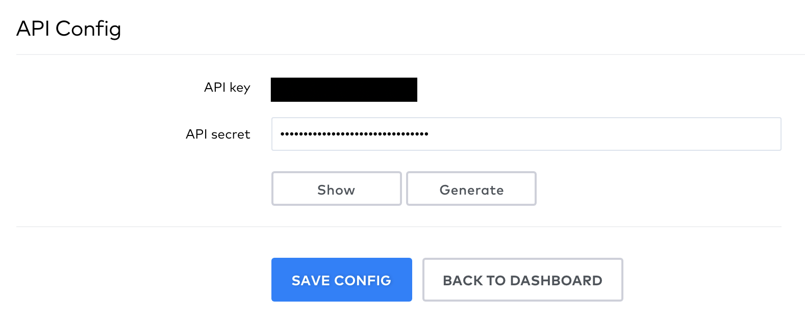
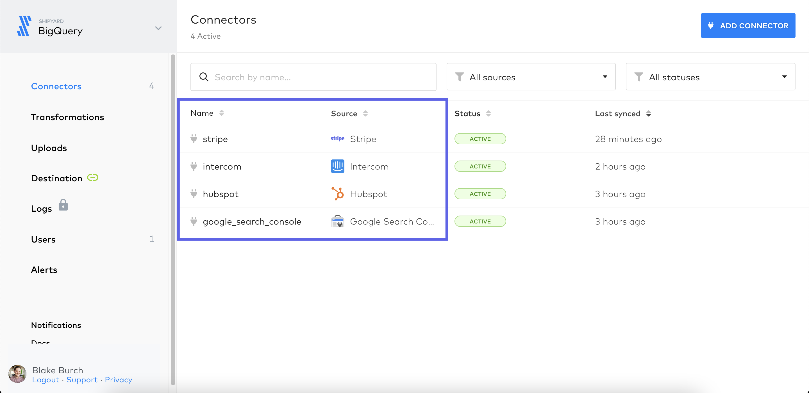
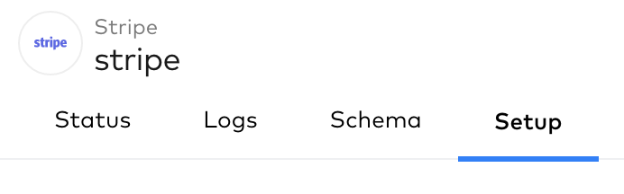
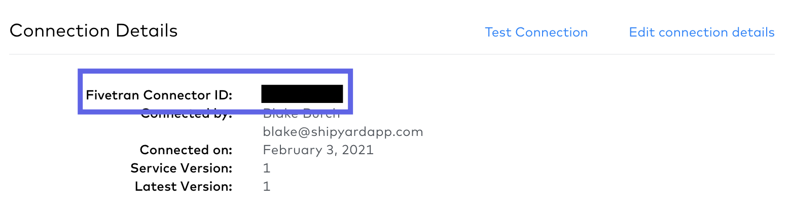

# Fivetran Authorization

To get started with any Fivetran Blueprints, you will need to generate an API Key and know how to find a connector ID. The API Key is a secure way for Shipyard to access Fivetran. The Connector ID is a unique generated ID attached to each connector. These two pieces of information will be required for **every** Fivetran Blueprint.

## Generate an API Key

1. Navigate to the [Settings Tab](https://fivetran.com/account/settings) of your Account.
2. Scroll down to the API Config Section. Select an option to generate a Key. If you already have a key, skip to the next step.

3. Copy both the API Key and the API Secret somewhere safe.

## Get the Connector ID
1. Navigate to the [Connectors page](https://fivetran.com/dashboard/connectors) of your dashboard.
2. Click on the connector you want to get the ID of.

3. Click the setup tab at the top.

4. Copy down the value under Fivetran Connector ID. This will typically be two words separated by an underscore. e.x. (`lively_planted`)
