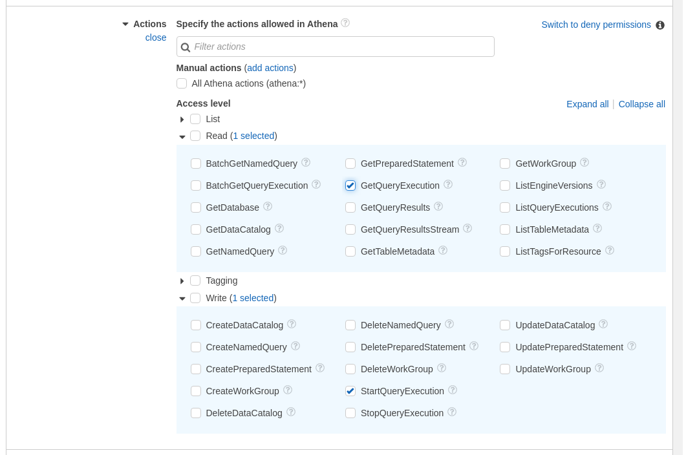
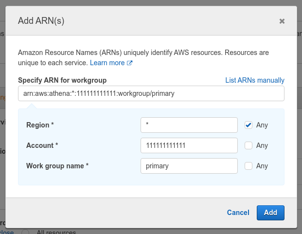

# Google BigQuery Blueprints

## Authorization

### Overview

In order to get started with the Google BigQuery Blueprints, a service account with the necessary GCP permissions is required.

### Steps

- iam & admin in sidebar
- click "service accounts" in sidebar
- click "+ create service account" header
- add "service account name" value
	- id generated (don't change)
- optionally add description
- click "create and continue"
- "select a role" dropdown
- find "bigquery"
- select "bigquery user"
- click "+ add another role"
- find "cloud storage"
- select "storage object creator"
- click "continue"
- skip "grant users access to this service account"
- click "done"
- find new service account in table
- under "actions" column select "manage keys"
- under "add key" dropdown
- click "create new key"
- for "key type" select "json"
- click "create"
- copy downloaded json file contents
- add to "service account" inputs field on all bigquery blueprints

<!-- 
1. Login to your [AWS Management Console](https://aws.amazon.com/console/)  
2. Search for and go to the IAM service page  
	  
3. Select "Policies" on the left sidebar  
	  
4. Click the blue "Create policy" button  
5. Select the "Visual editor" tab  
6. Add required Athena permissions  
	a. On the "Service" dropdown, search for and select "Athena"  
		  
	b. On the "Actions" dropdown  
		i. Under "Read" select "GetQueryExecution"  
		ii. Under "Write" select "StartQueryExecution"  
		  
	c. On the "Resources" dropdown, click "Add ARN"  
		i. Add your region ID and workgroup name or select "Any" for both options - this example, the region has been set to `"*"` and the workgroup set to `"primary"`  
		  
	d. Skip the "Request Conditions" dropdown  
	e. Click "Add additional permissions" to add the next set of permissions  
 -->

### Notes

- Creating [service accounts](https://cloud.google.com/iam/docs/creating-managing-service-accounts)
- Creating [service account keys](https://cloud.google.com/iam/docs/creating-managing-service-account-keys)

## Execute Query Blueprint

### Overview

The **Google BigQuery - Execute Query** Blueprint allows users to run arbitrary queries against BigQuery.

### Variables

| Variable Name | Description |
|:---|:---|
| **Query** | [REQUIRED] The query to run against the BigQuery database |
| **Service Account** | [REQUIRED] The JSON from a Google Cloud Service account key - see **Authorization** above for more information |

## Store Query Results as CSV Blueprint

### Overview

The **Google BigQuery - Store Query Results as CSV** Blueprint allows users to run arbitrary queries against BigQuery and store the CSV output in the Shipyard Vessel.

### Variables

| Variable Name | Description |
|:---|:---|
| **Query** | [REQUIRED] The query to run against the BigQuery database |
| **Local File Name** | [REQUIRED] Name of file to be generated with the results which should be a `.csv` extension. |
| **Local Folder Name** | The optional folder name to store the results file in |
| **Service Account** | [REQUIRED] The JSON from a Google Cloud Service account key - see **Authorization** above for more information |

## Store Query Results in Google Cloud Storage Blueprint

### Overview

The **Google BigQuery - Store Query Results in Google Cloud Storage** Blueprint allows users to run arbitrary queries against BigQuery and store them in Google Cloud Storage (GCS).

### Variables

| Variable Name | Description |
|:---|:---|
| **Query** | [REQUIRED] The query to run against the BigQuery database |
| **Bucket Name** | [REQUIRED] Name of the GCS bucket to store the results file in |
| **Bucket File Name** | [REQUIRED] Name of file to be generated with the results which should be a `.csv` extension |
| **Bucket Folder Name** | The optional folder name to store the results file in |
| **Service Account** | [REQUIRED] The JSON from a Google Cloud Service account key - see **Authorization** above for more information |

## Upload CSV to Table Blueprint

### Overview

The **Google BigQuery - Upload CSV to Table** Blueprint allows users to upload a CSV file to a BigQuery table.

### Variables

| Variable Name | Description |
|:---|:---|
| **Dataset Name** | [REQUIRED] The name of the dataset to be uploaded to BigQuery |
| **Table Name** | [REQUIRED] The name of the BigQuery table to upload the dataset to |
| **Local File Name Match Type** | [REQUIRED] A dropdown selection of how to match the file name |
| **Local File Name** | [REQUIRED] The name of the CSV file containing data to upload to BigQuery |
| **Local Folder Name** | The optional local folder name where the CSV file to upload is stored |
| **Upload Method** | [REQUIRED] A dropdown selection for how to upload the data to BigQuery |
| **Service Account** | [REQUIRED] The JSON from a Google Cloud Service account key - see **Authorization** above for more information |
| **Schema** | The schema for the uploaded dataset - if not provided it will be auto-detected |
| **Header Rows to Skip** | Number of header rows to skip when inserting data - only required if provided custom schema. |

## Helpful Links

[Google Bigquery Python Library Documentation](https://cloud.google.com/bigquery/docs/reference/libraries) [Pandas to_sql Method](https://pandas.pydata.org/pandas-docs/stable/reference/api/pandas.DataFrame.to_sql.html)
