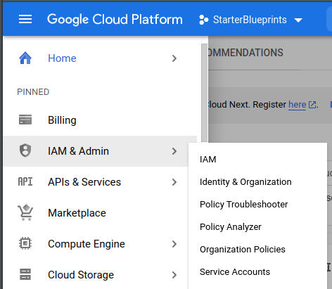
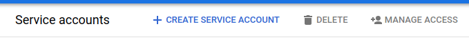
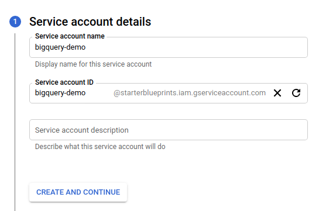
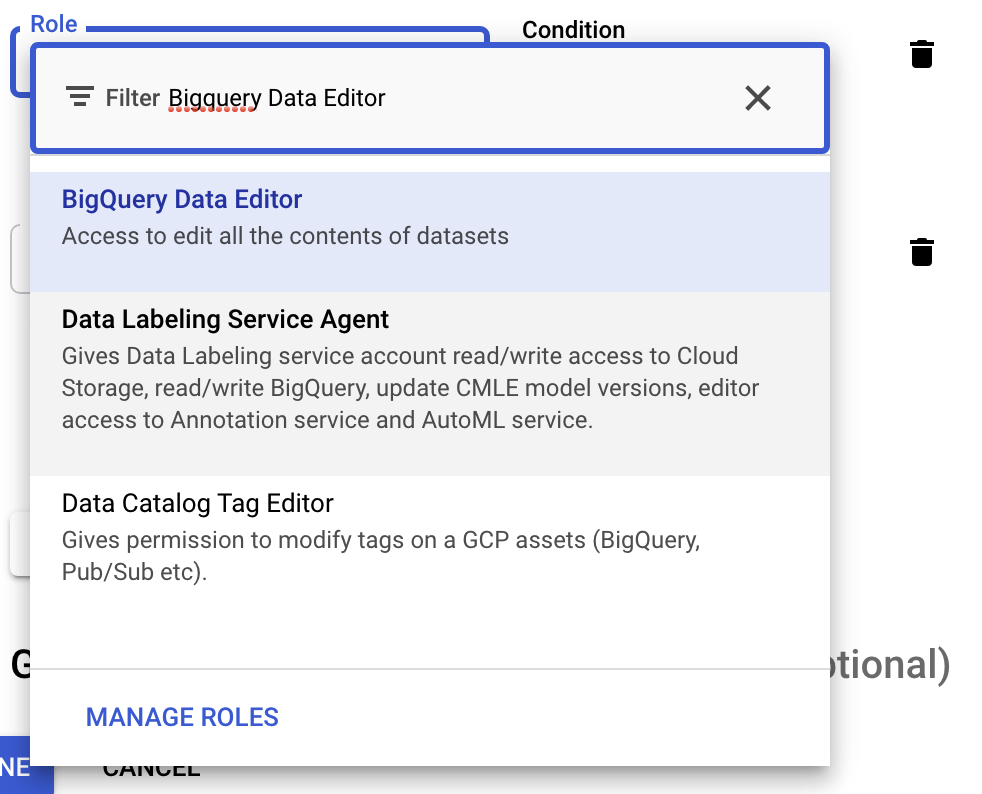
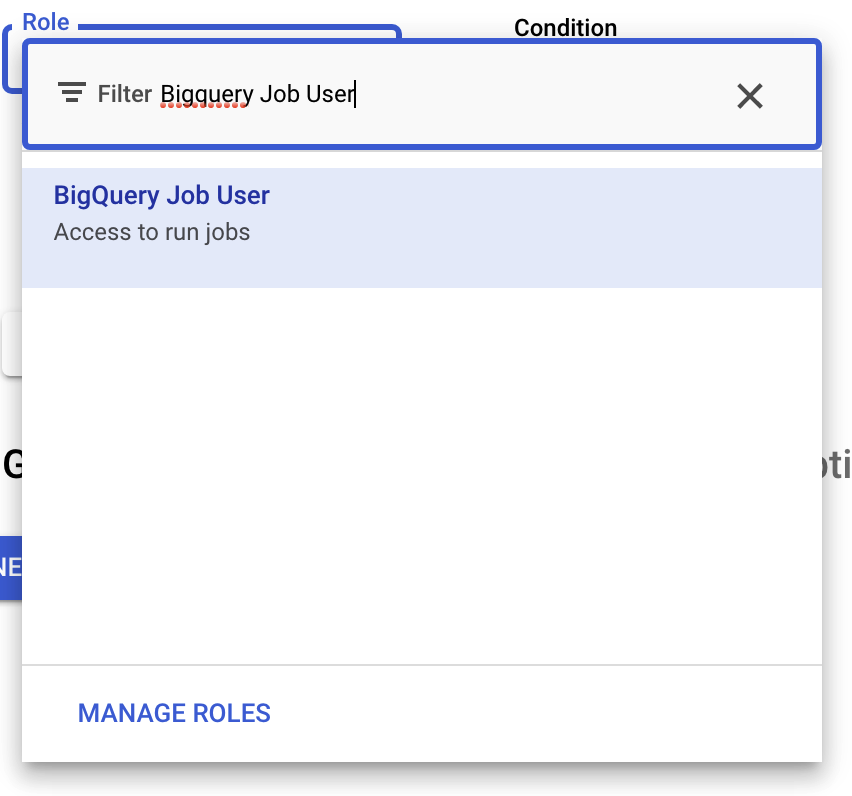
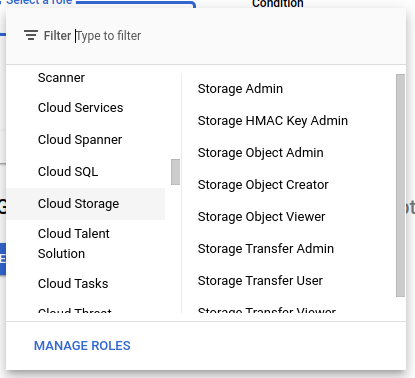
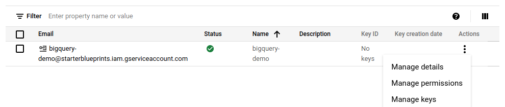
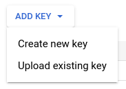

# Google BigQuery Authorization

In order to get started with the Google BigQuery Blueprints, a service account with the necessary GCP permissions is required. All BigQuery Blueprints are still subject to [BigQuery quotas and limits](https://cloud.google.com/bigquery/quotas#queries).

## Creating a BigQuery Service Account

1. Login to your [GCP console](https://console.cloud.google.com/)
2. Using the top selector, choose the Project where your BigQuery Instance lives.  

3. Open the sidebar and select "**IAM & Admin**"  
	  
3. Click "**Service Accounts**" in the options  
4. Click "**+ CREATE SERVICE ACCOUNT**"  
	  
5. Add a service account name  
	a. Do not edit the ID field which will auto-populate  
	b. Optionally add a description to the service account  
	  
6. Click "**CREATE AND CONTINUE**"  
7. Click "**Select a role**" dropdown  
	
	a. Search for and select "**BigQuery Data Editor**"  
	
	b. "Click "+ ADD ANOTHER ROLE"  
	c. Search for and select "**BigQuery Job User**"  
	
	:::info
	If you want to use our "Store Query Results in Google Cloud Storage" Blueprint, you will also need to:
	
	a. "Click "+ ADD ANOTHER ROLE"  
	b. Click the "**Select a role**" dropdown  
	c. Search for and select **Storage Object Admin**  
	
	:::  

8. Click "**CONTINUE**"  
9. Click "**DONE**"  
10. Find the new service on the service accounts table  
	a. Click the menu dots under the "Actions" column  
	b. Click "**Manage keys**"  
	  
11. On the Keys page click the "**ADD KEY**" dropdown  
12. Click "**Create new key**"  
	  
13. In the popup modal select the "**JSON**" radio button  
14. Click "**CREATE**"  
15. Copy the downloaded file JSON contents and save for safe keeping. The contents of this file can be pasted into the "**Service Account**" input for all BigQuery Blueprints.
