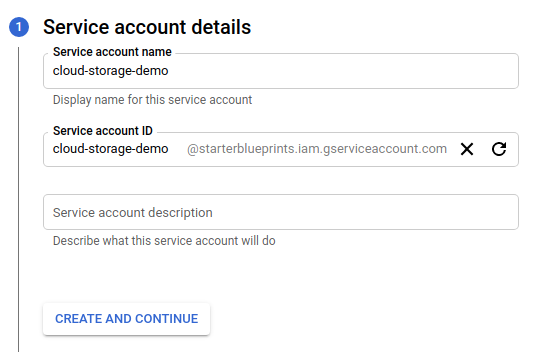
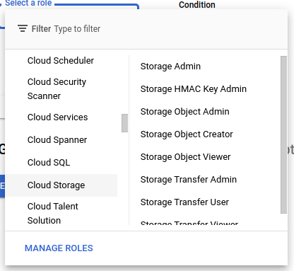
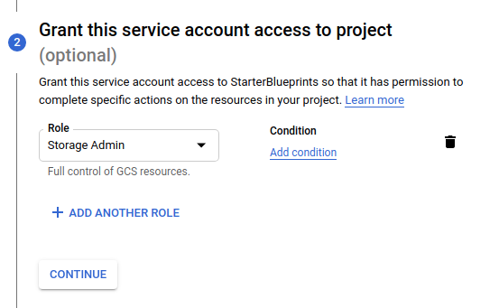
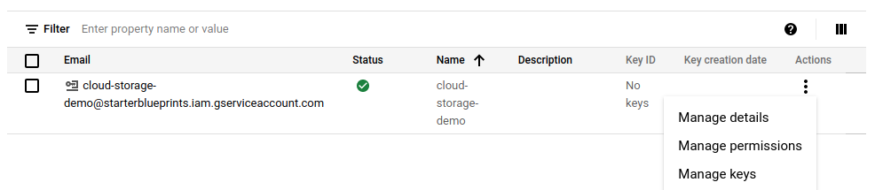

# Google Cloud Storage Blueprints

## Authorization

### Overview

In order to get started with the Google Cloud Storage Blueprints, a service account with the necessary GCP permissions is required.

### Steps

1. Login to your [GCP console](https://console.cloud.google.com/)  
2. Hover over "IAM & Admin" in the sidebar  
	  
3. Click "Service Accounts" in the options  
4. Click "+ CREATE SERVICE ACCOUNT"  
	  
5. Add a service account name  
	a. Do not edit the ID field which will auto-populate  
	b. Optionally add a description to the service account  
	  
6. Click "CREATE AND CONTINUE"  
7. Click "Select a role" dropdown  
	a. Scroll down the options and hover over "Cloud Storage"  
	b. Select "Storage Object Admin"  
	  
8. Click "CONTINUE"  
	  
10. Click "DONE"  
11. Find the new service on the service accounts table  
	a. Click the menu dots under the "Actions" column  
	b. Click "Manage keys"  
	  
12. On the Keys page click the "ADD KEY" dropdown  
13. Click "Create new key"  
	  
14. In the popup modal select "JSON"  
15. Click "CREATE"  
16. Copy the downloaded file JSON contents and use in the "Service Account" variable input in the Blueprints (see **Variables** sections below)  

## Download Files Blueprint

### Overview

The **Google Cloud Storage - Download Files** Blueprint allows users to quickly export one or more files from a Google Cloud Storage (GCS) bucket.

### Variables

| Variable Name | Description |
|:---|:---|
| **Bucket Name** | [REQUIRED] Name of the GCS bucket to fetch the file from |
| **GCS Folder Name** | Folder in the GCS bucket to fetch the file from |
| **GCS File Name Match Type** | [REQUIRED] Dropdown selection of how to match the file name |
| **GCS File Name** | [REQUIRED] Name for the file stored in GCS |
| **Local Folder Name** | Folder name to store the fetched file in |
| **Local File Name** | [REQUIRED] Name for the file when fetched locally into the Shipyard Vessel |
| **Service Account** | [REQUIRED] JSON from a Google Cloud Service account key - see **Authorization** above for more information |

## Upload Files Blueprint

### Overview

The **Google Cloud Storage - Upload Files** Blueprint allows users to easily import one or more files directly into a Google Cloud Storage (GCS) bucket, no matter how big they are.

### Variables

| Variable Name | Description |
|:---|:---|
| **Local Folder Name** | Folder name to store the fetched file in |
| **Local File Name Match Type** | [REQUIRED] Dropdown selection of how to match the file name |
| **Local File Name** | [REQUIRED] Name for the file when fetched locally into the Shipyard Vessel |
| **GCS Bucket Name** | [REQUIRED] Name of the GCS bucket to fetch the file from |
| **GCS Folder Name** | Folder in the GCS bucket to fetch the file from |
| **GCS File Name** | [REQUIRED] Name for the file stored in GCS |
| **Service Account** | [REQUIRED] JSON from a Google Cloud Service account key - see **Authorization** above for more information |

## Helpful Links

[Google Cloud Storage Python Documentation](https://cloud.google.com/storage/docs/reference/libraries#client-libraries-install-python)
