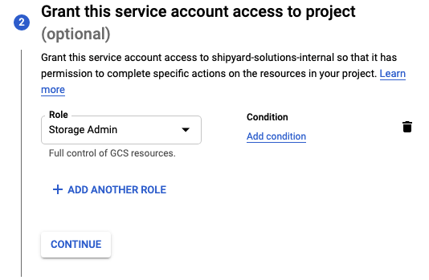

# Google Cloud Storage Authorization

In order to get started with the Google Cloud Storage Blueprints, a service account with the necessary GCP permissions is required.

## Creating a Service Account for Google Cloud Storage (GCS)

1. Login to your [GCP console](https://console.cloud.google.com/)  
2. Using the top selector, choose the Project where your Google Cloud Storage bucket lives.  

3. Hover over "**IAM & Admin**" in the sidebar  
	  
3. Click "**Service Accounts**" in the options  
4. Click "**+ CREATE SERVICE ACCOUNT**"  
	  
5. Add a service account name  
	a. Do not edit the ID field which will auto-populate  
	b. Optionally add a description to the service account  
	  
6. Click "**CREATE AND CONTINUE**"  
7. Click "**Select a role**" dropdown  
	a. Scroll down the options and hover over "**Cloud Storage**"  
	b. Select "**Storage Admin**"  
	  
8. Click "**CONTINUE**"  
	
9.  Click "**DONE**"  
10. Find the new service on the service accounts table  
	a. Click the menu dots under the "Actions" column  
	b. Click "**Manage keys**"  
	  
12. On the Keys page click the "**ADD KEY**" dropdown  
13. Click "**Create new key**"  
	  
14. In the popup modal select "**JSON**"  
15. Click "**CREATE**"  
16. Copy the downloaded file JSON contents and save for safe keeping. The contents of this file can be pasted into the "**Service Account**" input for all Google Cloud Storage Blueprints.  