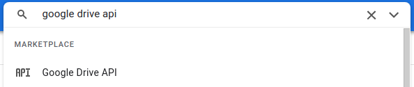
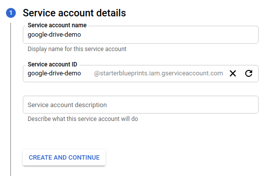
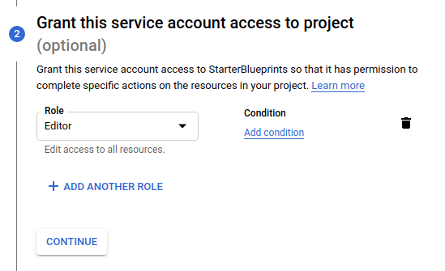
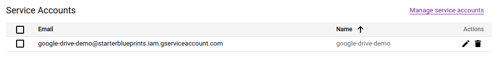
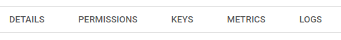

# Google Drive Blueprints

## Authorization

### Overview

In order to get started with the Google Drive Blueprints, a service account with the necessary GCP permissions is required.

### Steps

1. Login to your [GCP console](https://console.cloud.google.com/)  
2. Search for "Google Drive API" in the search bar  
	  
3. Click "ENABLE"  
4. Click "CREATE CREDENTIALS"  
5. For "Which API are you using?" in the "Select an API" dropdown select "Google Drive API"  
6. For "What data will you be accessing?" select the "Application data" radio button  
7. For "Are you planning to use this API with Compute Engine, Kubernetes Engine, App Engine, or Cloud Functions?" select the "No, I'm not using them" radio button  
8. Click "NEXT"  
9. Add a service account name  
	a. Do not edit the ID field which will auto-populate  
	b. Optionally add a description to the service account  
	  
10. Click "CREATE AND CONTINUE"  
11. Click "Select a role" dropdown  
	a. Scroll down the options and hover over "Basic"  
	b. Select "Editor"  
	  
12. Click "CONTINUE"  
13. Click "DONE"  
14. Find the new service on the service accounts table  
	a. Click the edit icon under the "Actions" column  
	  
15. Click "KEYS" tab  
	  
16. On the Keys page click the "ADD KEY" dropdown  
17. Click "Create new key"  
	  
18. In the popup modal select "JSON"  
19. Click "CREATE"  
20. Copy the downloaded file JSON contents and use in the "Service Account" variable input in the Blueprints (see **Variables** sections below)  

## Download Files Blueprint

### Overview

The **Google Drive - Download Files** Blueprint allows users to quickly export one or more files from their Google Drive account.

### Variables

| Variable Name | Description |
|:---|:---|
| **Google Drive Folder Name** | Folder in Google Drive to fetch the file from |
| **Google Drive File Name** | [REQUIRED] Name of the file stored in Google Drive |
| **Google Drive File Name Match Type** | [REQUIRED] Dropdown selection of how to match the file name |
| **Local Folder Name** | Folder name to store the fetched file in |
| **Local File Name** | Name for the file when fetched locally into the Shipyard Vessel |
| **Shared Drive Name** | Shared Drive name - should only be provided if the file exists in a shared Drive |
| **Service Account Credentials** | [REQUIRED] JSON from a Google Cloud Service account key - see **Authorization** above for more information |

## Upload Files Blueprint

### Overview

The **Google Drive - Upload Files** Blueprint allows users to easily import one or more files directly into their Google Drive account.

### Variables

| Variable Name | Description |
|:---|:---|
| **Local File Name** | [REQUIRED] Name for the local file in the Shipyard Vessel to upload to Google Drive |
| **Local File Name Match Type** | [REQUIRED] Dropdown selection of how to match the file name |
| **Local Folder Name** | Folder name the file to upload is stored in |
| **Shared Drive Name** | Shared Drive name - should only be provided if the file will be uploaded to a shared Drive |
| **Google Drive Folder Name** | Folder in Google Drive to store the file in |
| **Google Drive File Name** | Name for the file stored in Google Drive |
| **Service Account Credentials** | [REQUIRED] JSON from a Google Cloud Service account key - see **Authorization** above for more information |

## Helpful Links

[Google Drive API Python Documentation](https://developers.google.com/drive/api/v3/quickstart/python)
