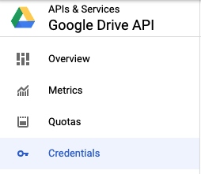
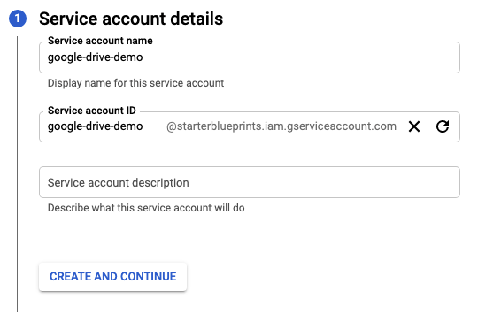
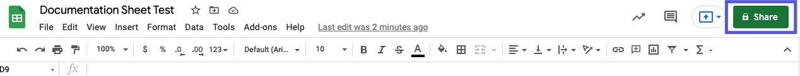
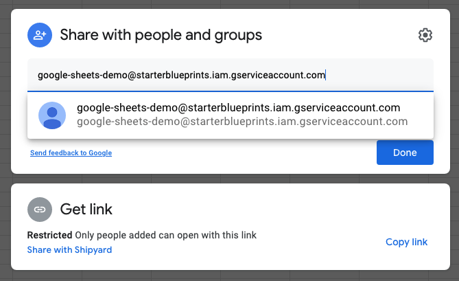
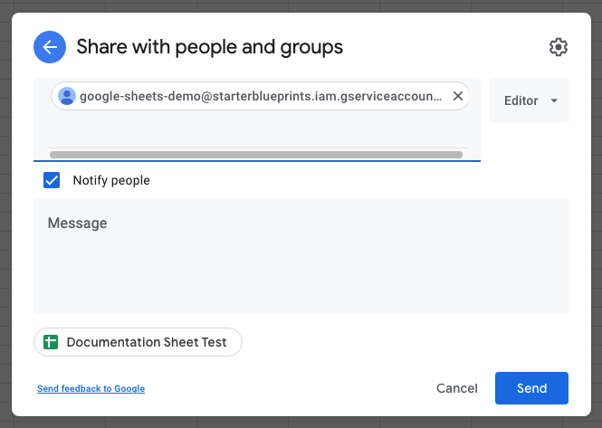
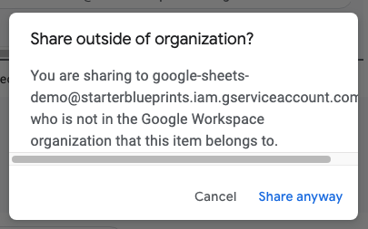

# Google Drive Blueprints

## Authorization

### Overview

In order to get started with the Google Drive Blueprints, a service account with the necessary GCP permissions is required. Additionally, this Service account will need to be invited to any files or folders you wish to access programatically.

### Creating a Service Account for Google Drive

1. Login to your [GCP console](https://console.cloud.google.com/)  
2. Using the top selector, choose the Project where you want your Google Drive service account to live.  

3. Search for "**Google Drive API**" in the search bar  
	  
3. Depending on your existing setup, either click "**ENABLE**" or "**MANAGE**"
4.  Click "**Credentials**" in the sidebar  
	 
5. Click "**+ CREATE CREDENTIALS**" and select "**Service account**" from the options  
	  
6. Add a service account name  
	a. Do not edit the ID field which will auto-populate  
	b. Optionally add a description to the service account  
	
7. Click "**CREATE AND CONTINUE**"  
8.  Click "Select a role" dropdown  
	a. Scroll down the options and hover over "Basic"  
	b. Select "Editor"  
	  
12. Click "**CONTINUE**"  
13. Click "**DONE**"  
14. Find the new service on the service accounts table  
	a. Click the pencil icon under the "Actions" column to edit  
	  
15. Click the "**KEYS**" tab  
	  
16. On the Keys tab click the "**ADD KEY**" dropdown and click "**Create new key**"  
	  
1.  In the popup modal select "**JSON**"  
2.  Click "**CREATE**"  
3.  Copy the downloaded file JSON contents and save for safe keeping. The contents of this file can be pasted into the "**Service Account**" input for all Google Drive Blueprints. 

### Inviting a Service Account to a Google Drive File

1. Navigate to the [credentials page](https://console.cloud.google.com/apis/api/drive.googleapis.com/credentials) for the Google Drive API. 
2. In the table shown, copy the email/name of the service account you want to use. It should be formatted like `name@project.iam.gserviceaccount.com`
  
:::note
This value can also be found either be found under "client_email" in the Service Account JSON.
:::
3. Navigate to the file you're wanting to use.
4. Click the Share button.

5. Paste the email of the service account from step 2 and click the email option that appears (or press Enter)  

6. Ensure that the Service Account email has Editor access.
7. Click "**Send**".

8. Click "**Share anyway**"  

9. Now you can start using any of our Blueprints with that file!

:::info Pro Tip
Want to access multiple files with the same credentials? You can also share Google Drive folders with the Service Account Email, causing every file in that folder and its subfolders to be accessible.
:::

## Download Files Blueprint

### Overview

Quickly export one or more files from your Google Drive account. The [match type](../reference/blueprint-library/match-type.md) selected greatly affects how this Blueprint works.

### Variables

| Variable Name |Required?| Description |
|:---|:---|:--|
| **Google Drive Folder Name** |➖ | Name of the folder where the file is stored in Google Drive. Leaving blank will place the file in the root directory of Google Drive which is inaccessible from the UI. |
| **Google Drive File Name Match Type** | ✔️ | Determines if the text in "Google Drive File Name" will look for one file with exact match, or multiple files using regex. |
| **Google Drive File Name** | ✔️ | Name of the target file in Google Drive. Can be regex if "Match Type" is set accordingly. |
| **Local Folder Name** | ➖ |Folder where the file(s) should be downloaded. Leaving blank will place the file in the home directory. |
| **Local File Name** |➖ | What to name the file(s) being downloaded. If left blank, defaults to the original file name(s). |
| **Shared Drive Name** | ➖ |Name of the Shared Drive the sheet exists in. This field is case sensitive. Leave blank if the file does not exist in a Shared Drive.|
| **Service Account** | ✔️ |JSON from a Google Cloud Service account key. |

## Upload Files Blueprint

### Overview

Easily import one or more files directly into a Google Drive account. The [match type](../reference/blueprint-library/match-type.md) selected greatly affects how this Blueprint works.

### Variables

| Variable Name | Required? | Description |
|:---|:---|:---|
| **Local File Name** | ✔️ | Name of the target file on Shipyard. Can be regex if "Match Type" is set accordingly. |
| **Local File Name Match Type** | ✔️ | Determines if the text in "Local File Name" will look for one file with exact match, or multiple files using regex. |
| **Local Folder Name** | ➖ |Name of the local folder on Shipyard to upload the target file from. If left blank, will look in the home directory. |
| **Shared Drive Name** | ➖ |Name of the Shared Drive the file exists in. This field is case sensitive. Leave blank if the file does not exist in a Shared Drive. |
| **Google Drive Folder Name** | ➖ |Folder where the file(s) should be uploaded. Leaving blank will place the file in the root directory of Google Drive which will be inaccessible in the UI. |
| **Google Drive File Name** | ➖ |What to name the file(s) being uploaded. If left blank, defaults to the original file name(s). |
| **Service Account Credentials** | ✔️ | JSON from a Google Cloud Service account key. |

## Helpful Links

[Google Drive API Python Documentation](https://developers.google.com/drive/api/v3/quickstart/python)
