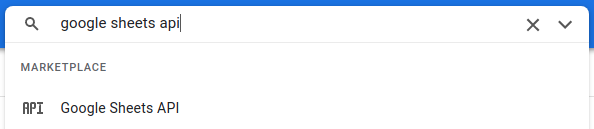
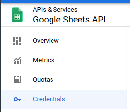
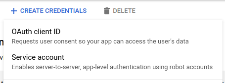
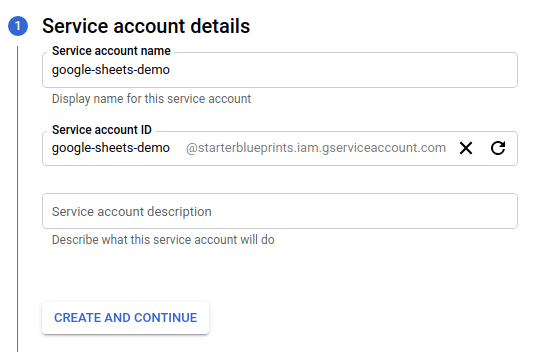
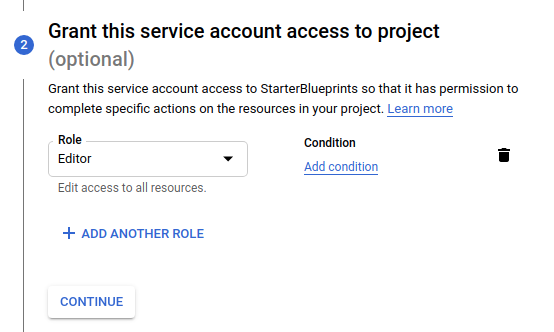
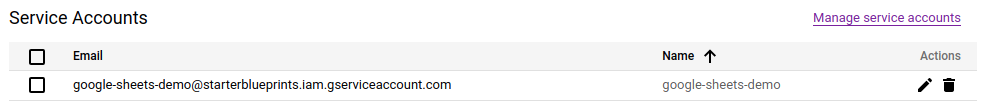
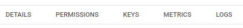

# Google Sheets Blueprints

## Authorization

### Overview

In order to get started with the Google Sheets Blueprints, a service account with the necessary GCP permissions is required.

### Steps

1. Login to your [GCP console](https://console.cloud.google.com/)  
2. Search for "Google Sheets API" in the search bar  
	  
3. Click "ENABLE"  
4. Click "Credentials" in the sidebar
	  
5. Click "+ CREATE CREDENTIALS" and select "Service account" from the options
	  
6. Add a service account name  
	a. Do not edit the ID field which will auto-populate  
	b. Optionally add a description to the service account  
	  
7. Click "CREATE AND CONTINUE"  
8. Click "Select a role" dropdown  
	a. Scroll down the options and hover over "Basic"  
	b. Select "Editor"  
	  
9. Click "CONTINUE"
10. Click "DONE"
11. Find the new service on the service accounts table  
	a. Click the edit icon under the "Actions" column  
	  
12. Click "KEYS" tab  
	  
13. On the Keys page click the "ADD KEY" dropdown  
14. Click "CREATE NEW KEY"  
	  
15. In the popup modal select "JSON"  
16. Click "CREATE"  
17. Copy the downloaded file JSON contents and use in the "Service Account" variable input in the Blueprints (see **Variables** sections below)  

## Download Sheet to CSV Blueprint

### Overview

The **Google Sheets - Download Sheet to CSV** Blueprint allows users to retrieve data from a Google Sheet as a CSV.

### Variables

| Variable Name | Description |
|:---|:---|
| **Google Sheet Name** | [REQUIRED] The name of the sheet to fetch data from |
| **Tab Name** | The name of the tab in the sheet to fetch data from - if left blank the default is the first tab |
| **Shared Drive Name** | The shared Drive name - should only be provided if the sheet exists in a shared Drive |
| **Local File Name** | [REQUIRED] The name for the file when fetched locally into the Shipyard Vessel |
| **Local Folder Name** | The folder name to store the fetched CSV file in |
| **Cell Range** | The range to fetch data from in the sheet - if left blank the full tab will be fetched |
| **Google Service Account Credentials** | [REQUIRED] The JSON from a Google Cloud Service account key - see **Authorization** above for more information |

## Upload CSV to Sheet Blueprint

### Overview

The **Google Sheets - Upload CSV to Sheet** Blueprint allows users to upload a CSV data into a Google Sheet.

### Variables

| Variable Name | Description |
|:---|:---|
| **Google Sheet Name** | [REQUIRED] The name of the sheet to put data into |
| **Tab Name** | The name of the tab in the sheet to insert data into - if left blank the default is the first tab |
| **Shared Drive Name** | The shared Drive name - should only be provided if the sheet exists in a shared Drive |
| **Local File Name** | [REQUIRED] The name for the CSV file to upload into the sheet |
| **Local Folder Name** | The folder name the CSV file may optionally be in |
| **Starting Cell** | The cell to start at when uploading data - if left blank the full tab will be uploaded |
| **Google Service Account Credentials** | [REQUIRED] The JSON from a Google Cloud Service account key - see **Authorization** above for more information |

## Clear Data from Sheet Blueprint

### Overview

The **Google Sheets - Clear Data from Sheet** Blueprint allows users to remove data from a Google Sheet.

### Variables

| Variable Name | Description |
|:---|:---|
| **Google Sheet Name** | [REQUIRED] The name of the sheet to clear data from |
| **Tab Name** | The name of the tab in the sheet to clear data from - if left blank the default is the first tab |
| **Shared Drive Name** | The shared Drive name - should only be provided if the sheet exists in a shared Drive |
| **Cell Range** | The range to clear data from in the sheet - if left blank the full tab will be cleared |
| **Google Service Account Credentials** | [REQUIRED] The JSON from a Google Cloud Service account key - see **Authorization** above for more information |

## Helpful Links

[Google Sheets API Python Documentation](https://developers.google.com/sheets/api/quickstart/python)
