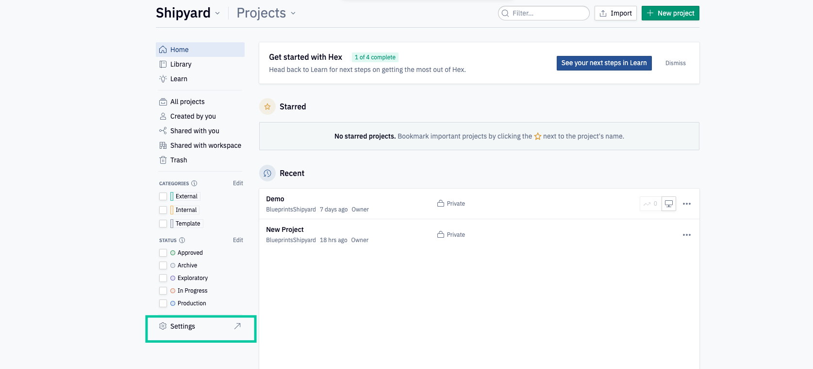
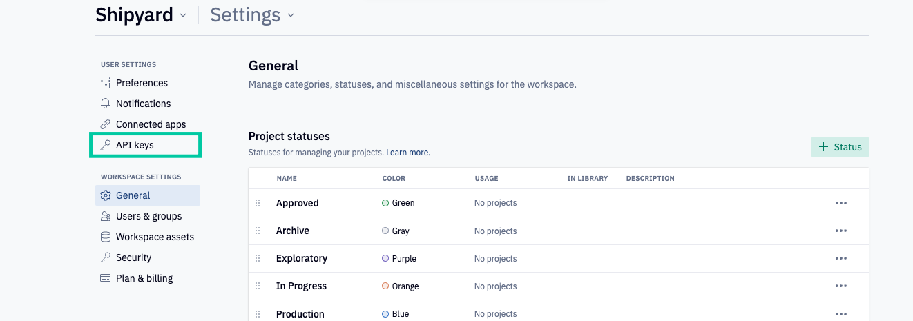
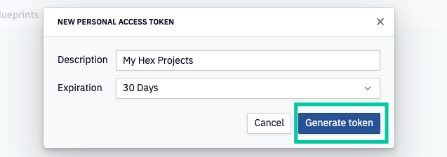
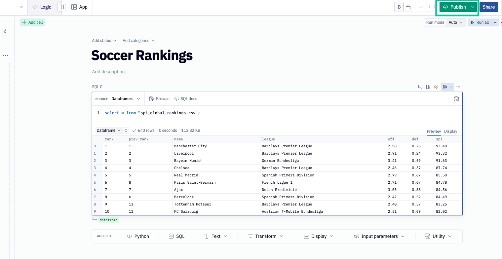
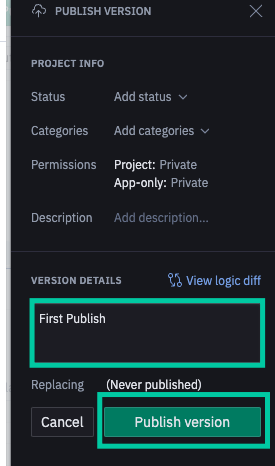
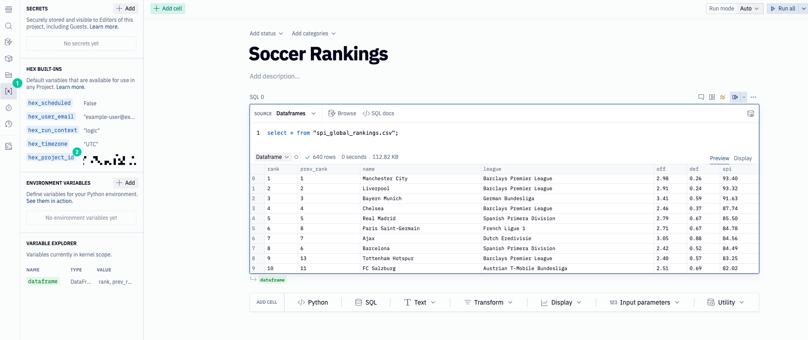

# Hex Authorization
To get started with the Hex Blueprints, you will need the following items from Hex:

- API Token
- Project ID

## Creating a Hex API Token
1. Log into [Hex](https://hex.tech/) and select the **Settings** option in the bottom left hand corner of the sidebar

2. Select the **API Keys** option

3. Select **New Token** and then when prompted, opt for a 30 day expiration and provide a description for your token.
4. Select **Generate Token**

5. Ensure that you copy the token and save it, you will be unable to access it again.

## Publishing a Hex Project
In order for these Blueprints to function, the Hex project needs to be published. Ensure that the project is properly published by:

1. Selecting the **Publish** button in the top right corner

2. Add in details to the **Version Details** section then hit **Publish version**

## Accessing the Project ID
The safest way to access the Project ID is through the project itself. 
1. Select the desired Project
2. Once open, select the **Variables** option on the left hand panel. The `hex_project_id` will be displayed under the **Hex Built-Ins** section. Click the `hex_project_id` to copy the Project ID to the clipboard. 

