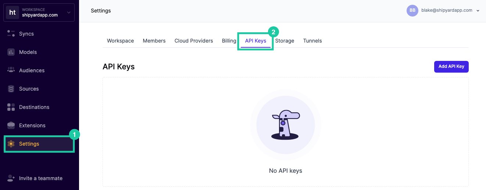
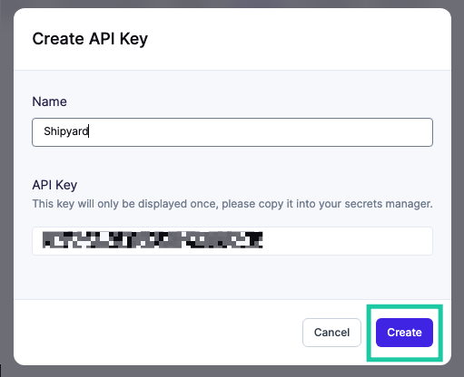

# Hightouch Authorization

To get started with any Hightouch Blueprints, you will need to create an API Key. This API Key is a secure way for Shipyard to access Hightouch and will be required for **every** Hightouch Blueprint. Additionally, you'll need a Sync ID.

## Creating a Hightouch API Key
1. Log into [Hightouch](https://app.hightouch.com/).
2. Select **Settings** on the sidebar and then click **API Keys** on the top navigation.

3. Click the button that says **Add API Key**.
4. Enter a descriptive name like "Shipyard"
5. Copy the API Key and store it somewhere safe. This value will be used for every Hightouch Blueprint.
6. Click **Create**.

## Finding the Sync ID
Select any Sync from Hightouch. The Sync ID can be found at the end of the URL.

For example, if your sync URL is `https://app.hightouch.com/shipyard/syncs/90210` then your sync ID would be `90210`.