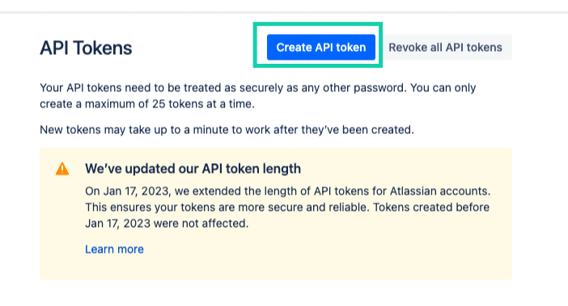
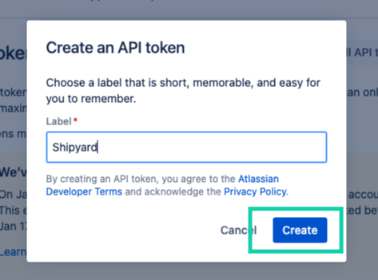
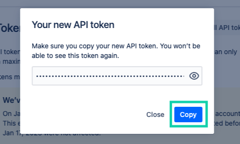
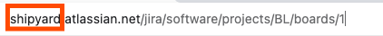

# Jira Authorization

## Create an API token
Create an API token from your Atlassian account:

**STEP 1.** Log in to https://id.atlassian.com/manage-profile/security/api-tokens.

**STEP 2.** Click Create API token.

**STEP 3.** From the dialog that appears, enter a memorable and concise Label for your token and click Create.

**STEP 4.** Click Copy to clipboard, then paste the token to your script, or elsewhere to save:

_NOTE:_

For security reasons it isn't possible to view the token after closing the creation dialog; if necessary, create a new token.
You should store the token securely, just as for any password.

## Find Jira Subdomain
Your Jira subdomain is the first part of your Jira URL. For example, if your Jira URL is https://shipyard.atlassian.net, your Jira subdomain is shipyard.
