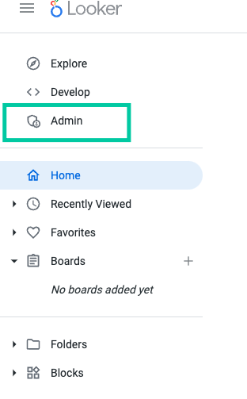
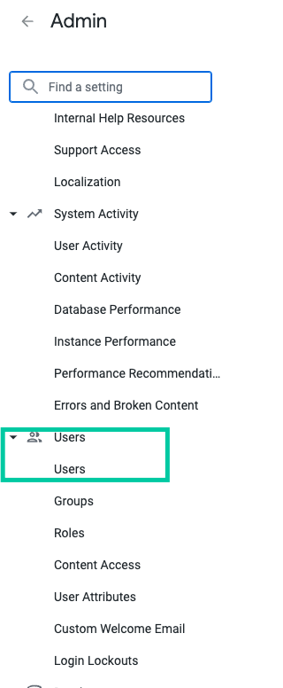
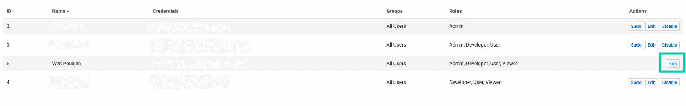
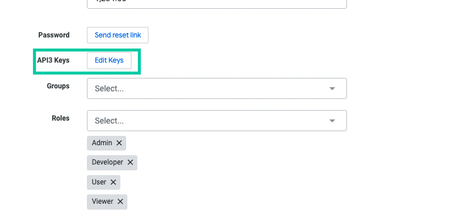
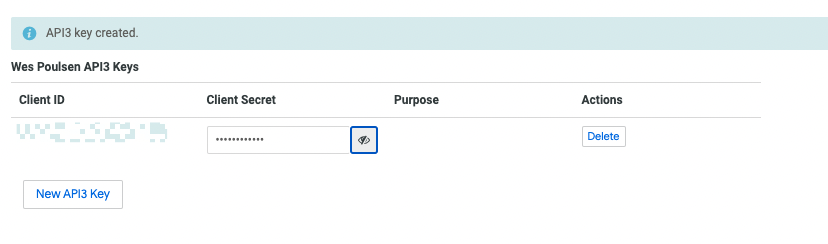
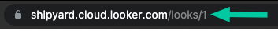

# Looker Authorization

## API Credentials

In order to make use of the Looker API, you will need a Client Id and an associated Client Secret. Follow these steps as a demonstration on how to create those.
1. Once logged in, on the Looker home page navigate to the Admin section. If you are not an admin, have your Looker do this section for you.

2. Navigate to the Users Tab

3. Select the **Edit** box for the user needing the API credentials

4. Select the **Edit Keys** box under the API3 Keys section

5. Select the **new API3 Key**, which will generate a Client ID and Client Secret.

## Look Id
The `Look Id` can be obtained through the Looker UI by selecting a Look and extracting the Id from the URL:

## Dashboard Id
Similar to the `Look Id`, the `Dashboard Id` can be obtained through the Looker UI by selecting a Dashboard and extracting the Id from the URL:

