# Microsoft Power BI Authorization
The blueprint requires a Service Principal to authenticate with the Power BI REST API. The service principal must be created in Azure Active Directory and have read/write permissions to the tenant's Power BI resources. The service principal must also be added to the Power BI workspace as a member.

You will need the following from the Service Principal Account
* Application (client) ID
* Directory (tenant) ID
* Client Secret

## Service Principal Creation

 **Step 1:** Go to the [Azure portal](https://portal.azure.com/) and search for App Registration
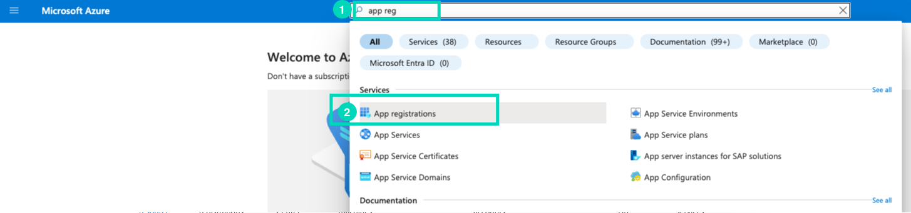

 **Step 2:** Click on New Registration

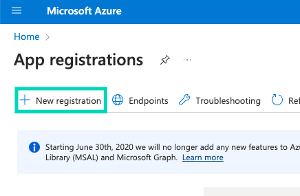

 **Step 3:** Fill in the Form
* App Name: Platform Power BI (or whatever you want to call it)
* Supported Account Types: Accounts in this organizational directory only
* Redirect URI: Leave blank

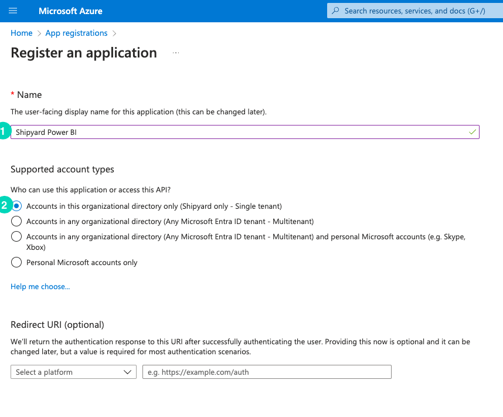

**Step 4:** Click Register

**Step 5:** Copy the Application (client) ID and Directory (tenant) ID and save them somewhere.
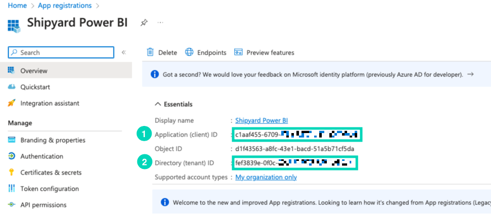

**Step 6:** Click on Certificates & Secrets

**Step 7:** Click on New Client Secret

**Step 8:** Fill in the Form
* Description: Platform Power BI (or whatever you want to call it)
* Expires: 6 months(Recommended)
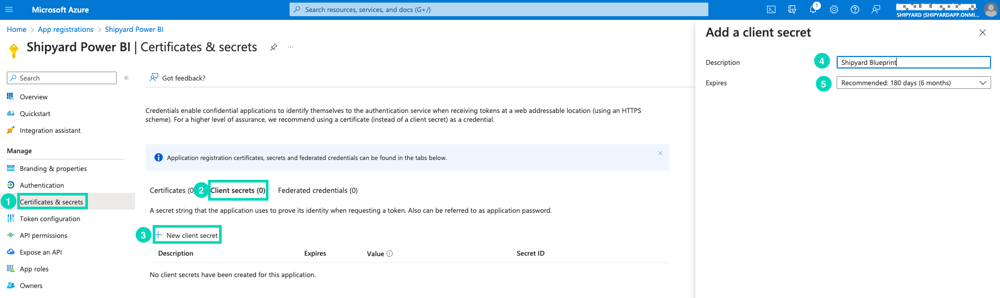

**Step 9:** Click Add

**Step 10:** Copy the Value of the Client Secret and save it somewhere.
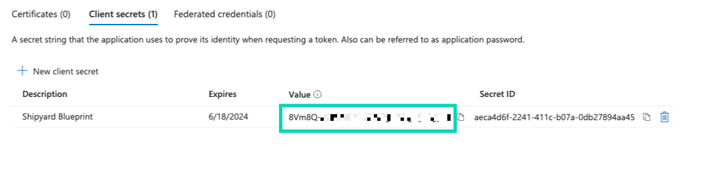

**Step 11:** Click on API Permissions

**Step 12:** Click on Add a Permission

**Step 13:** Click on Microsoft APIs

**Step 14:** Click on Power BI Service
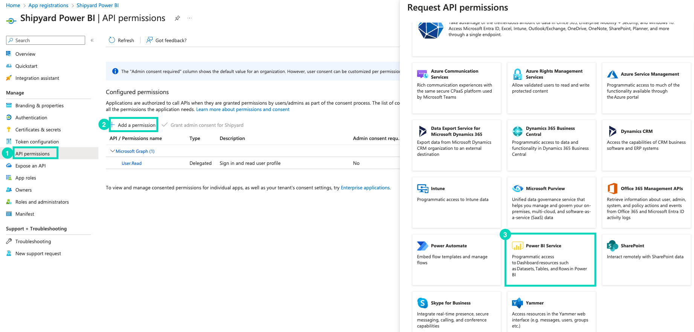

**Step 15:** Click on Application Permissions > Read/Write Tenant Permissions

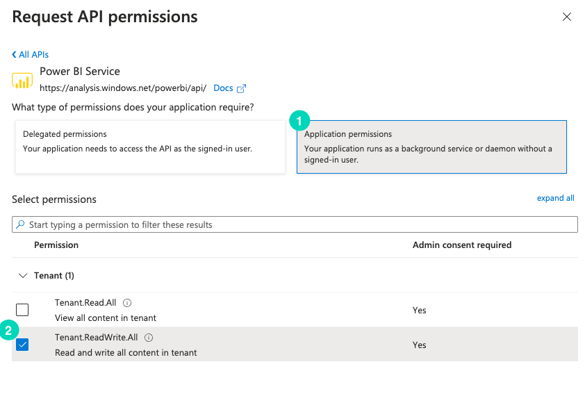

**Step 16:** Click on Add Permissions

**Step 17:** Click on Grant Admin Consent
Note: If you are not the admin for your organization your account admin will need to approve the permissions for you.
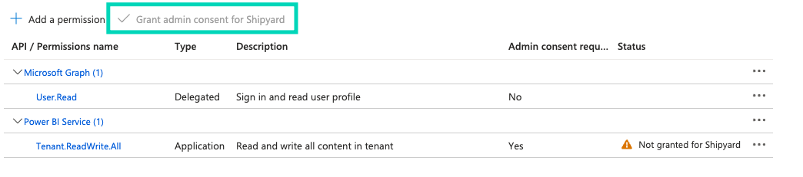
**Step 18:** Click on Yes

## Inviting Service Principal to Power BI Workspace

**Step 1:** Go to the Power BI Workspace

**Step 2:** Click on Manage Access

**Step 3:** Click on Add people or groups
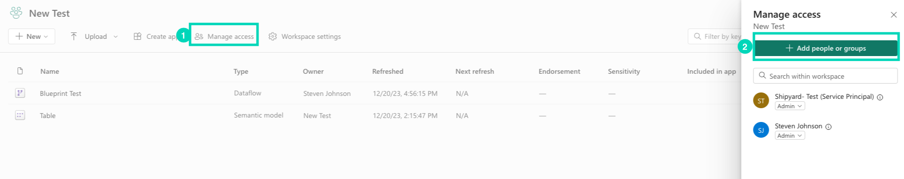

**Step 4:** Search for the name of the service principal created

**Step 5:** Select a role > Click on Add

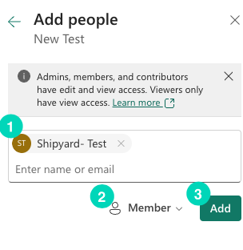

## Enable the Power BI service admin settings

**Step 1:** Go to the Power BI Workspace

**Step 2:** Click on Settings

**Step 3:** Click on Admin portal

**Step 4:** Click on Tenant settings

**Step 5:** Click on Developer settings

**Step 6:** Click on Allow service principals to use Power BI APIs

**Step 7:** Click on Apply

## Finding the Workspace ID
Log into the Power BI workspace and copy the ID from the URL. The ID is the string of characters after the "groups/" in the URL.

ex: `https://app.powerbi.com/groups/<workspace_id>/list?experience=power-bi`

**Note:** The workspace cannot be "My Workspace" as the service principal does not have access to this workspace.
## Finding the Object ID
Go to the Power BI workspace and click on the dataset or dataflow you want to refresh. The ID is the string of characters after the "datasets/" or "dataflows/" in the URL.

ex: `https://app.powerbi.com/groups/<workspace_id>/datasets/<object_id>/settings/refreshSchedule`

ex: `https://app.powerbi.com/groups/<workspace_id>/dataflows/<object_id>/settings/refreshSchedule`
