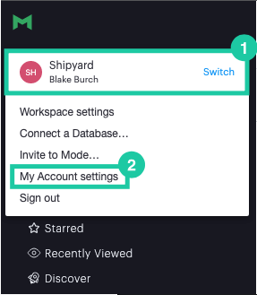
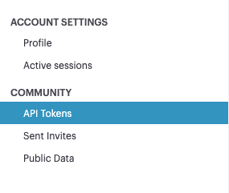
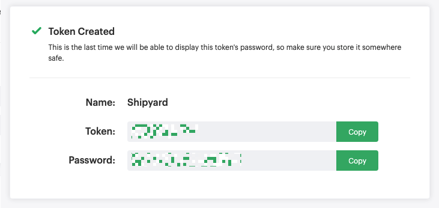

# Mode Authorization

To get started with any Mode Blueprints, you will need to create an API Access Token. This API Access Token is a secure way for Shipyard to access Mode and will be required for **every** Mode Blueprint. Additionally, you'll need to find your Workspace Name and your Report ID.

## Creating a Mode Access Token
1. Log into [Mode](https://app.mode.com/).
2. At the top, click your Name/Workspace then click **My Account Settings**.

 

3. Click **API Tokens** on the sidebar.

4. Provide a descriptive New token name like "Shipyard".
5. Click **Create Token**.
6. Copy both the Token and Token Password and store them somewhere safe. These values will be used for every Mode Blueprint.

## Finding your Workspace Name
On any page of Mode, the workspace name can be found in the URL.

For example, if your're on the main dashboard and the URL is `https://app.mode.com/my-workspace/spaces/90210abcdef` then your workspace name would be `my-workspace`.

## Finding your Report ID
When viewing a report in Mode, the Report ID can be found at the end of the URL.

For example, if your're on a report and the URL is `https://app.mode.com/my-org/reports/90210abcdef` then your report ID would be `90210abcdef`.