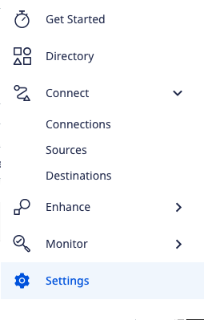
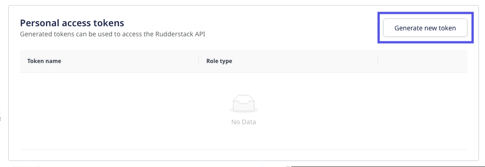
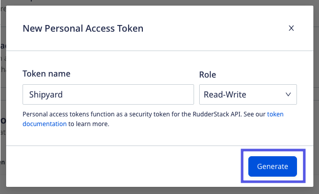
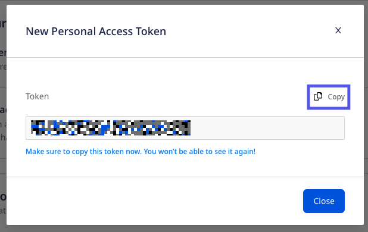
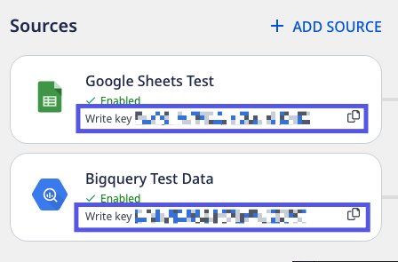
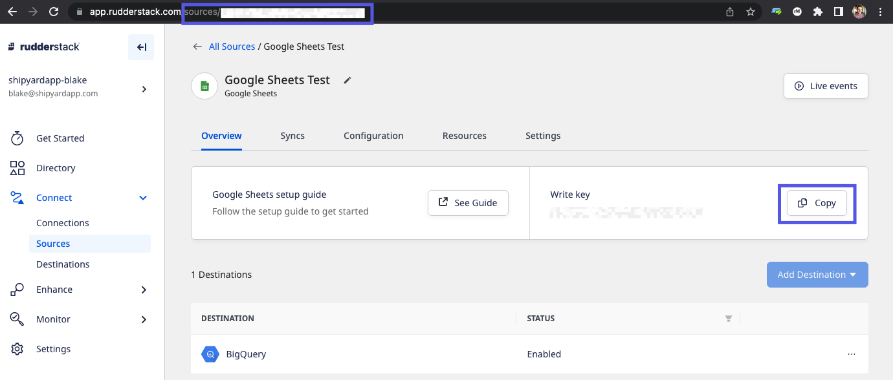

# RudderStack Authorization
To get started with any RudderStack Blueprints, you will need to create an Access Token. This Access Token is a secure way for Shipyard to access RudderStack and will be required for **every** RudderStack Blueprint. Additionally, you will need to know where to find your Source IDs.

## Create a RudderStack Access Token
1. Sign in to [RudderStack](https://app.rudderstack.com/)
2. On the sidebar, click **Settings**.

3. Scroll to the bottom until you see **Personal Access Tokens**.
4. Click **Generate new token**

5. Provide a descriptive Token name like "**Shipyard**". 
6. Select the "**Read-Write**" Role.
7. Click **Generate**.

8. Copy the personal access token and store it in a safe place. You'll need this for every RudderStack Blueprint.

## Getting your Source ID

There are 3 places you can find your Source ID.

### Main Dashboard
On the main dashboard, the Source ID is found underneath every source card.

### Source Overview
When the source is selected, the Source ID is available both in the URL and under the Write key section.

### Source Settings
When you're on the source settings page, the Source ID is visible.

# Helpful Links
[Rudderstack Personal Access Tokens](https://www.rudderstack.com/docs/dashboard-guides/personal-access-token/)