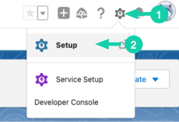
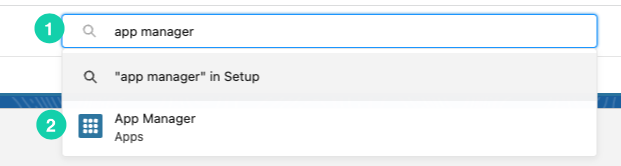
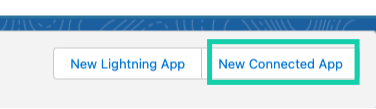
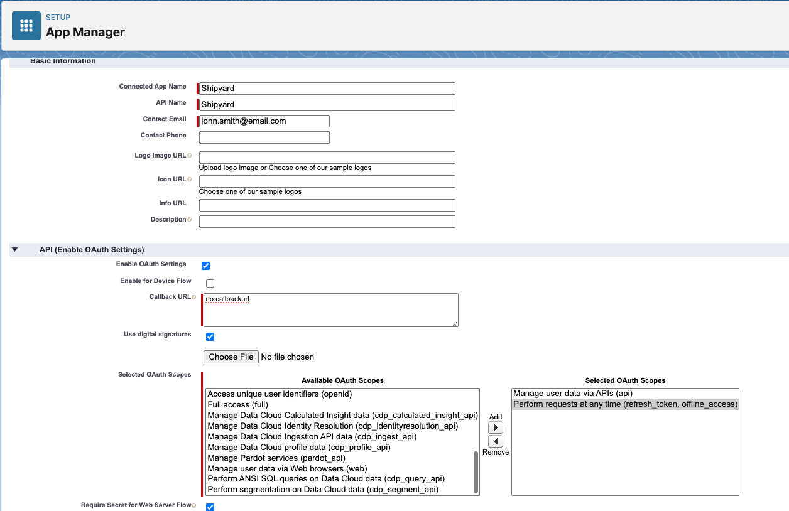
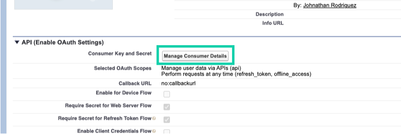

# Salesforce Authorization
To get started with the Salesforce Blueprints, you will need your Salesforce Domain URL. Depending on your authentication approach, you might require:

To initiate the Salesforce Blueprints:

- **Domain**: Essential for all methods.
- **Connected App Details** (Recommended):
  - Consumer Key
  - Consumer Secret
  - Username
  - Password
  - Security Token (may be needed based on organizational policies)
- **Access Token** (Alternative method)

## Setting Up a Connected App (Recommended)
1. **Navigate to App Manager**
   - Go to Setup.
   
   
   - Type "App Manager" in the Quick Find box.
   - Select App Manager from the results.
   
2. **Initiate App Creation**
   - Click on "New Connected App".
   
   
3. **Input App Details**
   - **Connected App Name**: Shipyard
   - **API Name**: Shipyard
   - **Contact Email**: [Your email address]
   - **API (Enable OAuth Settings) Section** 
      - **Enabled OAuth Settings**: Ensure this is checked.
      - **Callback URL**: If you lack a callback URL, enter `no:callbackurl`.
      - **Selected OAuth Scopes**: This might vary based on your use case. However, commonly you'll select:
         - `Perform requests at any time (refresh_token, offline_access)`
         - `Manage user data via APIs`
   inputs should look similar to the below
        
   
4. **Save and Continue**
   - Click "Save".
   - Click "Continue".

5. **Retrieve Consumer Details**
   - Click the recently created app.
   - Navigate to "Manage Consumer Details".
   - Copy the "Consumer Key" and "Consumer Secret" and store them securely for future use.
   
> **Note**: If your organization requires you to use a security token, you can reset it from your personal settings.From your personal settings, in the Quick Find box, enter Reset, and then select Reset My Security Token.
Click Reset Security Token. The new security token is sent to the email address in your Salesforce personal settings.

> **Note**: Ensure that the "Username-Password Flow" isn't restricted for your organization. Go to the setup console, search for `OAuth and OpenID Connect Settings`, and verify that `Allow OAuth Username-Password Flows` is enabled.


## Obtaining an Access Token Using Salesforce CLI

The access token (commonly referred to as a “bearer token”) acquired from Salesforce CLI is essential for authentication.

1. **Setup Salesforce CLI**
   - If you've previously installed Salesforce CLI, update it following the guide: [Update Salesforce CLI].
   - If Salesforce CLI isn't installed, download and install the latest version appropriate for your OS.

2. **Authenticate Developer Org with CLI**
   - Use Salesforce CLI to log in to your Developer org.
   - A browser window will open. Sign in using your org credentials.
   - Grant permission by clicking "Allow" in the browser.

3. **Confirm Authentication**
   - In the CLI, you should see a confirmation message like:
     ```
     Successfully authorized juliet.capulet@empathetic-wolf-g5qddtr.com with org ID 00D5fORGIDEXAMPLE
     ```

4. **Retrieve the Access Token**
   - Use the following command, replacing `<username>` with your username:
     ```bash
     sfdx force:org:display --targetusername <username>
     ```
   - The access token will appear in the command output.
   


