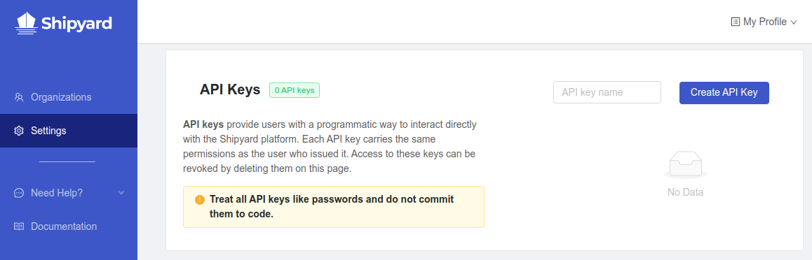
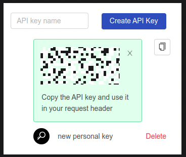

## Authorization

In order to interact with the API, an **API key** is required.

1. Navigate to your user's [**Settings**](https://app.shipyardapp.com/user/settings) page

2. On the right side of the page, enter a name in the **API key name** text field
3. Click the **Create API Key** button

4. Copy the generated API key value - _this is the **only time** the value will be available_

:::caution

Treat all API keys like passwords and do not commit them to code or share them with unauthorized parties

:::

Access for an API key can be revoked by clicking the **Delete** button next to its name in the list.