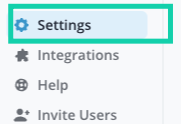
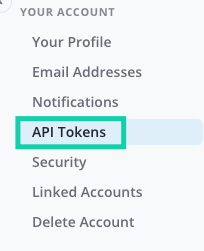
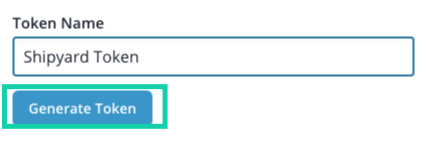

# Shortcut Authorization

## Generating a Shortcut API Token
**Step 1:** Go to Settings

**Step 2:** Your Account > API Tokens

**Step 3:** Generate token

Add a name for the token and click Generate Token. The Generate Token button will be greyed out until a name is added.

Please note, API Tokens are both user and Workspace specific. If the user account that created the API token were to be removed from the Workspace, that API token will not work as expected.