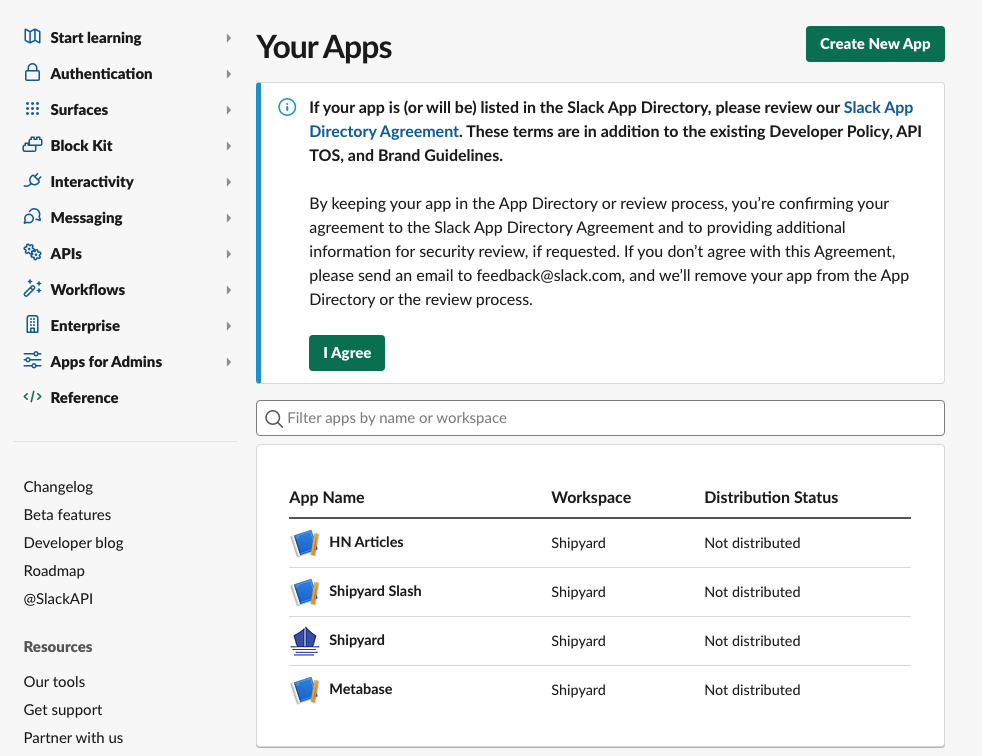
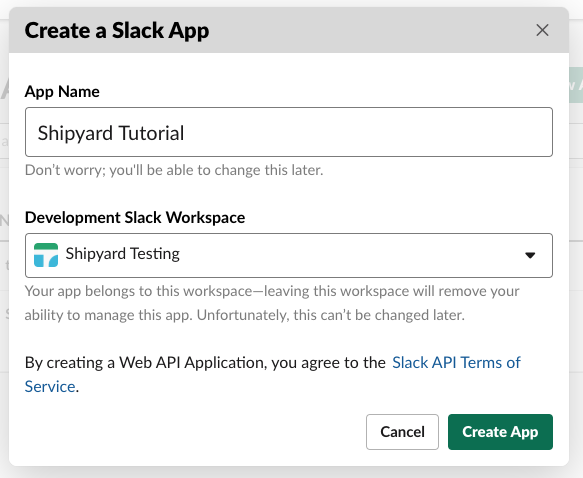
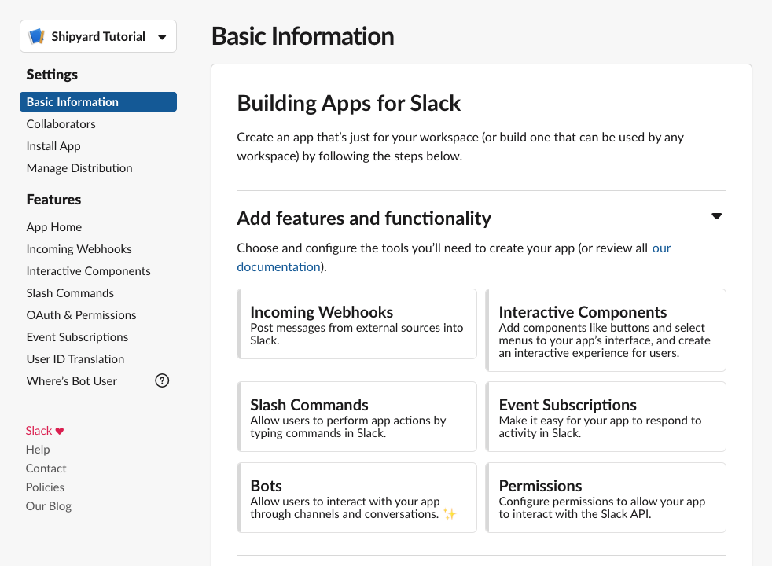
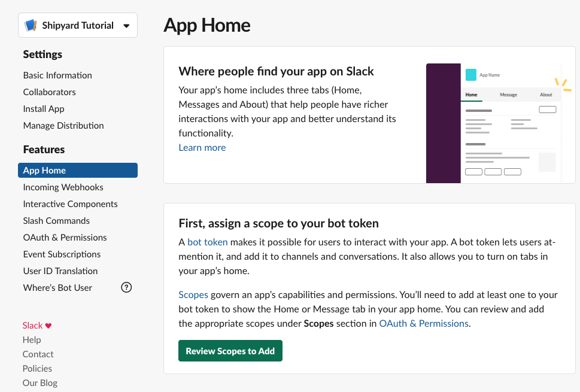
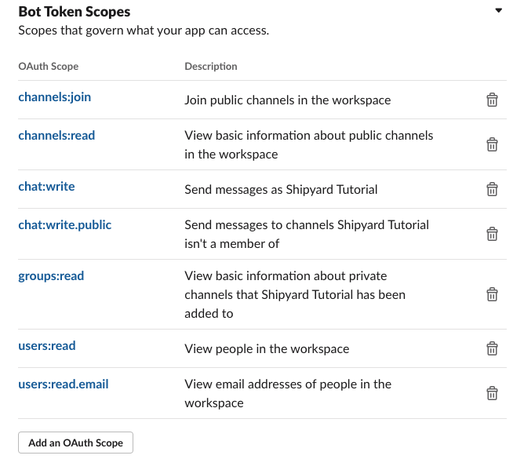
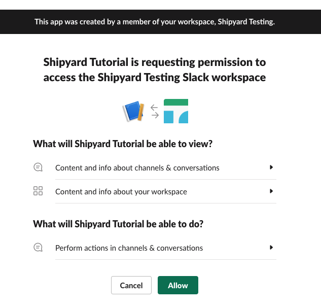
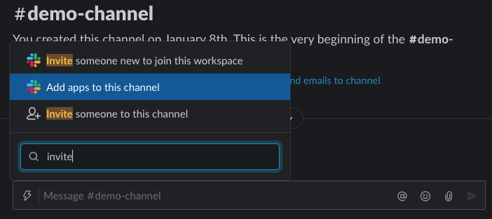
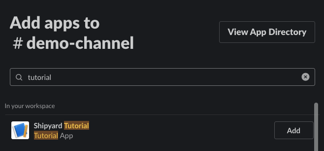

# Slack Authorization

Slack Blueprints rely on users to have the Slack token of a working Slack app that's install to their organization's Workspace with the right permissions. The app must be invited to all channels the user wants to send a message to. Below are the steps of how to accomplish each of these individually.

## Creating a Slack App
1. Visit the [Your Apps](https://api.slack.com/apps) page in Slack.

2. Click the **Create New App** at the top. You'll be greeted with a modal that asks you for a few details.
3. In the modal, you'll need to give your app a name and need to tie your app to an existing Workspace that you have access to. Once finished, click **Create App**.

## Setting Slack App Permissions
1. On your new app's Basic Information page, select **Bots** to navigate to the App Home page.

2. On the App Home page, click **Review Scopes to Add**.

3. Scroll down to the Scopes section of the page and click **Add an OAuth Scope** for your Bot token.
4. Search for and add all of the following scopes:
   - channels:join
   - channels:read
   - chat:write
   - chat:write.public
   - groups:read
   - users:read
   - users:read.email
  

At a high level, here's what these scopes mean for your application:

**Channels/Groups** - Give your bot the ability to see both public and private channels that exist, with the added ability for users to invite your bot to the channel.

**Chat** - Send messages from the bot to any channels where it is currently a member (or a public channel).

**Users** - Give your bot the ability to look up information about users so it can appropriately `@tag` them.

:::caution
There are two sections for Slack App scopes. You do not need to add OAuth Scopes for User tokens.
:::

### Accessing the Slack Bot Token
1. Once all permissions are set, scroll to the top of the page and click **Install to Worksapce**.
2. On the next screen, click **Allow**.

3. The next screen will now show you a Bot User Oauth Token. Store this somewhere safe and **DO NOT SHARE IT** with anyone outside of your organization. This token is what you'll enter in the **Slack Token** field on Shipyard.

:::note
If you ever add additional scopes to your application, you will have to reinstall it to your workplace.
:::

## Inviting a Slack App to your Channel
In every private channel that you want send messages to, you'll need to invite your application. 

1. Navigate to the channel you want to send messages to.
2. Type `/invite` and select the option that appears to **Add apps to this channel**

3. Search for the app you want to add to the channel and click **Add**.

:::note
If the channel is public, the bot should be able to find it without being added. If not, try adding the bot to the channel.
:::