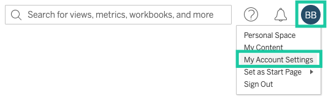

# Tableau Authorization

Tableau Blueprints rely on users to:
- Provide their username and password or a Personal Access Token.
- Provide the Site ID and Server URL
- Provide the name of the relevant element (Workbook, Datasource, View)

Below are the steps of how to accomplish each of these individually.

## Creating a Personal Access Token
1. Sign into your instance of Tableau.
2. Click your user icon in the top-right corner and select **My Account Settings**
   
3. Scroll halfway down the page and stop at the section titled Personal Access Tokens.

4. Provide a descriptive name for the token (we suggest `Shipyard`) and click **Create New Token**.
5. Click **Copy to Clipboard** and store your Token Secret in a safe location. You will need both the Token Name and the Token Secret for authentication.

## Finding the Site ID
As a part of every URL on Tableau, you should see a section that says `/site/YOURSITEID/`.

For example, if the full URL was `https://10ax.online.tableau.com/#/site/shipyarddevelopmentdev123456/explore`, your Site ID would be `shipyarddevelopmentdev123456`.

## Finding the Server URL

The Server URL is the beginning part of the URL, including the subdomain, domain, and TLD.

For example, if the full URL was `https://10ax.online.tableau.com/#/site/shipyarddevelopmentdev123456/explore`, your Site ID would be `https://10ax.online.tableau.com`.

## Finding the Workbook Name

Workbook names can be found in multiple locations.

#### In the Explore Section

#### While Viewing Workbook Details

#### While Editing a Workbook

## Finding the Datasource Name

#### In the Explore Section

#### While viewing Datasource Details

#### While Editing the Datasource

:::note
Currently, we only support refreshing Datasources that have been published.
:::

## Finding the View Name

Views can be individual charts or a Dashboard that combines multiple charts. The names for these views can be found in multiple locations.

#### While Viewing Workbook Details

#### While Editing a Workbook

:::note
Currently, we only support pulling data from views that have been published as part of the workbook. Anything in a draft state cannot be accessed.