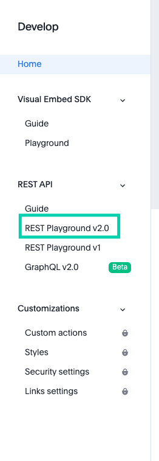

# Thoughtpsot Authorization
An API token is necessary in order for Shipyard to access your Thoughtspot instance. To generate a token, navigate to the API playground which can be found by selecting **Develop** tab of upper selection panel and then the **REST Playground v2.0** tab on the side

Within the **Authentication** endpoint select the **Get Full Access Token** option.

Follow the steps listed to generate a permanent token, or copy the temporary token listed.

## Metadata Identifiers

The metadata identifier for Answers, Liveboards, and tables can be found in the url address of each

