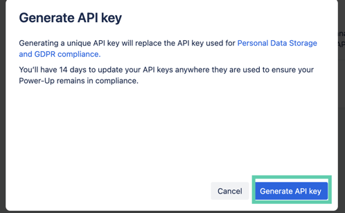
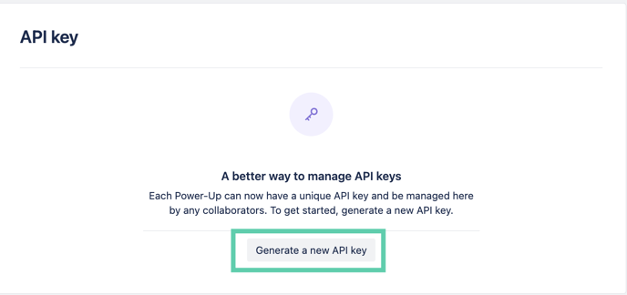
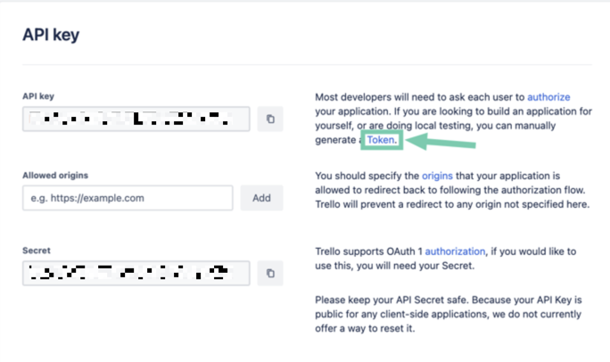
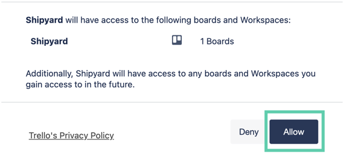
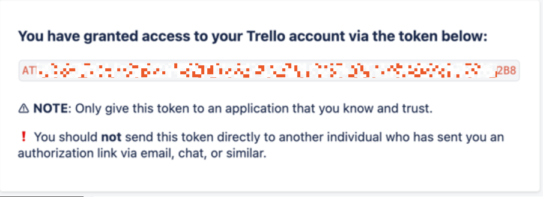

# Trello Authorization
# Generating Access Token & API Keys

To generate your access token and API keys, follow these steps:

**Step 1:** Go to [https://trello.com/power-ups/admin](https://trello.com/power-ups/admin)

**Step 2:** Click on "New"

**Step 3:** Fill out the form and click create. The required fields are:
- New Power-Up or Integration (Name of the power-up)
- Workspace (Workspace your blueprint should have access to)
- Email
- Support contact
- Author

**Step 4:** Click on "Generate a new API key"

**Step 5:** Read the prompt and then select "Generate API key"

**Step 6:** Copy your API Key

**Step 7:** Generate a token by selecting the "Token" hyperlink to the right of where your API Key is.

**Step 8:** Click on "Allow"

**Step 9:** Copy your Access Token

