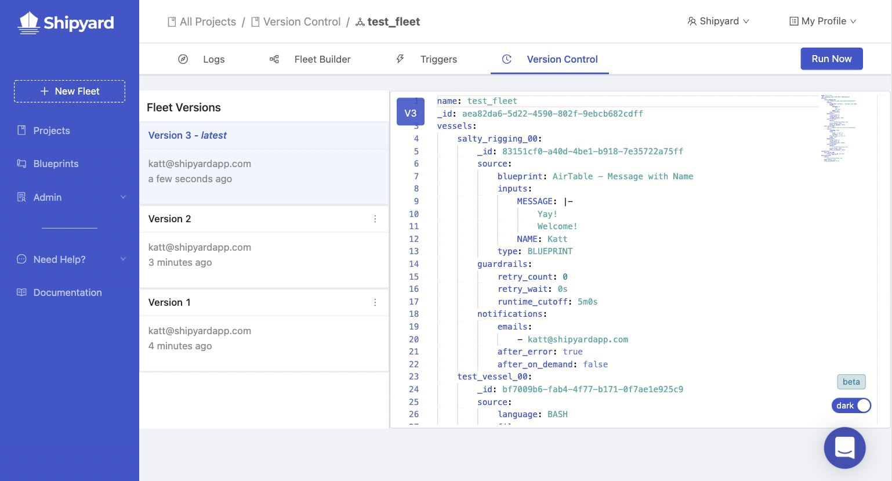

# Changelog: Feb 2020 -  Dec 2022
:::info
This changelog, though extremely lovable, has been retired. Please head to [Canny](https://shipyard.canny.io/) to view our new changlog, provide feedback, make a feature request, or check out Shipyard's roadmap!
:::

Below is an ordered list of changes that we have made to Shipyard from its inception through December 2022. Changes include but are not limited to: new features, feature enhancements, bug fixes, or other usability updates. Some changes may be omitted, such as changes that do not affect the user-facing experience.

The purpose of this changelog is to publicly document the updates we are continuously making to improve the [Shipyard](https://www.shipyardapp.com) platform. We hope this is useful to our users to know exactly what parts of the product are being actively worked on.

## 12/21/2022

**Enhancements**
- Python is ending its support for version 3.7 in June 2023. We know, it *is* sad! But don't let this language barrier get in the way of communicating. New Vessels and Blueprints built with Python will now default to version 3.9. Plus, you can update any of your Vessels and Blueprints to use 3.7 or 3.9. But we highly recommend you make the switch to 3.9 before too long.

## 12/19/2022

**Enhancements**
- Canny is continuing to complement our compelling course! You Cann now make feature requests right from the application main side menu.

**Bug Fixes**
- Just because you ain't paying us, doesn't mean we don't love you. We've made sure Dev Plan users get their full compliment of runtime hours at the start of each 30-day cycle.
- Our Fleet Builder is studying to be a magician and specialized in making Node and Python packages disappear. While we are so proud of its efforts, we put the kibosh on that. Your packages will remain safely nestled in your Vessels.

## 12/15/2022

**Enhancements**
- We got the impression that you just wanna build your Fleet and figure out the Vessel details later. Well, now you can! We've eliminated those multiple pesky error notifications and consolidated them into one place so you can move between Vessels at will. Just make sure you get them all addressed before saving!

- It is un-Canny how sharp-eyed and keen-minded y’all are! Thanks for helping us track down bugs and come up with new features. Now, you can track all the improvements you’ve inspired by clicking the Canny bell at the top of the app.

## 12/08/2022

### Enhancements
- Seconds, years, hours, epochs! We have a lot of time on our hands. So, check out our new [time-related Shipyard Environment Variables](https://www.shipyardapp.com/docs/reference/environment-variables/shipyard-environment-variables/) and start referencing your Fleet and Vessel times in your code. 

### Bug Fixes
- Sometimes the Visual Editor would develop a blindspot for your mouse clicks but now its back to being an easy touch.

## 11/21/2022

### Enhancements
- Still haven't built a Fleet? We noticed! To ensure you're properly guided, you'll land on the *How to Use* panel when you visit the Fleet Builder until you get your sea legs.
- We've added a header on the Usage Dashboard with a link to our new **Shipyard API - Export Logs** Blueprint. If you want more granular detail than the dashboard provides, this new Blueprint can get it for you.

### Bug Fixes
- Switching from the YAML to the Visual Editor was causing unexpected damage to Vessels using GitHub integration. Luckily (and because we fixed it), this is no longer the case.

## 11/03/2022

### Enhancements
- Blocked on your Python script? Never fear, AI is here! You can now get a jump start on any Python-based Vessel or Blueprint by describing what you want and letting our robo-friend generate some rough code for you. Plus, he's kinda cute.

- Now you can start a Fleet in YAML (maybe by copying a sweet [WordsToWorkflows](https://www.wordstoworkflows.com) Fleet into the Editor) and flip to the Visual Editor to tweak and connect your Vessels.

## 11/01/2022

### Bug Fixes
- Some users' Projects weren't loading due to borked Fleets. We've rooted out the cause and patched it up.

## 10/24/2022

### Enhancements
- We've been tuning our queries to speed things up for you. Users will see faster load times on Projects and Fleets.

### Bug Fixes
- Like most new features, the API endpoint for logs needed a little tweaking. All's well on the logging front.

## 09/29/2022

### Enhancements
- Cookies? Yes, please! You can now let us know if cookies are welcome in your browser or not.

## 09/28/2022

### New Features
- Introducing our public API! You can pull all your logs and quickly create and edit Fleets in bulk. Just check out Settings under _My Profile_ to get started.

## 09/20/2022

### Bug Fixes
- Our Markdown was messed up, so we got down, cleaned up, and are ready for our checkmark! Markdown should now display as intended.

## 09/06/2022

### Bug Fixes
- Housekeeping did some great work but might have misplaced a few hyperlinks. They have been found and put back where they belong.

## 08/17/2022

It's a Blueprint-palooza this week, with lots of new data vendors to integrate with and updates to improve the overall Blueprint experience.

### New Features
- We've added a handful of new Blueprints to the application. Check out the added functionality with the links below!
  - [Mode](blueprint-library/mode/mode-overview.md)
  - [Rudderstack](blueprint-library/rudderstack/rudderstack-overview.md)
  - [Census](blueprint-library/census/census-overview.md)
  - [Hightouch](blueprint-library/hightouch/hightouch-overview.md)
  - [Databricks](blueprint-library/databricks/databricks-overview.md)
  
### Enhancements

- The [Snowflake Upload CSV to Table](blueprint-library/snowflake/snowflake-upload-csv-to-table.md) Blueprint has been updated to use a new method for uploading by default. From our testing, uploads can now be up to 15x faster... and that's especially true for larger datasets. (We uploaded 25mm rows in under 5 minutes!)
- The [HTTP Download File from URL](blueprint-library/http/http-download-file-from-url.md) Blueprint has been updated to accept custom headers so you can customize your requests.
- The [Domo Blueprints](blueprint-library/domo/domo-overview.md) have been updated to accept developer tokens as an alternative to username/password.

### Bug Fixes
- Empty non-required password fields in Blueprint vessels were being rejected on Fleet save. They have now been authorized to remain empty if you so choose.

## 08/15/2022

### Enhancements

- Get cracking with Shipyard! Our new **Get Started** page is a quick and easy guide for those who are new to the platform, but also a great way for current users to explore features. And that feeling you'll get when a completed task is greeted with a shower of confetti? Priceless.

## 07/26/2022

### Enhancements

- It's time for action! Fleets, Vessel, and Blueprint actions, that is. Now, you can perform all your favorite actions from a table with just one click. Just hover over the vertical dots in any _Action_ column and behold the menu of options: run now, delete, duplicate, and more.

### Bug Fixes

- We were taking it a wee bit personally when a user cancelled. Organizations with a previously cancelled [Team Plan](https://www.shipyardapp.com/pricing) weren't able to access anything. They now get all the perks of our [Developer Plan](faqs/plans/developer-plan.md). See, we forgive you.

## 07/20/2022

### Enhancements

- We are just trying to help you, and frankly, you keep ignoring us. So, we've made our troubleshooting notification in an errored Vessel’s output a bit more, well, in your face. Honestly, it is just because we care.

### Bug Fixes

- Changing a Blueprint's inputs, after creating a Vessel with it, was causing some odd behavior. Now, you'll see a warning when you try to access a Fleet or Vessel that is out of sync with a Blueprint. We hope you'll take the time to patch up the holes before anything sinks!

## 07/17/2022

### Enhancements

- All of our tables have been amped up!
  - New columns (_Last Run_ and _Version_) will give you greater visibility into your Fleets and their runs without having to dig in.
  - A new _Triggers_ column indicates if your Fleet is scheduled or has a webhook.
  - Filtering, searching, and sorting have been added in several tables so you can more easily find what you're looking for.

### Bug Fixes

- Who wasn't showing up to the party after they'd RSVP'ed? Status dots. We've tracked them down so they don't miss the fun. On the Fleets and Vessels tables, the Status dots should now be filled in to show you the most recent 8 statuses for your Fleet or Vessel.

## 06/27/2022

### Enhancements

- We want everyone to jump right in and make quick use of our platform. To help you get acclimated, there is now a short "how to" video available in the Fleet Builder guide section.

- For those of you struggling with a lagging internet connection, we have added in loaders so you know things are happening...even if they are taking their sweet time.

### Bug Fixes

- Some logs were refusing to display causing some Fleets to keel over. Those Fleets are now afloat, the logs are back onboard, and users can see their logs in all their glory.

## 06/09/2022

### New Features

- [Fleets are now version controlled!](reference/fleets/version-control.md) Those of you on Team Plans now have access to the last six versions of your Fleets. Each version is presented in their [YAML format](reference/fleets/yaml-editor.md) so they can be easily compared to the current configuration of the Fleet. In addition, you can revert to a previous version or create a brand new Fleet from a version. 

### Bug Fixes

- Fleets with freshly duplicated Vessels weren't saving but all's well now.

## 06/09/2022

### New Features

- Want to provide data to a [Shipyard webhook](reference/triggers/webhook-triggers.md)? Now you can by using the [webhook parameters](reference/logs/fleet-logs.md###webhook-parameters) giving your Vessels access to the webhook headers and body you may provide.

### Bug Fixes

- Various small fixes have been made to the logs pages ensuring you're able to see the status and results of all of your Fleets and Vessels accurately.
- A bug preventing you from naming one Fleet what another Fleet has been previously made has been addressed.
- There was a situation where some Fleets were unable to be deleted and has now been resolved.
- Previously, you were able to create a Fleet using YAML without any Vessels provided which lead to an incorrect Fleet state. Now, you'll prevented from doing so with an alert in the code editor.

## 06/02/2022

### Enhancements

- Time is relative, and so are our timestamps. All times displayed in tables now use an easy-to-read format with a hover-over if you want more detail.

### Bug Fixes

- Project Vessels were uninterested in joining Fleets. If you tried to add a Project Vessel to an existing Fleet, the Fleet would fail to save. They have since learned that "teamwork makes the dream work" and can be successfully added to Fleets.
- Some Vessels weren't taking to their new names so, when you tried to rename a Fleet Vessel, its old name would reappear. New names will now stick around after a Vessel has been renamed.

## 05/25/2022

### Enhancements

- Fleet and Vessel logs now have limits placed on them depending on whether you're on the Developer or Team plan. Want to see more of what's happend in your historical logs? [Sign in and upgrade your plan now!](https://app.shipyardapp.com/auth/signin)

## 05/12/2022

### Enhancements

- Hit a "Panel Invalid" error while building a Fleet? We've all been there. But now the message will be a bit more helpful and the invalid Vessel and panels will be highlighted in red. 

- Ever find it weird that you can see billable runtime on Fleet Run and Voyage tables but not on the actual log? Yeah, we did too. Now you can.

### Bug Fixes

- Vessels were rebelling against their Blueprint parents and refusing to adopt the same guardrails. The Blueprints won out. Every Vessel built with a Blueprint (from this point forward) will be set to same guardrails as the original Blueprint. If you decide to change the Vessel guardrails anyway, that decision will also be respected.
- We did a little refactoring and miiight have left a variable undefined. That's been fixed, so next time you visit the YAML Editor it shouldn't keel over on you.
- A few clients had trouble viewing their Usage charts but that's been cleared up.

## 05/05/2022

### Enhancements

- Update the code input on Code Vessels to have syntax highlighting.
- Add a badge with a count of required fields that need completing to Blueprint Vessels.
- Add more troubleshooting tips for when a Vessel errors.

### Bug Fixes

- Fix error occurring when Panda's version is not provided in a Python Vessel.
- Fix issue with some jobs not scheduling appropriately.

## 04/27/2022

### Enhancements

- Enhanced Developer Plan. It now includes 10 hours of runtime each month.

### Bug Fixes

- Fix Voyages not always terminating when requested.

## 04/14/2022

### Enhancements

- Add New Zealand to the billing options.
- Always show Vessel tools on the selected Vessel in the Fleet Builder.

### Bug Fixes

- Allow Vessels in Fleets to have the same name as Project Vessels.

## 04/11/2022

### Bug Fixes

- Fix error occurring when editing a Project Blueprint Vessel.

## 04/07/2022

### Enhancements

- Update *Delete Fleet* and *Go to Vessel* buttons to make their function more obvious.

### Bug Fixes

- Prevent new Fleets overwriting existing Fleets with the same name.
- Fix selected Vessel not being highlighted in Fleet.
- Fix error occurring when saving Fleets larger than five Vessels.

## 04/06/2022

### Bug Fixes

- Prevent the "double scheduling" error.

## 3/30/2022

### Enhancements

- Separate tabs in Logs for **Historical** and **Upcoming** Fleet Runs.

### Bug Fixes

- Disable **Run Now** on an edited, pre-saved Fleet
- Prevent the modal to select a Project from appearing unnecessarily in the Fleet Settings

## 3/16/2022

### Features

- Add YAML Fleet editor to the UI.

### Enhancements

- Add error messages for incompatible Pandas versions.
- Add a new Project modal to the Fleet builder flow.

### Bug Fixes

- Fixed issue where changing order of Blueprint Inputs would not prompt a save.
- Fixed an issue where users could not click on Vessels after creating a Project.

## 3/10/2022

### Enhancements

- Triggers have been removed from Project Vessels for more Fleet-centered workflow construction.

## 3/8/2022

### Enhancements

- Add help messages to the logs pages with possible resolutions.
- Make unique Blueprint downloaded file name in a voyage.

## 2/28/2022

### Enhancements

- Blueprint "Dependent Vessels" table now has links to both the Vessel and conditionally to the Fleet if the Vessel is a part of one
- Project-level Vessels can now be added to and removed from Fleets without having to build them in the Fleet Builder

### Bug Fixes

- Duplicate Vessel names are now prevented in the Project

## 2/22/2022

### Enhancements

- Users can now stop Voyages even if they are currently in a "Retry" state.
- Pagination has been removed from the Vessels table on a Fleet's Log page for better visibility.
- The "Edit Vessel" on the Vessel Logs page is now more prominent and easier to find.
- Handlebars have been added to Blueprint inputs for reordering in the UI.

### Bug Fixes

- Subscriptions will now correctly reflect the number of users active in the account when the organization upgrades to a paid account.

## 2/16/2022

### New Features

- Users can create a Project directly from the Fleet Builder now.
- A "New Fleet" button has been added to the main sidebar of the application.

### Enhancements

- A success notification will alert users when a Project has been created.
- Upon first logging in, users will be redirected to the new Fleet Builder page.
- Blueprint descriptions will be displayed automatically when a Blueprint Vessel is added to a Fleet.
- Users with one Organization will now be directed to the Projects page instead of the Organizations page..
- The Shipyard Demo Organization has been renamed to Example Organization with clearer links to it and has been made less obtrusive.

## 2/2/2022

### New Features

- Added a mini map view of Fleets with zoom in/out buttons for easier navigation.

### Bug Fixes

- Prevented an error on save after removing and adding Blueprint Vessels to a Fleet.

## 1/31/2022

### Enhancements

- Allow Debian Linux system packages to be installed on Node and Python Vessels.  
- Display the Usage tab in the Admin sidebar.  
- The Organization Blueprints dropdown is now expanded by default for easier discovery.  
- A "create" button has been added to all pages that report no data exists (e.g. "No Vessels").  
- An error is now thrown when users attempt to signup without accepting the Terms of Service.   

### Bug Fixes

- The Admin sidebar items now remain highlighted after selection.  
- Blueprint code will not be deleted when making updates to the Requirements tab.  

## 1/20/2022

### Enhancements
- Allow Fleets to have a single Vessel instead of requiring two or more.
- Added a Need Help section to the sidebar with different options for reaching
out for support.
- Switched the Fleets and Vessels tab on the main Project landing page. Additionally,
moved the New Fleet option above New Vessel in the New dropdown.

## 1/18/2022

### Enhancements
- Updated the "Use Blueprint" button to redirect to the Fleet builder with a Vessel
selected for building from that Blueprint.
- Added a confirmation before deleting a Vessel in the Fleet builder.
- Added functionality to accept coupons during subscription sign up.

## 12/22/2021

### Bug Fixes
- Prevented Usage Dashboard graphs from occasionally showing no data.
- Updated Snowflake Blueprints to suppress SQLAlchemy error messages.

## 12/20/2021

### Bug Fixes
- Prevented an error that occurred when changing a Fleet name immediately after saving.
- Removed project ID field from the project creation screen.

## 12/14/2021

### New Features
- We now accept international payments from Canada, Australia, United Kingdom, and any country in the EU! The billing portal has been updated to reflect these changes.

## 11/29/2021

### New Features
- Updated the Fleet Builder tab to allow the creation of multiple Vessels all from one location. You will no longer need to create individual Vessels first then string them together. In fact - you can't! If you're wanting to connect Vessels, you'll need to build them as part of your Fleet initially. See more about these changes [here](reference/fleets/fleets-overview.md#visual-editor)
- Added the ability to Duplicate a Fleet. See more about these changes [here](how-tos/fleets/duplicate-fleet.md)
- Added the ability to Duplicate a Vessel directly from the Fleet Builder screen.

### New Blueprints
- Added an Airtable Blueprint to download data from a base/table/view as a CSV.

### Enhancements
- Split the functionality of saving a Fleet from scheduling a Fleet. This update will make large Fleets save quicker, while the scheduling happens in the background.
- Improved the Snowflake Blueprints to have specific error codes and better messaging for common problems.

### Bug Fixes
- Fixed an issue where Blueprints in the Library Blueprint organization could not be duplicated.

## 11/08/2021

### Enhancements
- Improved internal logging to better track every notification email sent by our platform.

### Bug Fixes
- Prevent Vessel changes from being saved if the Vessel was removed from the Fleet.
- Fixed an issue that sometimes prevented error emails from sending for larger Fleets.

## 10/19/2021

### New Features
- Updated the Fleet Builder tab to allow editing of multiple Vessels all from one location. See more about these changes [here](reference/fleets/fleets-overview.md#visual-editor)
- There's a new feature for Guardrails to exclude specific exit codes. This was custom-built to help situations when working with asynchronous APIs where you may not need to keep retrying because a final result of an error is returned and that will never change. See more about these changes [here](reference/guardrails.md#exclude-exit-code-ranges).

### Enhancements
- Arguments are now more flexible. You can provide only a flag, a flag and a value, or just a value. 

## 10/5/2021
### Enhancements
- Github connections now show the organization name as part of the repository name, like `org_name/repository`. This makes it easier to discern which org a repository belongs to if there is a shared repository name.

## 9/29/2021

### Bug Fixes

- Fixed issue where refreshing on the Fleet's Triggers tab would not show saved
schedules.

## 9/22/2021

### Enhancements

- Add multiline support for Alphanumeric and Password Blueprint Variable types.
This will allow for easier support for multiline Alphanumeric inputs like JSON
or SQL and for multiline password inputs like SSH keys.

## 9/14/2021

### Enhancements

- Added Usage Dashboard data for Trialing and Developer Tier Organizations.

### Bug Fixes

- Fixed an issue where Voyages in a Fleet Run could incorrectly be removed.
- Fixed an issue where the Usage Dashboard would sometimes show no data.

## 8/31/2021

### Bug Fixes

- Fixed Duration ticker not running while viewing a log.
- Fixed leaving the Triggers tab warning for Fleets.

## 8/24/2021

### New Features

- Added free developer plan to the application to allow continued, limited usage of the platform after the trial.

### Enhancements

- Users can now be invited to belong to multiple organizations.

## 8/3/2021

### Enhancements

- Expanded the clickable area for small + and - buttons.
- Removed "Time to Start" from the UI and replaced with Billable Runtime.
- Prevent native Python package from being entered in the Python requirements section.

### Bug Fixes

- Fixed incorrectly set Org in dropdown in header.
- Fixed generic error message for a duplicated Vessel name.
- Fixed incorrectly disabled "Stop Voyage" button for Voyages in a Fleet Run.

## 7/19/2021

### New Feature

- Added new Guardrail for Runtime Cutoff that limits the amount of time a Voyage can run.

### Enhancements

- Added a warning alert on mobile indicating the site is not meant for use on mobile devices.

### Bug Fixes

- Fixed an issue where duplicating a Vessel then immediately duplicating it again
would cause an error.

## 7/6/2021

### Enhancements

- Updated the Markdown styling for Blueprint previews.

### Bug Fixes

- Fix issue where users could not navigate away from "Something went wrong." page.

## 6/23/2021

### Enhancements

- Updated the Blueprint cards grids to be more responsive.
- Updated the historical runtime charts for Fleets and Vessels.

## 6/15/2021

### Enhancements

- Add all newly invited users to a "Shipyard Demos" Organziation with read only
access.

### Bug Fixes

- Fixed issue where you could not remove Vessels that were a part of prior Fleet Runs
and the Vessel is no longer part of the Fleet.

- Fixed issue where creating a new Project would not allow for Project access
for the requesting user.

## 6/9/2021

### Enhancements

- The admin permission panel has been updated to include new permissions.
The application throughout has been updated to more correctly reflect a User's permissions. 

### Bug Fixes

- Fixed bug where the Fleet's Last Statuses were not the most recent runs.

## 6/1/2021

### Enhancements

- Update the Fleet Builder to use a new library to enable new enhancements coming
soon.

- Update Trigger permissions with access for each of On Demand (run now), Schedules,
and webhooks.

## 5/11/2021

### New Feature

- Added Userflow widget for feature walkthroughs in the app.

## 5/5/2021

### New Feature

- Update the Fleet Log Gantt chart to be interactive.

### Enhancements

- Updated the Save and Next Step button bars to be sticky.
- Update Projects dropdown on sider to be just a single Projects link.
- Update Blueprint Library card names from truncating.
- Rename "Vessels" tab on Fleets to "Fleet Builder".
- Switched order of tabs on the Blueprints page.

### Bug Fixes

- Fixed Edit Vessel button not showing up on log page.

## 4/28/2021

### Enhancements

- Added the ability to add image URLs to Blueprints that will render during the selection stage when building a Vessel.
- Added a restriction where a user cannot create a Fleet unless there are at least two (minimum required) Vessels in a Project.

## 4/14/2021

### Enhancements

- Updated the Logs table to show explicit "Scheduled" indicators.

### Bug Fixes

- Fixed issue where update Select variable default option would not save.
- Fixed issue where Blueprint Library Blueprints were not available to use when
building a custom Vessel.

## 4/13/2021

### Enhancements

- Added the most recent eight status on the Vessels and Fleet Runs tables.
- Moved the Fleet Run Voyages under the Fleet Run in routing.
- Removed Shipyard support users from billing in the Usage Dashboard and in Stripe.

## 4/8/2021

### Enhancements

- Added in Blueprint Library usage read only ability to all Organizations.
- Blueprint Password input values are no longer sent to the frontend.

## 3/30/2021

### Enhancements

- Added auto refreshing to the Fleet Run page.
- Added Timezone information to the Triggers tab for Vessels and Fleets.

## 3/29/2021

### Bug Fixes

- Fixed bug where writing to subdirectories of a Git clone would fail with invalid permissions.

## 3/16/2021

### New Features

- Added `gpg` binary available to all Voyages.

## 3/10/2021

### Enhancements

- A new simplified pricing structure with a pricing calculator.

## 3/3/2021

### New Features

- Native Node Vessels. You can now run Node Vessel with dependencies isntalled for you.

### Enhancements

- Added six environment variables available to your Voyage at runtime:

  - `SHIPYARD_VESSEL_START_TIME` indicates the time at which the Vessel started running.
  - `SHIPYARD_FLEET_START_TIME` indicates the time at which the Fleet started running. It will be empty if the Voyage is not part of a Fleet.
  - `SHIPYARD_VESSEL_SCHEDULED_TIME` indicates the time at which the Vessel was scheduled to run.
  - `SHIPYARD_FLEET_SCHEDULED_TIME` indicates the time at which the Fleet was scheduled to run. It will be empty if the Voyage is not part of a Fleet.
  - `SHIPYARD_BLUEPRINT_ID` indicates the ID of the Blueprint of the Vessel. It will reflect the Code type if the Vessel is not build from a Blueprint.
  - `SHIPYARD_BLUEPRINT_NAME` indicates the name of the Blueprint of the Vessel. It will reflect the Code type if the Vessel is not build from a Blueprint.

- Updated the maximum number of allowed retries to 24.

## 2/23/2021

### New Features

- Added new Webhook triggers to Vessels and Fleets.

  In addition to Schedules, you can now trigger a Voyage or Fleet Run by POSTing

  to a webhook URL generated from the UI.

  Read more about this update [here](https://www.shipyardapp.com/blog/webhook-triggers-event-driven-automation/).

## 2/4/2021

### New Features

- Added a new [Usage Dashboard](reference/admin/usage-dashboard.md) that shows progress within a billing period and

  estimated cost for paying customers.

  You can access this dashboard from the Admin section of the Org, if available.

### Enhancements

- Removed Triggers steps from the Vessel create flows.

  You can now add Triggers once the Vessel has been created.

  This is in preparation for adding Webhook Triggers.

- When creating a custom Vessel, you will be shown directions to the Blueprint

  Library if your Org does not have any Blueprints to choose from.

- When your Org's trial or subscription has lapsed, you are shown a splash screen

  indicating such instead of just error message notifications.

### Bug Fixes

- Fixed a backend bug concerning improper error handling of a billing error.

## 1/27/2021

### Enhancements

- Updated the Vessels DAG view for a Fleet to have a better initial layout.

### Bug Fixes

- Fixed styling issue on the Blueprint Library discover page.
- Fixed bug surrounding correct form data on Code steps.
- Fixed bug where and Organization after their trial period could not sign up

  for a subscription.

## 1/13/2021

### Bug Fixes

- Fixed broken link for "Manage Git Integrations".

### Enhancements

- Added functionality to know what Vessel you are editing in the dropdown

  for a Vessel node on the Fleet edit DAG page.

- Updated error messages for non-unique entity names.
- Updated the messages in empty tables due to filtering.
- Updated Project name in breadcrumbs where it was showing a generic 'Project' text.
- Updated backend formatting of notification emails.
- Added two environment variables when the Vessel is built using a Git connection:

  - SHIPYARD_REPO_NAME indicates the name of the Git repository defined in the Code section.
  - SHIPYARD_CLONE_LOCATION indicates the local directory of where the root of

    the Git repository was cloned to.

- Make consistent wording around "Use this Blueprint".

## 1/12/2021

### New Features

- Fleets now have conditional paths between Vessels.

  There are three options for a path to be followed:

  - Success - The upstream Voyage was successful.
  - Errored - The upstream Voyage was not successful.
  - Completed - Either Success or Errored.

    For a downstream Voyage to run, all upstream Voyages and the path conditions

    must be met.

## 12/16/2020

### Bug Fixes

- Fixed bug that allowed for invalid Blueprint Variable reference names.
- Fixed backend issue where Fleet run infrastructure was not being correctly cleaned up.
- Fixed idempotency issues with an external backend service.

## 12/8/2020

### New Features

- Add the ability for self service password resets.
- For Git connected Voyages, the git commit hash is now printed to output.

### Enhancements

- Update Blueprint Variable previewing mechanics.
- Update Schedules forms to be explicit about empty Schedules.

### Bug Fixes

- Fixed bug to throw "unsaved changes" dialog when clicking Logs or Vessels tab.
- Fixed bug where removed Blueprint Variables would error in a Voyage.

## 12/3/2020

### New Features

- Added the ability to use GitHub repositories as the source of your code in Blueprints

  and Vessels.

  You can find the option to use this under the Git radio button on the Code tabs.

### Enhancements

- Updated our backend to better log web based errors.
- Add a new error boundary and error page to our frontend.

### Bug Fixes

- Fixed Organization billing Uploaded Data values.
- Fixed non active Organizations from scheduling Voyages.

## 11/4/2020

### Enhancements

We overhauled the creation and edit flow for both Vessels and Blueprints to make the process quicker and more seamless. Noticeable improvements are:

- The "Write" tab is now the default tab for providing code.
- The "Script Name" and "File to Run" fields now mirror each other when you're on the write tab.
- If you have unsaved changes, you'll receive a warning when navigating away.
- You can't click "Save" if you don't have any changes - making it easier to identify when you've made updates.
- You can only click "Run Now" or "Duplicate" after first saving your changes.
- The "Inputs" step for Blueprints has a clearer preview section to show you what your Blueprint will look like.
- Clicking back out of a creation flow will now take you to the last page you came from.

## 11/2/2020

### Enhancements

- We added `python3-dev` as a default package that is installed in the container

  that runs your code.

## 10/26/2020

### New Features

- Add a Playground project to every new Organization upon sign up.

  Note the the project will default to the US/Pacific timezone.

## 9/30/2020

### New Features

- Implement new pricing tiers: Freelance, Startup, and Business.
- Add a panel to the sign up page to let users know what they are getting.

## 9/29/2020

### New Features

- Redirect user to a new confirmation URL on successful sign up request.
- Allow building a Vessel from a Blueprint from the Blueprint's page.
- Update password strength requirements and their display to the user.
- Redirect users to the Projects page if they are a member of just one Organization.

### Bug Fixes

- Fix errors with a blank default value on the Select Blueprint variable type.

## 9/22/2020

### New Features

- Added a distinct action arrow on empty collection pages to help the user figure

  out what to do.

### Bug Fixes

- Fix configuration handling across the application.

### Other

- Removed deprecated queueing infrastructure.

## 9/15/2020

### New Features

- New banner in the header indicating how many days left you have in your trial.

  There are no changes if you are already a paying, subscribed customer.

### Enhancements

- The entire cards in the New Vessel flow are clickable to select Code or Custom

  Blueprint.

- The Active and Inactive Vessels tables have been merged into one.

  The notion of an Acitve or Inactive Vessel no longer exists.

  A Vessel will always run on all of its Triggers.

- The Active, Test, and Inactive Blueprints tables have been merged.

  The meaning of an Active, Test, or Inactive Blueprint has been updated to mean

  visibility for the Users in your Org.

  The translation is as follows:

  - Active > Visible to Everyone. Every User can create Vessels from these Blueprints.
  - Test > Editors. Users with Blueprint Create and Update permissions can create

    Vessels from these Blueprints.

  - Inactive > Hidden. No User can create Vessels from these Blueprints.

## 9/8/2020

### New Features

- Connection to Stripe Customer Portal in the Sider once you have a subscription.
- New User permission for restricting access to the Billing section of Orgs.
- Add ReCAPTCHA v3 to Sign Up page.

### Enhancements

- Improvements to backing infrastructure that your code runs on.

### Bug Fixes

- Minor bug fix with backing queue connectivity.

## 8/19/2020

### New Features

- Self Sign up and new Organization creation.
- Allow for manually stopping a running Voyage.
- Backend automated Org billing.

### Enhancements

- Improvements to backend queueing technology.
- Improvements to internal APM technologies.

## 8/6/2020

We've been hard at work over the past few months to deliver a new system for Fleets that's modular and flexible enough to meet the needs of the modern data team.

🎉 **New Features:**

**Fleet Overhaul**

Fleets have been redesigned from the ground up to tackle more complex problems with a greater level of flexibility and visibility.

- Edit your Fleets visually. Drag and drop Vessels and paths to make a workflow that's as complex or simple as you need.

- Fleets can now run on converging, branching, and sequential paths.

- Vessels in a Fleet all share the same local file storage while continuing to run in independent containers. This allows upstream Vessels to pass data to downstream Vessels without the need for external storage and without the risk of package and language conflicts.
- Fleets now have their own logs, allowing you to assess historical status and performance.

- Fleets now have their own notifications. Receive alerts whenever a Fleet runs into errors preventing it from running in its entirety.
- Vessels can now run independently AND as a part of a Fleet, allowing you to maintain overlapping triggers without having to duplicate Vessels.

**Blueprint Library**

- Browse through over 40 pre-made Blueprints that integrate with more than 15 external services, databases, and cloud storage vendors.

- Add a Blueprint to your organization so you can quickly create Vessels and Fleets that download, upload, and manipulate data across your tech stack.

🌟 **Enhancements:**

- Vessels no longer have the option for "Internal Triggers" to create a Fleet.
- The "Build Vessel" button has been exchanged with a "+ New" button that allows you to make a New Vessel or a New Fleet.
- The sidebar navigation has been updated to include:
  - A link for the Blueprint Library
  - A divider to split options for the Organization or for the Platform.

## 6/2/2020

🎉 **New Features:**

You can now follow along with actively running Vessels - LIVE!

- Clicking the "Run Vessel" button will automatically redirect you to the newly created log.
- If a Vessel is scheduled to run soon, or is currently running, the log page will now automatically refresh to show you live details. Details include:

  - Current Vessel Status 
  - Live Updating Duration 
  - Live Output Indicator

    

When you put all of these changes together, it looks like this:

This new feature will provide better visibility into the progress of Vessels without requiring users to constantly refresh the page.

🌟 **Enhancements:**

- The output section of the Log page has been refreshed to allow for:
  - Word highlighting
  - Line counting
  - Lines without wraparound

- All of our automated email notifications have slick new look! These will provide greater clarity and insight to help you get started tracking down and resolving issues with your Vessels.
  - Welcome Email
  - Success Email
  - Error Email

- Blueprint descriptions now support Markdown to help you write more in-depth guides for users. Use all of the traditional features of Markdown like headers, bullets, and code snippets to get your point across.

🔧 **Bug Fixes:**

- Fixed an issue where the error message for unnamed Vessels would shift the spacing of all the fields on the Information Tab.
- Timestamps on the Log page no longer overlap on smaller screens.

## 4/14/2020

🌟 **Enhancements:**

- Retries have an updated look! We've refined the design to give you better visibility into:
  - When the next retry is going to occur
  - What retry number Shipyard is currently on
  - Visibly see when something is currently retrying
- If your Vessel uses a Custom Blueprint, you'll now see a link to go directly to that Blueprint. This will make navigation throughout the application a bit easier.

🔧 **Bug Fixes:**

- Trying to access an organization that you don't have permissions for will result in an explicit error message and be redirected to their list of organizations. Previously, this landed you on a broken page.
- When you refresh the page, projects on the sidebar will no longer disappear.
- Fixed an error where the Blueprint field would just say "Blueprint".

## 4/2/2020

🔧 **Bug Fixes:**

- Fixed an issue where Blueprint names couldn't be duplicated across the application.

## 3/31/2020

🎉 **New Features:**

You can now create a new organization directly through the UI!

While we still don't support multi-organization users, let us know if this use case would be helpful for you.

🌟 **Enhancements:**

- Selecting your Timezone when creating a project is now easier, with more common Timezones listed at the top.

🔧 **Bug Fixes:**

- Guardrail values now correctly display the saved values.
- Guardrails from Blueprints now transfer to Vessels set up with that Blueprint.
- Removed the ability to add the current Vessel as an Internal Trigger.

## 3/24/2020

🎉 **New Features:**

- [User Management](reference/admin/user-management.md) page for viewing, managing, and deleting users
- User Invite System for growing your organization and collaborating with outside parties.
- [User Permissions Panel](reference/admin/user-permissions.md) to set granular access settings per user.

\_\*\*\_For more information about these features, see [our blog post](https://www.shipyardapp.com/blog/increasing-collaboration-for-organizations).

🔧 **Bug Fixes:**

- Fixed Google SSO issue that some users were having.
- Prevented code from disappearing when you moved back during the Wizard setup.

## 2/18/2020

🔧 **Bug Fixes:**

- Fixed issue where a Log's output would sometimes not refresh correctly.
- Fixed issue where project name had to be unique across all organizations. Project names still have to be unique _within_ your organization.

🌟 **Enhancements:**

- Added a page to make it more clear when Blueprints have no dependent Vessels.

## 2/3/2020

🔧 **Bug Fixes:**

- Fixed issue where Intercom button was occasionally overlapping buttons.

🌟 **Enhancements:**

- Updated Python from 3.5.3 to 3.7.3
