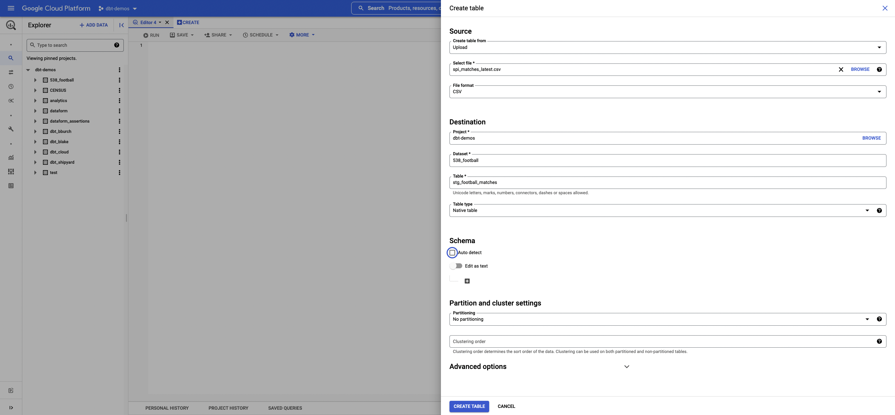
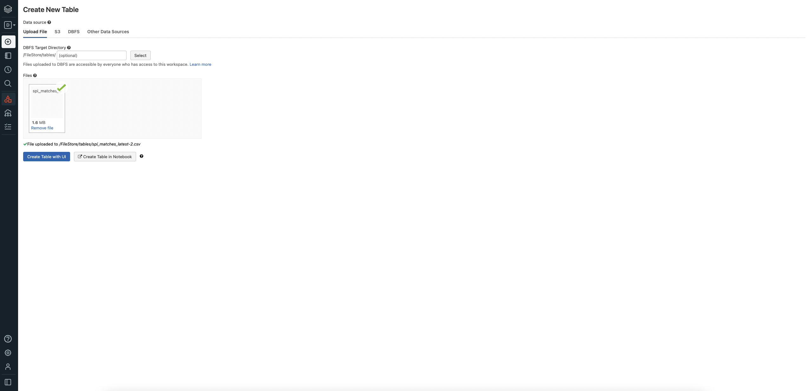
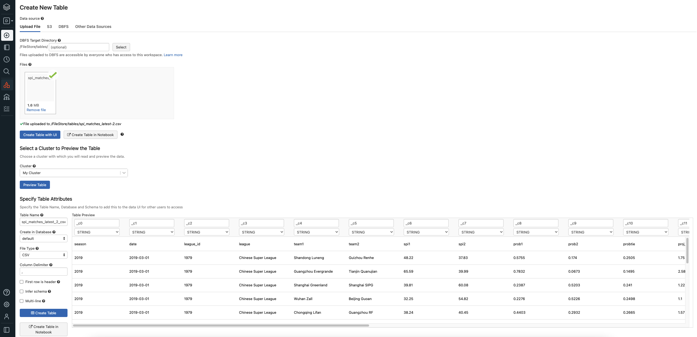
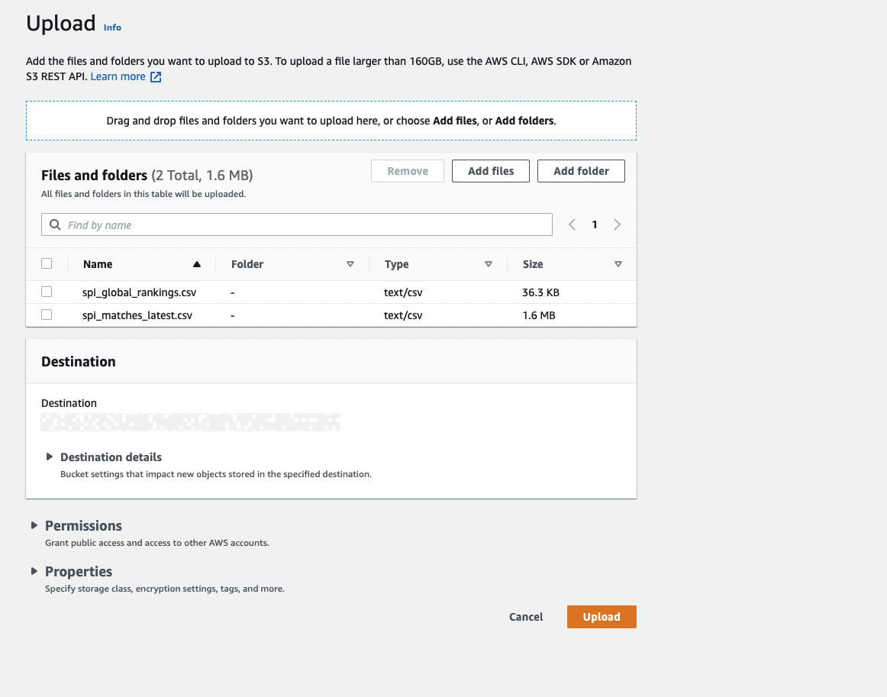
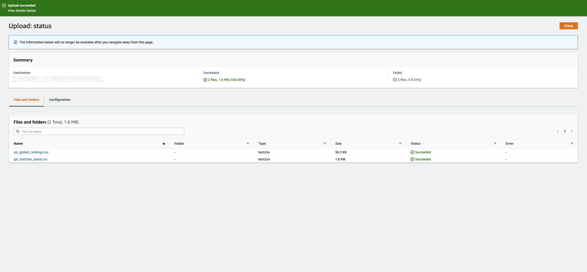

import Tabs from '@theme/Tabs';
import TabItem from '@theme/TabItem';

# dbt Core Part 1 - Loading Sample Data into your Cloud Provider

To begin our tutorial for dbt core in Shipyard, we need to setup an example dataset to work with. This guide will follow the steps in dbt's tutorial, however, we will setup the following cloud data warehouses:
* Bigquery
* Databricks
* Redshift
* Snowflake

Before getting into the steps of setting up the different cloud data warehouses, please download the sample files that we will use for this tutorial [here](https://drive.google.com/drive/folders/15gLVxj5-aMee0CRZ7H9Ht-S9CkZ1jB6y?usp=sharing).

:::note
This tutorial assumes that you have an account created for your chosen data warehouse. If not, please go create an account before proceeding.
:::

<Tabs
groupId="code-inputs"
defaultValue="bigquery"
values={[
{label: 'Bigquery', value: 'bigquery'},
{label: 'Databricks', value: 'databricks'},
{label: 'Redshift', value: 'redshift'},
{label: 'Snowflake', value: 'snowflake'}
]}>


<TabItem value="bigquery">

### Setting up demo project
1. Navigate to the [BigQuery Console](https://console.cloud.google.com/bigquery?project=dbt-demos)
2. Click to access the **Project Browser** on the top left corner of your screen.


3. On the top right of the Project Browser, click New Project. This will redirect you to put information in about your new project
4. Under **Project Name**, enter `dbt-demos`
5. Organization and Location can stay at their default values.
6. Click **Create***.

### Upload Data
1. Locate the `dbt-demos` project that we created on the left side bar.
2. Click the 3 dots and choose **Create dataset**


1. For **Dataset ID**, enter `538_football`.
2. Click **Create Dataset**.
3. Expand the dbt-demos project on the left sidebar by clicking the arrow. Locate the 538_football dataset. Click the 3 dots and choose **Create Table**.
4. Under **Create Table from**, choose Upload and choose `spi_matches_latest.csv`.
5. Under **File Format**, choose CSV.
6. Project and Dataset should automatically be set to `dbt-demos` and `538_football` respectively.
7.  Under table, enter `stg_football_matches`
8.  Check the box for **Auto Detect**.

Your settings should look like this:



1.  Click **Create Table**.
2.  Repeat steps 6-12 with the second CSV file, however name the table `stg_football_rankings`.

You should be able to see the two tables you created under the `538_football` dataset on the left sidebar as seen in this photo:


</TabItem>


<TabItem value="snowflake">
1. In a Snowflake worksheet, input the follow query:

```
USE ROLE accountadmin;
-- dbt roles
CREATE OR REPLACE ROLE dbt_dev_role;
CREATE OR REPLACE USER dbt_user PASSWORD = "sailboats";
GRANT ROLE dbt_dev_role,dbt_prod_role TO USER dbt_user;
GRANT ROLE dbt_dev_role,dbt_prod_role TO ROLE accountadmin;
CREATE OR REPLACE WAREHOUSE dbt_dev_wh  WITH WAREHOUSE_SIZE = 'XSMALL' AUTO_SUSPEND = 60 AUTO_RESUME = TRUE MIN_CLUSTER_COUNT = 1 MAX_CLUSTER_COUNT = 1 INITIALLY_SUSPENDED = TRUE;
GRANT ALL ON WAREHOUSE dbt_dev_wh  TO ROLE dbt_dev_role;
CREATE OR REPLACE DATABASE dbt_hol_dev;
GRANT ALL ON DATABASE dbt_hol_dev  TO ROLE dbt_dev_role;
GRANT ALL ON ALL SCHEMAS IN DATABASE dbt_hol_dev   TO ROLE dbt_dev_role
```
This query creates an example user, warehouse, and database to use throughout the tutorial.
2. Run the queries.
3. Click the **Databases** button on the top left of your screen. You should see the `DBT_HOL_DEV` database that we created:


1. Click **DBT_HOL_DEV** to navigate inside of the database.

### Load Data
1. Click **Create** on the top left of the screen to create a table inside our database.
2. Under **Table Name**, enter `stg_football_rankings`.
3. We will need to manually input our schema for the CSV. This first table takes 7 columns. Click the **Add** button to create the first column in the schema.
4. Under the **Name** column, enter rank.
5. Under the **Type** column, select integer. We will need to follow this process for the remaining six columns. The information for those are as follows:

| Name | Type |
|-|-|
| rank | Integer |
| prev_rank | Integer |
| name | String |
| league | String |
| off | Float |
| def | Float |
| spi | Float |

Your final table setup should look like this:


1. Click **Finish**. You should see the new table **stg_football_rankings** in your dbt_demo database now


1. Click **Load Data** which will bring up the load data menu.
2. Choose **DBT_DEV_WH** as the warehouse to load data. Click next.
3. Click **Select Files** and select `spi_global_rankings.csv`. Click next.
4.  Click the plus sign next to the drop down to create our file format.
5.  Under **name**, enter **dbt_tutorial_csv**.
6.  Change header lines to skip to 1 from 0.
7.  Keep the other settings at their default.
8.  Click **Finish**.
9.  Click **Load**.
10. After the data has loaded into Snowflake, you will receive a success message that looks like this:


1.  We will need to repeat the steps above for our second table with the following settings:
   1. **Table Name**: stg_football_matches
   2. **Schema**:

| Name | Type |
|-|-|
| season | Integer |
| date | Date |
| league_id | Integer |
| league | String |
| team1 | String |
| team2 | String |
| spi1 | Float |
| spi2 | Float |
| prob1 | Float |
| prob2 | Float |
| probtie | Float |
| proj_score1 | Float |
| proj_score2 | Float |
| importance1 | Float |
| importance2 | Float |
| score1 | Integer |
| score2 | Integer |
| xg1 | Float |
| xg2 | Float |
| nsxg1 | Float |
| nsxg2 | Float |
| adj_score1 | Float |
| adj_score2 | Float |

    1. File selected to load data from: `spi_matches_latest.csv`.

You should be able to see both tables listed under your `DBT_HOL_DEV` database now


1.  Click on `STG_FOOTBALL_RANKINGS` and click **Grant Privileges** on the right of the screen. Grant all actions to the `DBT_DEV_ROLE`.
2.  Repeat this for `STG_FOOTBALL_MATCHES`

</TabItem>

<TabItem value="databricks">


1. Navigate to the left sidebar and select data. This will open up the sidebar to look at the data currently stored in Databricks.
2. Click **Create Table**. This will take you to the Create New Table page.
3. Under Files, click the box to browse your files and select `spi_matches_latest.csv`.



1. Click **Create Table with UI**
2. Select Cluster to preview table. Click **Preview Table**. This will give you the ability to specify options for the table.



1. Under **Table Name**, enter `stg_football_matches`.
2. Under **Create in Database**, feel free to change to any database you like. We will use the default for simplicity's sake.
3. Under **File Type**, make sure CSV is selected.
4. Under **Column Delimiter**, make sure `,` is in the box.
5.  Check the box for **First row is header**.
6.  Check the box for **Infer schema**.
7.  Click **Create Table**. This will redirect to the table that you just created:


1.  Click **Data** on the left sidebar to open the data sidebar. Click **Create Table**.
2.  Repeat steps 3-12 with the following changes:
    1.  Under Files, click the box to browse your files and select `spi_global_rankings.csv`.
    2.  Under **Table Name**, enter `stg_football_rankings`.
3.  After repeating those steps with the indicated changes, your resulting page should look like this:


</TabItem>

<TabItem value="redshift">

:::note
This tutorial assumes that you have done the following:

  * setup the appropriate permissions.
  * created a cluster.
  * created an S3 bucket to store the sample files.
:::

### Load data into S3

1. From your AWS console, navigate to your S3 buckets.
2. Navigate into the bucket you created for this tutorial by clicking on its name.
3. Create a folder inside of your bucket named `fivethirtyeight_football` by clicking the **Create Folder** button.
4. Once the folder is created, navigate inside of it.
5. Click the **Upload** button to begin the process of uploading our sample files.
6. Click **Add Files**.
7. Select the two files from your file system and click open. After you do that, your page should look like this:



1. Click **Upload**. After the upload is complete, you should be shown an upload succeeded banner that looks like this:



### Create Tables in Redshift

1. Navigate into Redshift and to the query editor.
2. Create new schema for our sample data named `soccer` by running this query:

```sql
create schema if not exists soccer
```
3. Create the tables inside of our new soccer schema to hold our uploaded data in S3. This query will accomplish that:

```sql
create table soccer.stg_football_rankings(
  rank integer,
  prev_rank integer,
  name varchar(255),
  league varchar(255),
  offense float,
  def float,
  spi float
);

create table soccer.stg_football_matches(
  season integer,
  date date,
  league_id integer,
  league varchar(255),
  team1 varchar(255),
  team2 varchar(255),
  spi1 float,
  spi2 float,
  prob1 float,
  prob2 float,
  probtie float,
  proj_score1 float,
  proj_score2 float,
  importance1 float,
  importance2 float,
  score1 integer,
  score2 integer,
  xg1 float,
  xg2 float,
  nsxg1 float,
  nsxg2 float,
  adj_score1 float,
  adj_score2 float
);
```

Now that we have our tables setup in Redshift. We need to load the data from S3 into the tables.
### Load data from S3 into Redshift Tables

1. Navigate to S3 and find the files that we uploaded in the prior steps.
2. Click the name of each table to locate the S3 URI.
3. Copy and paste the S3 URIs to a notepad for use later in these steps.


1. Navigate back to the Redshift console.
2. Run the following two queries replacing the italicized lines with the S3 URI, IAM_role, and your region:

```sql
copy soccer.stg_football_matches( season, date, league_id, league, team1, team2, spi1, spi2, prob1, prob2, probtie, proj_score1, proj_score2, importance1, importance2, score1, score2, xg1, xg2, nsxg1, nsxg2, adj_score1, adj_score2)
from 'S3 URI'
iam_role ''arn:aws:iam::XXXXXXXXXX:role/RoleName''
region 'us-east-1'
delimiter ','
ignoreheader 1
acceptinvchars;
```

```sql
copy soccer.stg_football_rankings( rank, prev_rank, name, league, offense, def, spi)
from 'S3 URI'
iam_role 'arn:aws:iam::XXXXXXXXXX:role/RoleName'
region 'us-east-1'
delimiter ','
ignoreheader 1
acceptinvchars;
```

You should now be able to query `soccer.stg_football_rankings` and `soccer.stg_football_matches`. Feel free to run a query to make sure that the data transfer worked correctly.
</TabItem>
</Tabs>
