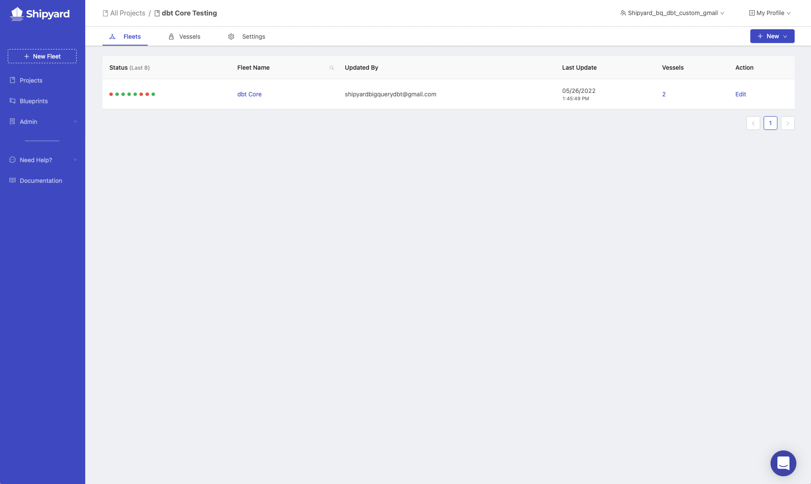
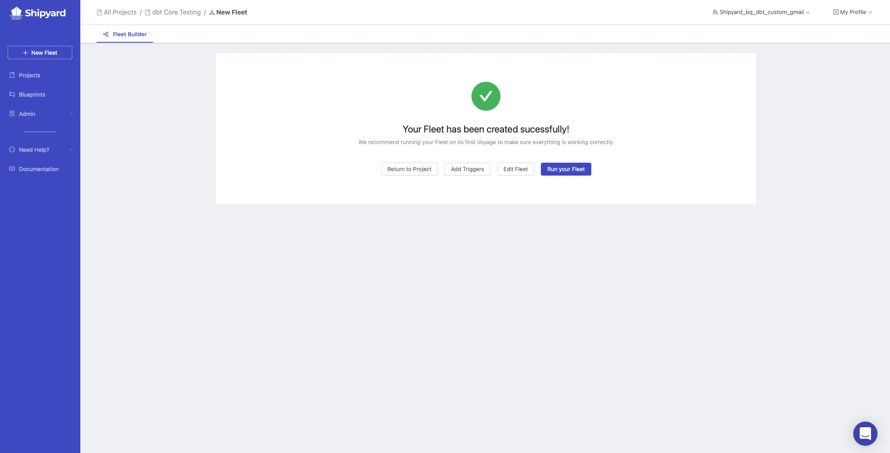
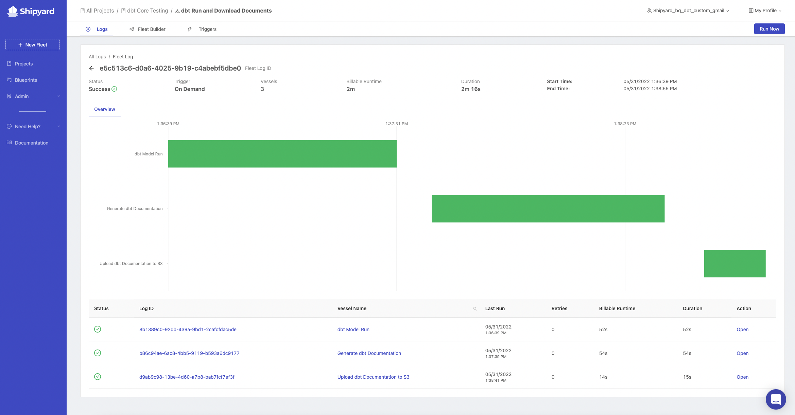
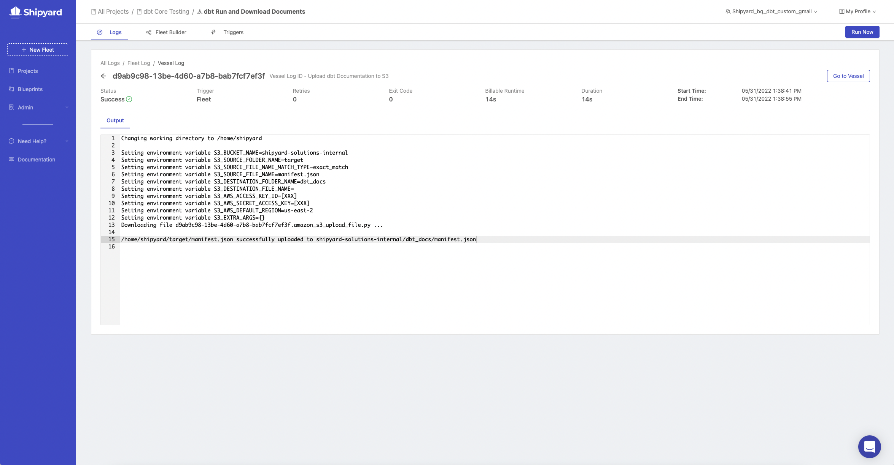

# dbt Core Part 4 - Run dbt Models and Exporting Documentation

In part 4 of the dbt Core guide, we will run the dbt model that was created in part 2. After the model completes its run, we will use Shipyard to upload the documentation to an Amazon S3 bucket. If you missed the first two installments of this guide, please go back and check them out: 

  * [Part 1](dbt-core-set-up-data-warehouse.md)
  * [Part 2](dbt-core-set-up-dbt.md)
  * [Part 3](dbt-core-set-up-shipyard.md)

## Run dbt model

1. Navigate back to the Project created in Part 2 called `dbt Core Testing`.

1. Click the **+ New Fleet** button in the top right corner of your page.
2. Click the gear icon on the sidebar of the Fleet Builder to open **Fleet Settings**.
3. Under **Fleet Name**, enter `dbt Run and Download Documents`. 
4. Click the plus sign on the Fleet Builder sidebar to begin adding Vessels.
5. Scroll to Org Blueprints and find the Blueprint that was created in part 2 of the guide called `dbt - Execute CLI Command`. Click the Blueprint to add it to the Fleet as a Vessel.
6. Under **Vessel Name**, enter `dbt Model Run`. Leave the **dbt CLI Command** as the default.

## Generate Documentation on the dbt Run

1. Click on the plus sign on the Fleet Builder sidebar.
2. Click the `dbt - Execute CLI Command` Blueprint again to add it to the Fleet a second time. 
3. Under **Vessel Name**, enter `Generate dbt Documentation`.
4. Under **dbt CLI Command**, enter `dbt docs generate`.
5. Connect the `dbt Model Run` and `dbt docs generate` Vessels together. 

## Upload Documentation to Amazon S3 Bucket

1. Click on the plus sign on the Fleet Builder sidebar.
2. Click on **Amazon S3** to expand the Blueprint options. Click the Blueprint titled `Upload Files`. A Vessel will be created and placed into the Fleet Builder.
3. Under **Vessel Name**, enter `Upload dbt Documentation to S3`.
4. Under **Bucket Name**, enter the bucket name inside of S3 in which you want the documentation to be placed.
5. Under **Local Folder Name**, enter `target`.
6. Under **Local File Name**, enter `manifest.json`.
7. Under **S3 Folder Name** and **S3 File Name**, feel free to populate those fields as you see fit to keep your bucket organized.
8. Under **Access Key ID** and **Secret Access Key**, enter those values from S3. See our [documentation](https://www.shipyardapp.com/docs/blueprint-library/amazon-s3/amazon-s3-authorization/) on authorization if you do not have those values readily available.
9. Under **Region**, enter the region of your S3 bucket.
10. Connect this Vessel to the `Generate dbt Documentation` Vessel.
11. Click **Save & Finish** on the bottom right of your page. This will redirect you to a page notifying you that your Fleet has been created successfully.

12. Click **Run your Fleet**. This will take you to the Fleet Log page.

On the Fleet Log, you can see the status confirms that the Fleet completed successfully. You can click on any of the Log IDs or the green bars to see the output from the Vessel run. Here is the output from the `Upload dbt Documentation to S3` Vessel:

### Other Options for Documentation Export

* [Azure Blob Storage](https://www.shipyardapp.com/docs/blueprint-library/azure-blob-storage/azure-blob-storage-overview/)
* [Box](https://www.shipyardapp.com/docs/blueprint-library/box/box-overview/)
* [Dropbox](https://www.shipyardapp.com/docs/blueprint-library/dropbox/dropbox-overview/)
* [Email](https://www.shipyardapp.com/docs/blueprint-library/email/email-overview/)
* [Google Cloud Storage](https://www.shipyardapp.com/docs/blueprint-library/google-cloud-storage/google-cloud-storage-overview/)
* [Google Drive](https://www.shipyardapp.com/docs/blueprint-library/google-drive/google-drive-overview/)
* [Slack](https://www.shipyardapp.com/docs/blueprint-library/slack/slack-overview/)