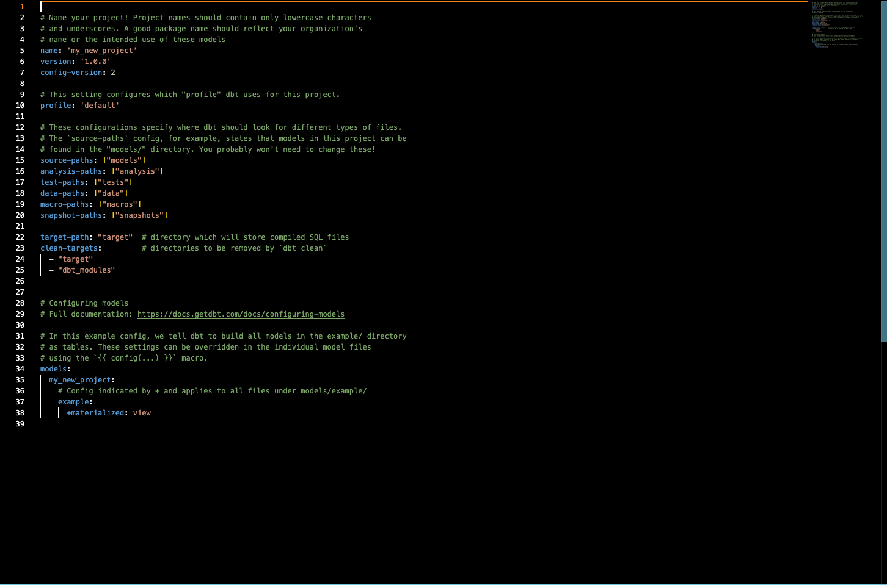
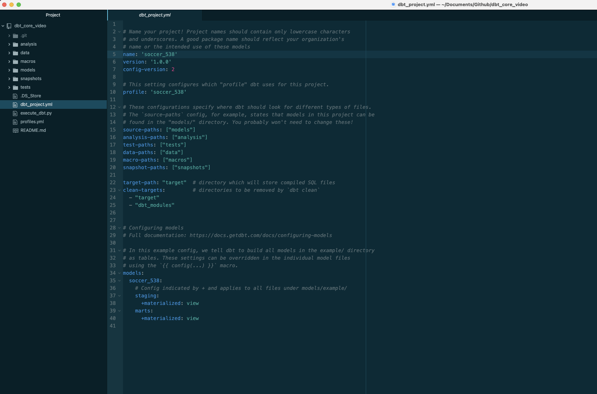
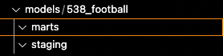

import Tabs from '@theme/Tabs';
import TabItem from '@theme/TabItem';

# dbt Core Part 2 - Setting Up dbt on GitHub

In part 2 of the dbt core setup series, we will review the setup process for each of the cloud data warehouses that we discussed on part 1. Before we can begin, there are some prerequisite items that need to be addressed:
* Complete [Part 1](dbt-core-set-up-data-warehouse.md) of the dbt core series
* Create a [GitHub Account](https://github.com/) if you do not currently have one.
* Have a text editor available. We recommend [Atom](https://atom.io/) or [Visual Studio Code](https://code.visualstudio.com/).

## dbt Set-Up

### Fork dbt Setup from GitHub
1. Fork [this repository](https://github.com/shipyardapp/dbt-guide-starting-point). The repository contains the beginning state of a dbt project.
2. Clone the repository locally on your computer.
3. Open `dbt_project.yml` in your text editor.




## dbt Project File Setup
1. Change the project name to `soccer_538`.
2. Change the profile to `soccer_538`.
3. Change model name to `soccer_538`.
4. Under the soccer_538 model, add a `staging` and `marts` folder that are both materialized as views.
5. Save your changes.



## dbt Profile Setup

<Tabs
groupId="code-inputs"
defaultValue="bigquery"
values={[
{label: 'BigQuery', value: 'bigquery'},
{label: 'Databricks', value: 'databricks'},
{label: 'Redshift', value: 'redshift'},
{label: 'Snowflake', value: 'snowflake'}
]}>

<TabItem value="bigquery">

1. Open `profiles.yml` and update the file to contain the following code:

```yaml title="profiles.yml"
soccer_538:
  target: dev
  outputs:
    dev:
      type: bigquery
      method: service-account
      project: dbt-demos # Replace this with your project id
      dataset: dbt_shipyard # Replace this with dbt_your_name, e.g. dbt_bob
      threads: 4
      timeout_seconds: 300
      location: US
      priority: interactive
      keyfile: "{{ env_var('BIGQUERY_KEYFILE') }}"
```
:::note
You'll note that the keyfile above is denoted as an environment variable. We will send that in as an environment variable inside of Platform to protect it from being seen.
:::
2. Create a new file in your root directory of your dbt project called `execute_dbt.py`.
3. Paste this code block for the content of `execute_dbt.py`:

```python title="execute_dbt.py"
import subprocess
import os
import json

bigquery_credentials = os.environ.get('BIGQUERY_CREDS')
directory_of_file = os.path.dirname(os.path.realpath(__file__))
dbt_command = os.environ.get('dbt_command', 'dbt run')

os.chdir(directory_of_file)
if not bigquery_credentials or not bigquery_credentials == 'None':
    bigquery_credentials = json.loads(bigquery_credentials)
    with open('bigquery_creds.json', 'w') as outfile:
        json.dump(bigquery_credentials, outfile)

subprocess.run(['sh', '-c', dbt_command], check=True)
```
4. Save your changes, make a commit, and push your changes to GitHub.

</TabItem>


<TabItem value="snowflake">

1. Open `profiles.yml` and update the file to contain the following code:

```yaml title="profiles.yml"
soccer_538:
  target: dev
  outputs:
    dev:
      type: snowflake
      account: "{{ env_var('snowflake_trial_account') }}"
      user: dbt_user
      password: "{{ env_var('dbt_user_password') }}"
      role: dbt_dev_role
      database: dbt_hol_dev
      warehouse: dbt_dev_wh
      schema: soccer_538
      threads: 200
```

2. Create a new file in your root directory of your dbt project called `execute_dbt.py`.
3. Paste this code block for the content of `execute_dbt.py`:

```python title="execute_dbt.py"
import subprocess
import os
import json

dbt_command = os.environ.get('dbt_command', 'dbt run')

subprocess.run(['sh', '-c', dbt_command], check=True)
```
5. Save your changes, make a commit, and push your changes to GitHub.

</TabItem>


<TabItem value="databricks">

1. Open `profiles.yml` and update the file to the following contents, changing the schema to use your name and the correct http path:

```yaml title="profiles.yml"
soccer_538:
    target: dev
    outputs:
        dev:
          type: databricks
          schema: dbt_jack_sparrow
          host: "{{ env_var('databricks_host') }}"
          http_path: /sql/your/http/path
          token: "{{ env_var('databricks_token') }}"
```
2. Create a new file in your root directory of your dbt project called `execute_dbt.py`.
3. Paste this code block for the content of `execute_dbt.py`:

```python title="execute_dbt.py"
import subprocess
import os
import json

dbt_command = os.environ.get('dbt_command', 'dbt run')

subprocess.run(['sh', '-c', dbt_command], check=True)
```
4. Save your changes, make a commit, and push your changes to GitHub.

</TabItem>


<TabItem value="redshift">

1. Open `profiles.yml` and update the file to contain the following code:

```yaml title="profiles.yml"
soccer_538:
    target: dev
    outputs:
        dev:
            type: redshift
            host: hostname.region.redshift.amazonaws.com
            user: "{{ env_var('redshift_username') }}"
            password: "{{ env_var('redshift_password') }}"
            port: 5439
            dbname: analytics
            schema: soccer
            threads: 4
            keepalives_idle: 240 # default 240 seconds
            connect_timeout: 10 # default 10 seconds
            ra3_node: true
```

2. Create a new file in your root directory of your dbt project called `execute_dbt.py`.
3. Paste this code block for the content of `execute_dbt.py`:

```python title="execute_dbt.py"
import subprocess
import os
import json

dbt_command = os.environ.get('dbt_command', 'dbt run')

subprocess.run(['sh', '-c', dbt_command], check=True)
```
4. Save your changes, make a commit, and push your changes to GitHub.

</TabItem>
</Tabs>

---

Now that we have our sample data and dbt processes setup, we need to write our example models for the dbt job to run.

## dbt Models Setup
1. Navigate into the models folder in your text editor. There should be a subfolder under models called `example`. Delete that subfolder and create a new folder called `538_football`.
2. Create two subfolders inside `538_football` called `staging` and `marts`.



3. Inside the staging folder, create a file called `stg_football_matches.sql` with the following query:

<Tabs
groupId="code-inputs"
defaultValue="bigquery"
values={[
{label: 'BigQuery', value: 'bigquery'},
{label: 'Databricks', value: 'databricks'},
{label: 'Redshift', value: 'redshift'},
{label: 'Snowflake', value: 'snowflake'}
]}>

<TabItem value="bigquery">

```sql title="stg_football_matches.sql"
SELECT * 
FROM dbt-demos.538_football.stg_football_matches
```

</TabItem>

<TabItem value="databricks">

```sql title="stg_football_matches.sql"
SELECT * 
FROM default.stg_football_matches
```
</TabItem>

<TabItem value="redshift">

```sql title="stg_football_matches.sql"
SELECT *
FROM soccer.stg_football_matches
```
</TabItem>

<TabItem value="snowflake">

```sql title="stg_football_matches.sql"
SELECT *
FROM "DBT_HOL_DEV"."PUBLIC"."STG_FOOTBALL_MATCHES"
```
</TabItem>
</Tabs>

4.  Inside the staging folder, create a file called `stg_football_rankings.sql` with the following query:

<Tabs
groupId="code-inputs"
defaultValue="bigquery"
values={[
{label: 'BigQuery', value: 'bigquery'},
{label: 'Databricks', value: 'databricks'},
{label: 'Redshift', value: 'redshift'},
{label: 'Snowflake', value: 'snowflake'}
]}>

<TabItem value="bigquery">

```sql title="stg_football_rankings.sql"
SELECT * 
FROM `dbt-demos.538_football.stg_football_rankings`
```
</TabItem>

<TabItem value="databricks">

```sql title="stg_football_rankings.sql"
SELECT * 
FROM default.stg_football_rankings
```

</TabItem>

<TabItem value="redshift">

```sql title="stg_football_rankings.sql"
SELECT *
FROM soccer.stg_football_rankings
```
</TabItem>

<TabItem value="snowflake">

```sql title="stg_football_rankings.sql"
SELECT *
FROM "DBT_HOL_DEV"."PUBLIC"."stg_football_rankings"
```

</TabItem>
</Tabs>

5. In the staging folder, add a file called `schema.yml` with the following code:

```yaml title="schema.yml"
version: 2

models:
  - name: stg_football_matches
    description: Table from 538 that displays football matches and predictions about each match.

  - name: stg_football_rankings
    description: Table from 538 that displays a teams ranking worldwide
```
:::note
This is file is where you will be able to add tests later.
:::

6.  In the marts folder, create a file called `mart_football_information.sql` with the following query:


```sql title="mart_football_information.sql"
WITH
  qryMatches AS (
    SELECT *
    FROM {{ ref('stg_football_matches') }}
    WHERE league = 'Barclays Premier League'
    ),
  qryRankings AS (
    SELECT *
    FROM {{ ref('stg_football_rankings') }}
    WHERE league = 'Barclays Premier League'
  ),

  qryFinal AS (
    SELECT
      qryMatches.season,
      qryMatches.date,
      qryMatches.league,
      qryMatches.team1,
      qryMatches.team2,
      team_one.rank AS team1_rank,
      team_two.rank AS team2_rank
    FROM qryMatches 
    JOIN
      qryRankings AS team_one ON
        (qryMatches.team1 = team_one.name) 
    JOIN
      qryRankings AS team_two ON
        (qryMatches.team2 = team_two.name)
  )

SELECT *
FROM qryFinal
```

7.  In the marts folder, add a file called `schema.yml` containing the following code.

```yml title="schema.yml"
version: 2

models:
  - name: mart_football_information
    description: Table that displays football matches along with each team's world ranking.
```
8. Save the changes.
9. Push a commit to GitHub

:::note
In this tutorial, we made changes using the main branch of our GitHub repository. This was done for simplicity sake and is not the best practice.
:::

We are ready to move into Platform to run our process in the cloud.

