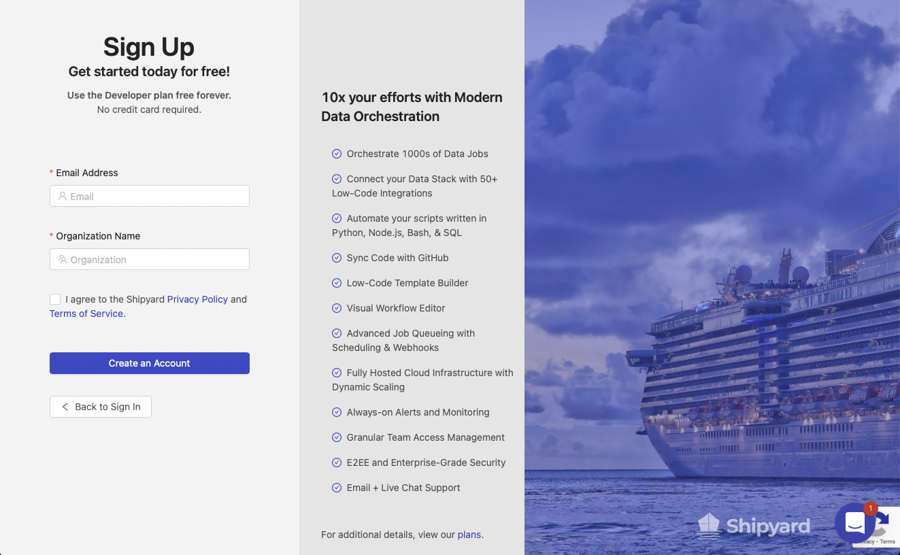
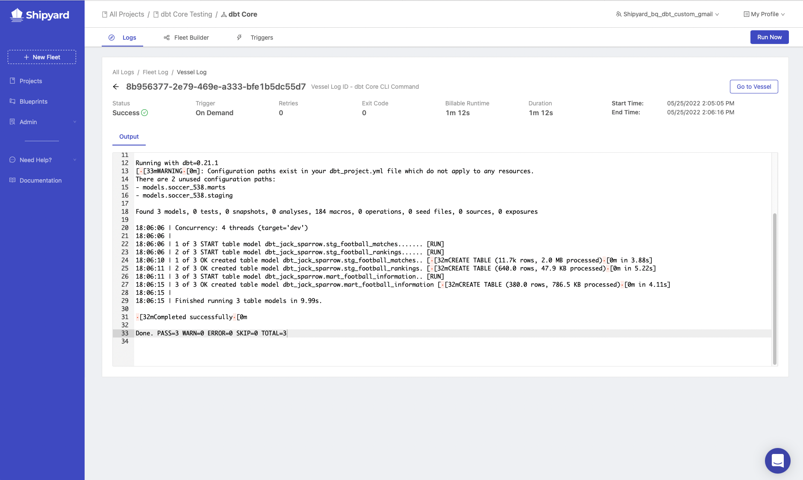

import Tabs from '@theme/Tabs';
import TabItem from '@theme/TabItem';

# dbt Core Part 2 - Setting Up dbt on GitHub

In part 2 of the dbt core setup series, we will review the setup process for each of the cloud data warehouses that we discussed on part 1. We will also setup a free developer account on **Shipyard** and setup a Blueprint to run our dbt core process. Before we can begin, there are some prerequisite items that need to be addressed:
* Complete [Part 1](dbt-core-set-up-data-warehouse.md) of the dbt core series
* Create a [Github Account](https://github.com/) if you do not currently have one.
* Have a text editor available. We recommend [Atom](https://atom.io/) or [Visual Studio Code](https://code.visualstudio.com/).

## dbt Set-Up

### Fork dbt Setup from GitHub
1. Fork [this repository](https://github.com/smjohnsonShipyard/dbt_test). The repository contains the beginning state of a dbt project.
2. Open `dbt_project.yml` in your text editor.


## dbt Project File Setup
1. Change the project name to `soccer_538`.
2. Change the profile to `soccer_538`.
3. Change model name to `soccer_538`.
4. Under the soccer_538 model, add a `staging` and `marts` folder that are both materialized as views.
5. Save your changes.

## dbt Profile Setup

<Tabs
groupId="code-inputs"
defaultValue="bigquery"
values={[
{label: 'BigQuery', value: 'bigquery'},
{label: 'Databricks', value: 'databricks'},
{label: 'Redshift', value: 'redshift'},
{label: 'Snowflake', value: 'snowflake'}
]}>

<TabItem value="bigquery">

1. Open `profiles.yml` and update the file to contain the following code:

```yaml title="profiles.yml"
soccer_538:
  target: dev
  outputs:
    dev:
      type: bigquery
      method: service-account
      project: dbt-demos # Replace this with your project id
      dataset: dbt_shipyard # Replace this with dbt_your_name, e.g. dbt_bob
      threads: 4
      timeout_seconds: 300
      location: US
      priority: interactive
      keyfile: "{{ env_var('BIGQUERY_KEYFILE') }}"
```
:::note
You'll note that the keyfile above is denoted as an environment variable. We will send that in as an environment variable inside of Shipyard to protect it from being seen.
:::
1. Create a new file in your root directory of your dbt project called `execute_dbt.py`.
2. Paste this code block for the content of execute_dbt.py:

```python title="execute_dbt.py"
import subprocess
import os
import json

bigquery_credentials = os.environ.get('BIGQUERY_CREDS')
directory_of_file = os.path.dirname(os.path.realpath(__file__))
dbt_command = os.environ.get('dbt_command', 'dbt run')

os.chdir(directory_of_file)
if not bigquery_credentials or not bigquery_credentials == 'None':
    bigquery_credentials = json.loads(bigquery_credentials)
    with open('bigquery_creds.json', 'w') as outfile:
        json.dump(bigquery_credentials, outfile)

subprocess.run(['sh', '-c', dbt_command], check=True)
```
3. Commit and push your changes to Github.

</TabItem>


<TabItem value="snowflake">

1. Open `profiles.yml` and update the file to contain the following code:

```yaml title="profiles.yml"
soccer_538:
  target: dev
  outputs:
    dev:
      type: snowflake
      account: "{{ env_var('snowflake_trial_account') }}"
      user: dbt_user
      password: "{{ env_var('dbt_user_password') }}"
      role: dbt_dev_role
      database: dbt_hol_dev
      warehouse: dbt_dev_wh
      schema: soccer_538
      threads: 200
```

2. Create a new file in your root directory of your dbt project called `execute_dbt.py`.
3. Paste this code block for the content of execute_dbt.py:

```python title="execute_dbt.py"
import subprocess
import os
import json

dbt_command = os.environ.get('dbt_command', 'dbt run')

subprocess.run(['sh', '-c', dbt_command], check=True)
```
5. Commit and push your changes to Github.

</TabItem>


<TabItem value="databricks">

1. Open `profiles.yml` and Update the file to the following contents, changing the schema to use your name and the correct http path:

```yaml title="profiles.yml"
soccer_538:
    target: dev
    outputs:
        dev:
          type: databricks
          schema: dbt_jack_sparrow
          host: "{{ env_var('databricks_host') }}"
          http_path: /sql/your/http/path
          token: "{{ env_var('databricks_token') }}"
```
2. Create a new file in your root directory of your dbt project called `execute_dbt.py`.
3. Paste this code block for the content of execute_dbt.py:

```python title="execute_dbt.py"
import subprocess
import os
import json

dbt_command = os.environ.get('dbt_command', 'dbt run')

subprocess.run(['sh', '-c', dbt_command], check=True)
```
4. Commit and push your changes to Github.

</TabItem>


<TabItem value="redshift">

1. Open `profiles.yml` and update the file to contain the following:

```yaml title="profiles.yml"
soccer_538:
    target: dev
    outputs:
        dev:
            type: redshift
            host: hostname.region.redshift.amazonaws.com
            user: "{{ env_var('redshift_username') }}"
            password: "{{ env_var('redshift_password') }}"
            port: 5439
            dbname: analytics
            schema: soccer
            threads: 4
            keepalives_idle: 240 # default 240 seconds
            connect_timeout: 10 # default 10 seconds
            ra3_node: true
```

2. Create a new file in your root directory of your dbt project called `execute_dbt.py`.
3. Paste this code block for the content of `execute_dbt.py`:

```python title="execute_dbt.py"
import subprocess
import os
import json

dbt_command = os.environ.get('dbt_command', 'dbt run')

subprocess.run(['sh', '-c', dbt_command], check=True)
```
4. Commit and push your changes to Github.

</TabItem>
</Tabs>

---

Now that we have our sample data and dbt processes setup, we need to write our example models for the dbt job to run.

## dbt Models Setup
1. Navigate into the models folder in your text editor. There should be a subfolder under models called `example`. Delete that subfolder and create a new folder called `538_football`.
2. Create two subfolders inside `538_football` called `staging` and `marts`.


3. Inside the staging folder, create a file called `stg_football_matches.sql` with the following query:

<Tabs
groupId="code-inputs"
defaultValue="bigquery"
values={[
{label: 'BigQuery', value: 'bigquery'},
{label: 'Databricks', value: 'databricks'},
{label: 'Redshift', value: 'redshift'},
{label: 'Snowflake', value: 'snowflake'}
]}>

<TabItem value="bigquery">

```sql title="stg_football_matches.sql"
SELECT * 
FROM dbt-demos.538_football.stg_football_matches
```

</TabItem>

<TabItem value="databricks">

```sql title="stg_football_matches.sql"
SELECT * 
FROM default.stg_football_matches
```
</TabItem>

<TabItem value="redshift">

```sql title="stg_football_matches.sql"
SELECT *
FROM soccer.stg_football_matches
```
</TabItem>

<TabItem value="snowflake">

```sql title="stg_football_matches.sql"
SELECT *
FROM "DBT_HOL_DEV"."PUBLIC"."STG_FOOTBALL_MATCHES"
```
</TabItem>
</Tabs>

4.  Inside the staging folder, create a file called `stg_football_rankings.sql` with the following query:

<Tabs
groupId="code-inputs"
defaultValue="bigquery"
values={[
{label: 'BigQuery', value: 'bigquery'},
{label: 'Databricks', value: 'databricks'},
{label: 'Redshift', value: 'redshift'},
{label: 'Snowflake', value: 'snowflake'}
]}>

<TabItem value="bigquery">

```sql title="stg_football_rankings.sql"
SELECT * 
FROM dbt-demos.538_football.stg_football_rankings
```
</TabItem>

<TabItem value="databricks">

```sql title="stg_football_rankings.sql"
SELECT * 
FROM `default.stg_football_rankings`
```

</TabItem>

<TabItem value="redshift">

```sql title="stg_football_rankings.sql"
SELECT *
FROM `soccer.stg_football_rankings`
```
</TabItem>

<TabItem value="snowflake">

```sql title="stg_football_rankings.sql"
SELECT *
FROM `"DBT_HOL_DEV"."PUBLIC"."stg_football_rankings"`
```

</TabItem>
</Tabs>

5. In the staging folder, add a file called `schema.yml` with the following code:

```yaml title="schema.yml"
version: 2

models:
  - name: stg_football_matches
    description: Table from 538 that displays football matches and predictions about each match.

  - name: stg_football_rankings
    description: Table from 538 that displays a teams ranking worldwide
```
:::note
This is file is where you will be able to add tests later.
:::

6.  In the marts folder, create a file called `mart_football_information.sql` with the following query:


```sql title="mart_football_information.sql"
WITH
  qryMatches AS (
    SELECT *
    FROM {{ ref('stg_football_matches') }}
    WHERE league = 'Barclays Premier League'
    ),
  qryRankings AS (
    SELECT *
    FROM {{ ref('stg_football_rankings') }}
    WHERE league = 'Barclays Premier League'
  ),

  qryFinal AS (
    SELECT
      qryMatches.season,
      qryMatches.date,
      qryMatches.league,
      qryMatches.team1,
      qryMatches.team2,
      team_one.rank AS team1_rank,
      team_two.rank AS team2_rank
    FROM qryMatches 
    JOIN
      qryRankings AS team_one ON
        (qryMatches.team1 = team_one.name) 
    JOIN
      qryRankings AS team_two ON
        (qryMatches.team2 = team_two.name)
  )

SELECT *
FROM qryFinal
```

7.  In the marts folder, add a file called `schema.yml` containing the following code.

```yml title="schema.yml"
version: 2

models:
  - name: mart_football_information
    description: Table that displays football matches along with each team's world ranking.
```

We are ready to move into Shipyard to run our process. First, you will need to create a developer account.

### Create Shipyard Developer Account

1. Navigate to Shipyard's [sign-up page](https://app.shipyardapp.com/auth/signup).



2. Sign up with your email address and organization name.
3. Connect to your Github account by following this [guide](https://www.shipyardapp.com/blog/automate-deployment-github-code/). After connecting your Github account, you'll be ready to create your first Blueprint.

### Creating dbt Core Blueprint
1. On the sidebar of Shipyard's website, click **Blueprints**.
2. Click **Add Blueprint** on the top right of your page.
3. Select **Python**.

### Setting Blueprint Inputs
1. Under **Blueprint variables**, click **Add Variable**.
5. Under **Display Name**, enter `dbt CLI Command`.
6. Under **Reference Name**, enter `dbt_command`.
7. Under **Default Value**, enter dbt run.
8. Click the check box for required.
9.  Under **Placeholder**, enter `Enter the command for dbt`.
10. Click Next

### Connect to your dbt Code
1. Click **Git**.


2. Select the repository where your dbt files sit.
3. Click the source that you want the files pulled from. Generally **main** or **master**.
4. Under **File to Run**, enter `execute_dbt.py`.
5. Under **Git Clone Location**, select the option for [Unpack into Current Working Directory](https://www.shipyardapp.com/docs/reference/code/git-connection/#unpack-into-current-working-directory).
6. Click **Next Step** on the bottom right of the screen.

### Add Requirements
1. Next to **Environment Variable**, click the plus sign 3 times to add 3 new environment variables.

The environment variables that need to be added will vary based on the cloud database that you use. Please select your database below. 

:::note
If a value is wrapped in `{}` this means that you need to update this with a value that's unique to your situation:
:::

<Tabs
groupId="code-inputs"
defaultValue="bigquery"
values={[
{label: 'BigQuery', value: 'bigquery'},
{label: 'Databricks', value: 'databricks'},
{label: 'Redshift', value: 'redshift'},
{label: 'Snowflake', value: 'snowflake'}
]}>


<TabItem value="bigquery">

| Variable Name     | Value                    |
|-------------------|--------------------------|
| BIGQUERY_CREDS   | `{bigquery_json_credentials}`        |
| BIGQUERY_KEYFILE | `./bigquery_creds.json`     |
| DBT_PROFILES_DIR | `.`                         |

</TabItem>

<TabItem value="databricks">

| Variable Name     | Value                    |
|-------------------|--------------------------|
| databricks_host   | `{host_from_databricks}`   |
| databricks_token  | `token_from_databricks}`  |
| DBT_PROFILES_DIR  | `.`                        |

</TabItem>

<TabItem value="redshift">

| Variable Name     | Value                    |
|-------------------|--------------------------|
| redshift_username | `{username_from_redshift}` |
| redshift_password | `{password_from_redshift}` |
| DBT_PROFILES_DIR  | `.`                        |

</TabItem>


<TabItem value="snowflake">

| Variable Name           | Value                    |
|-------------------------|--------------------------|
| snowflake_trial_account | `{snowflake_account_name}` |
| dbt_user_password       | `{password_from_snowflake}` |
| DBT_PROFILES_DIR        | `.`                        |

</TabItem>
</Tabs>

2. Click the plus sign next to **Python Packages** twice to add two new packages.
3. In the first **Name** field, enter `dbt`. In the version field, enter `==0.21.1`.
:::caution
For Databricks, use `dbt-databricks` instead of dbt
:::
4. In the second **Name** field, enter `MarkupSafe`. In the version field, enter `==2.0.1`.
4. Click **Next**.

### Blueprint Settings
1. Under **Blueprint Name**, enter `dbt - Execute CLI Command`.
2. Under **Synopsis**, enter `This Blueprint runs a dbt core command.`
3. Click **Save & Finish**.
4. On the success screen, click **Use this Blueprint**. This will take you over to the Fleet Builder and prompt you to select a project.

### Build dbt Core Fleet
1. On the **Select a Project** prompt, click the drop down menu to expand it and select `Create a New Project`.
2. Under project name, enter `dbt Core Testing`.
3. Under **timezone**, enter your timezone.
4. Click **Create Project**.


5. Make sure `dbt Core Testing` is selected and click **Select Project**. This will create a new Fleet in the project. The Fleet Builder will now be visible with one Vessel located inside of the Fleet, built using your new `dbt - Execute CLI Command` Blueprint. On the left-hand side of your screen, you'll see the settings for the Vessel.


6. Under **Vessel Name**, enter `dbt Core CLI Command`.
7. Under **dbt CLI Command**, enter `dbt debug`.
8. Click the gear on the sidebar to open Fleet Settings.


9. Under **Fleet Name**, enter `dbt Core`.
10. Click **Save & Finish** on the bottom right of your screen. This will take you to a page showing that your Fleet was created successfully.


### Run dbt Core Fleet
1.  Click **Run Your Fleet**. This will take you over to the live running Fleet Log.


2. Click on the bar to get the output from your run.



If you scroll to the top of the output, you will see that the environment variables that were put in during the Blueprint creation process are hidden from the user.


If dbt debug succeeds, we are ready to move into part three of the guide. If it fails, please go back to the steps above and make sure everything is setup correctly. Feel free to send an Intercom message to us at anytime using the widget on the bottom right of the Shipyard application. 
