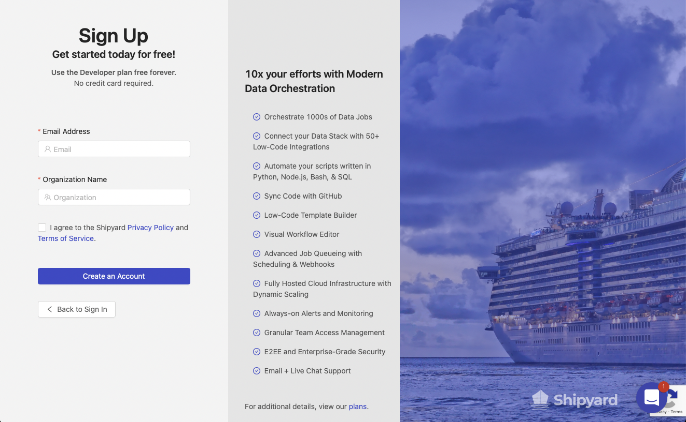
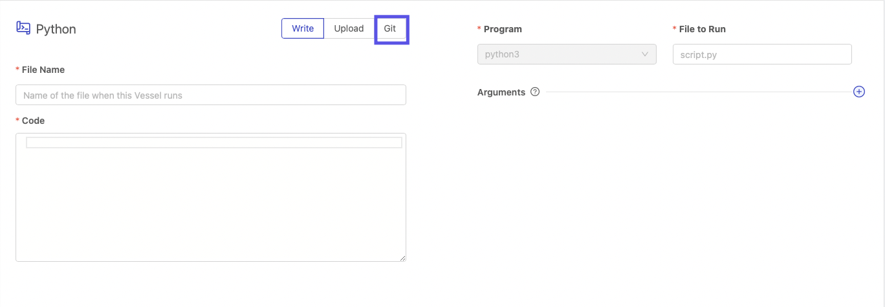
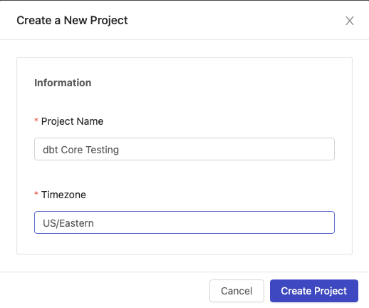
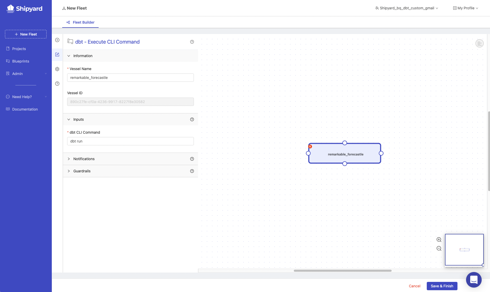
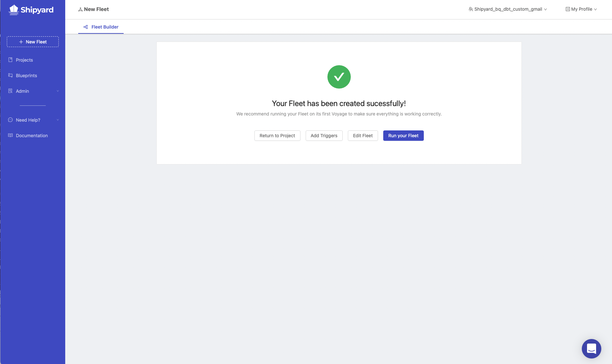
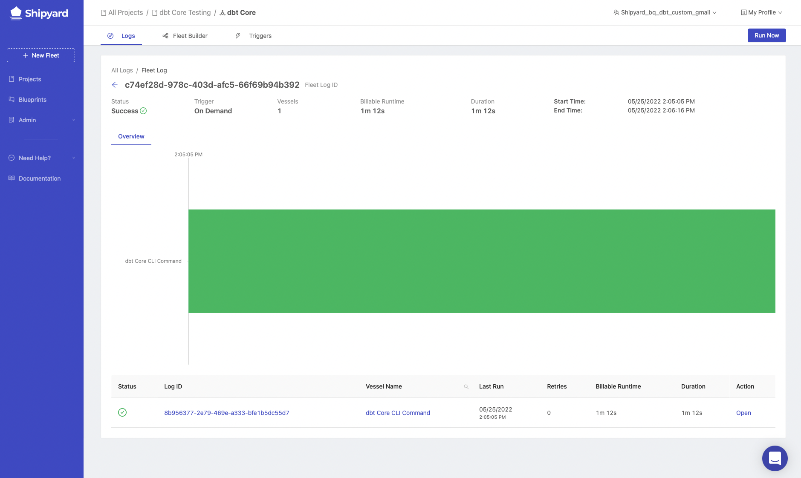
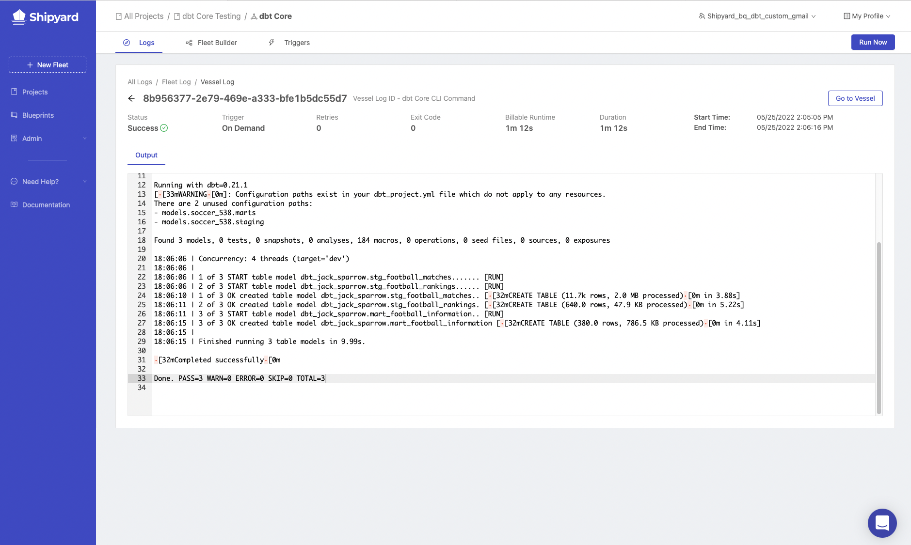
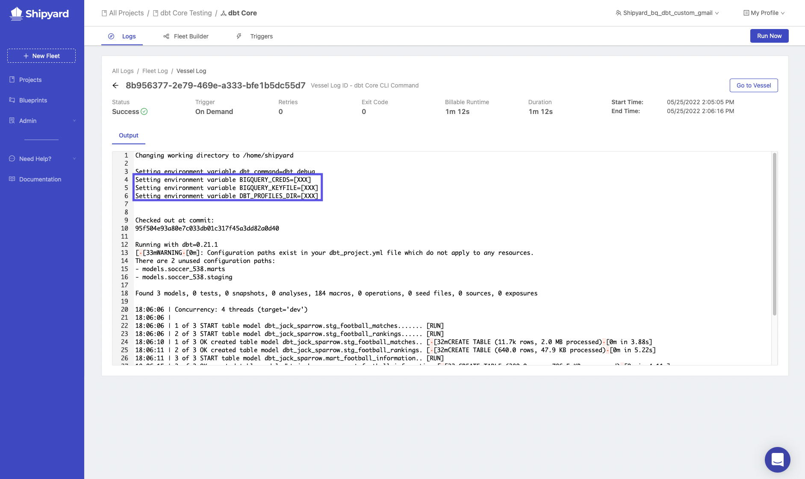

import Tabs from '@theme/Tabs';
import TabItem from '@theme/TabItem';

# dbt Core Part 3 - Setting Up dbt on Shipyard
In part 3 of this guide, we will move into Shipyard to deploy dbt Core in the cloud. First, we will need to create a free developer account for Shipyard. After we have a developer account, we will create a Blueprint that can run dbt Core commands.

### Create Shipyard Developer Account

1. Navigate to Shipyard's [sign-up page](https://app.shipyardapp.com/auth/signup).

2. Sign up with your email address and organization name.
3. Connect to your GitHub account by following this [guide](https://www.shipyardapp.com/blog/automate-deployment-github-code/). After connecting your GitHub account, you'll be ready to create your first Blueprint.

### Creating dbt Core Blueprint
1. On the sidebar of Shipyard's website, click **Blueprints**.
2. Click **Add Blueprint** on the top right of your page.
3. Select **Python**.

### Setting Blueprint Inputs
1. Under **Blueprint variables**, click **Add Variable**.
5. Under **Display Name**, enter `dbt CLI Command`.
6. Under **Reference Name**, enter `dbt_command`.
7. Under **Default Value**, enter dbt run.
8. Click the check box for required.
9.  Under **Placeholder**, enter `Enter the command for dbt`.
10. Click Next

### Connect to your dbt Code
1. Click **Git**.

2. Select the repository where your dbt files sit.
3. Click the source that you want the files pulled from. Generally **main** or **master**.
4. Under **File to Run**, enter `execute_dbt.py`.
5. Under **Git Clone Location**, select the option for [Unpack into Current Working Directory](https://www.shipyardapp.com/docs/reference/code/git-connection/#unpack-into-current-working-directory).
6. Click **Next Step** on the bottom right of the screen.

### Add Requirements
1. Next to **Environment Variable**, click the plus sign 3 times to add 3 new environment variables.

The environment variables that need to be added will vary based on the cloud database that you use. Please select your database below. 

:::note
If a value is wrapped in `{}` this means that you need to update this with a value that's unique to your situation:
:::

<Tabs
groupId="code-inputs"
defaultValue="bigquery"
values={[
{label: 'BigQuery', value: 'bigquery'},
{label: 'Databricks', value: 'databricks'},
{label: 'Redshift', value: 'redshift'},
{label: 'Snowflake', value: 'snowflake'}
]}>

<TabItem value="bigquery">

| Variable Name     | Value                    |
|-------------------|--------------------------|
| BIGQUERY_CREDS   | `{bigquery_json_credentials}`        |
| BIGQUERY_KEYFILE | `./bigquery_creds.json`     |
| DBT_PROFILES_DIR | `.`                         |

</TabItem>

<TabItem value="databricks">

| Variable Name     | Value                    |
|-------------------|--------------------------|
| databricks_host   | `{host_from_databricks}`   |
| databricks_token  | `token_from_databricks}`  |
| DBT_PROFILES_DIR  | `.`                        |

</TabItem>

<TabItem value="redshift">

| Variable Name     | Value                    |
|-------------------|--------------------------|
| redshift_username | `{username_from_redshift}` |
| redshift_password | `{password_from_redshift}` |
| DBT_PROFILES_DIR  | `.`                        |

</TabItem>

<TabItem value="snowflake">

| Variable Name           | Value                    |
|-------------------------|--------------------------|
| snowflake_trial_account | `{snowflake_account_name}` |
| dbt_user_password       | `{password_from_snowflake}` |
| DBT_PROFILES_DIR        | `.`                        |

</TabItem>
</Tabs>

2. Click the plus sign next to **Python Packages** twice to add two new packages.

<Tabs
groupId="code-inputs"
defaultValue="bigquery"
values={[
{label: 'BigQuery', value: 'bigquery'},
{label: 'Databricks', value: 'databricks'},
{label: 'Redshift', value: 'redshift'},
{label: 'Snowflake', value: 'snowflake'}
]}>

<TabItem value="bigquery">

3. In the first **Name** field, enter `dbt-bigquery`. In the version field, enter `==1.0.0`.

</TabItem>

<TabItem value="databricks">

3. In the first **Name** field, enter `dbt-databricks`. In the version field, enter `==1.0.0`.

</TabItem>

<TabItem value="redshift">

3. In the first **Name** field, enter `dbt-redshift`. In the version field, enter `==1.0.0`.

</TabItem>

<TabItem value="snowflake">

3. In the first **Name** field, enter `dbt-snowflake`. In the version field, enter `==1.0.0`.

</TabItem>
</Tabs>

4. Click **Next**.

### Blueprint Settings
1. Under **Bluprint Name**, enter `dbt - Execute CLI Command`.
2. Under **Synopsis**, enter `This Blueprint runs a dbt core command.`
3. Click **Save & Finish**.
4. On the success screen, click **Use this Blueprint**. This will take you over to the Fleet Builder and prompt you to select a project.

### Build dbt Core Fleet
1. On the **Select a Project** prompt, click the drop down menu to expand it and select `Create a New Project`.
2. Under project name, enter `dbt Core Testing`.
3. Under **timezone**, enter your timezone.
4. Click **Create Project**.

5. Make sure `dbt Core Testing` is selected and click **Select Project**. This will create a new Fleet in the project. The Fleet Builder will now be visible with one Vessel located inside of the Fleet, built using your new `dbt - Execute CLI Command` Blueprint. On the left-hand side of your screen, you'll see the settings for the Vessel.

6. Under **Vessel Name**, enter `dbt Core CLI Command`.
7. Under **dbt CLI Command**, enter `dbt debug`.
8. Click the gear on the sidebar to open Fleet Settings.

9. Under **Fleet Name**, enter `dbt Core`.
10. Click **Save & Finish** on the bottom right of your screen. This will take you to a page showing that your Fleet was created successfully.

### Run dbt Core Fleet
1.  Click **Run Your Fleet**. This will take you over to the live running Fleet Log.

2. Click on the bar to get the output from your run.

If you scroll to the top of the output, you will see that the environment variables that were put in during the Blueprint creation process are hidden from the user.

If dbt debug succeeds, we are ready to move into part three of the guide. If it fails, please go back to the steps above and make sure everything is setup correctly. Feel free to send an Intercom message to us at anytime using the widget on the bottom right of the Shipyard application. 
