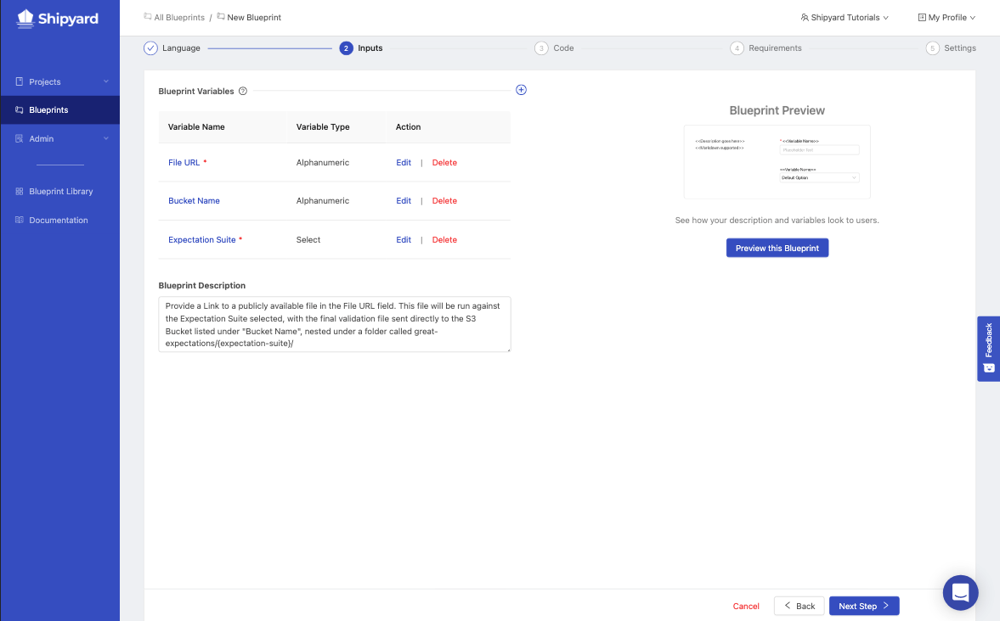
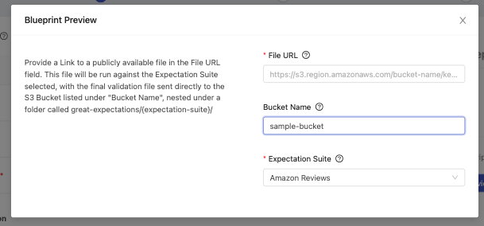
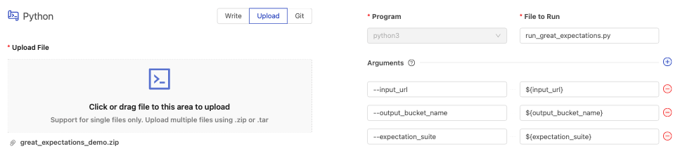
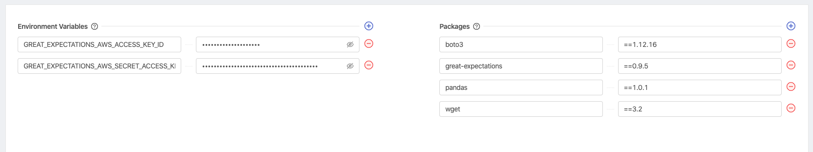
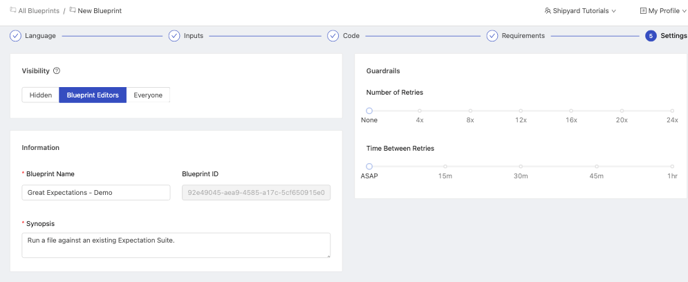
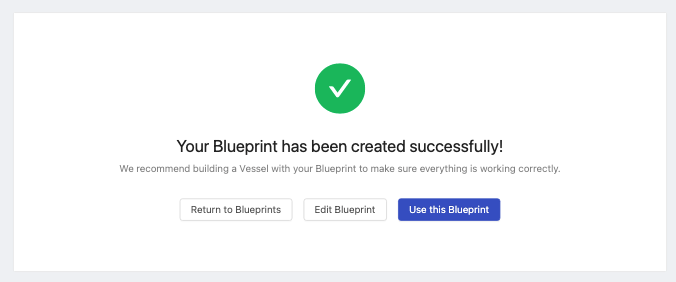
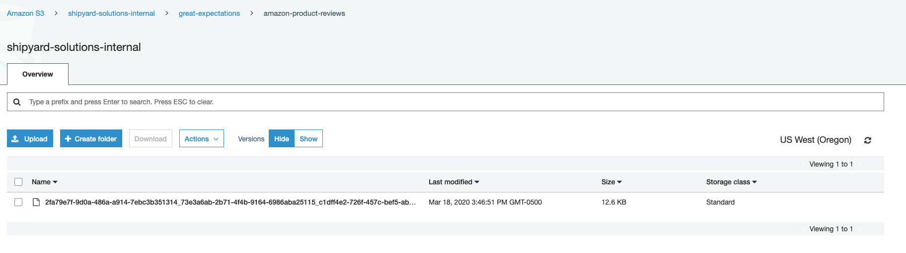

# Building a Blueprint with Great Expectations

## Overview

In this tutorial, you'll walk through the steps required to set up Great Expectations to run in the cloud, on Shipyard. We will be creating a Blueprint that can be re-used by multiple team members and updated in the background. This tutorial is only in Python.

By the end of the tutorial, you'll be able to:

- Set up a Blueprint using Python
- Successfully run Great Expectations on Shipyard
- Share expectations with your organization
- Run multiple instances of Great Expectations simultaneously
- Integrate an Expectation Suite into your Fleets

For more information, read [our blog post](https://www.shipyardapp.com/blog/getting-started-with-great-expectations/) that covers Getting Started with Great Expectations. You can also visit [www.greatexpectations.io](https://www.greatexpectations.io) for additional information.

## Setup

:::caution
For the sake of the this tutorial, we will be building a Fleet inside of a Project called "Default". You can do this by logging into Shipyard and, on the sidebar, click on **New Fleet** to begin.
:::

Download the [following file](https://drive.google.com/file/d/1eQPfrCMHYGpRH1mgqFbbugra1gtR57IR/view?usp=share_link) to your computer, without changing the file name. It's a .zip containing a single python file and a Great Expectations directory structure with JSON expectation suites and a YML setup file. We'll use this throughout the tutorial.

Feel free to peruse this script beforehand so you understand everything that it's doing. The main script is accomplishing the following things:

1. Downloading a file from a public URL.
2. Decompressing the file if it is a`.gz` file and converting the file into a CSV if it is not one already.
3. Running Great Expectations against the downloaded file, using the included sample expectation suites.
4. Uploading the validation output to S3, using a file name structure that reference's Shipyard's [Platform Environment Variables](../../reference/environment-variables/shipyard-environment-variables.md).
5. Printing the validation results to the standard output.
6. Returning the appropriate exit code based on expectation results.

## Steps

1. Click **Blueprints** on the side navigation bar.
2. Click the **Add Blueprint** button in the top right.

### Step 1 - Select A Language

Click on **Python**. You'll be immediately redirected to the next step.

### Step 2 - Create Blueprint Variables

Click the **+** icon to create a new Blueprint variable. You should see a screen that looks like this:

Our code for Great Expectations has 3 variables that we expect to receive. For a detailed overview of each of these fields, read more about [Blueprint Variables](../../reference/blueprints/org-blueprints/blueprint-variables.md).

#### File URL

1. Set the Display Name to `File URL`
2. Set the Reference Name to `input_url`
3. Leave the Variable Type set to Alphanumeric.
4. Leave the Default Value empty.
5. Check the box for Required?
6. Set the Placeholder to `https://s3.region.amazonaws.com/bucket-name/key-name.csv`
7. Set the Tooltip to `URL to download the file from. Must be publicly accessible.`
8. Click **Add Variable**.

#### Bucket Name

1. Set the Display Name to `Bucket Name`
2. Set the Reference Name to `output_bucket_name`
3. Leave the Variable Type set to Alphanumeric.
4. Set the Default Value to the bucket name you set up during the setup phase.
5. Leave the Required field alone.
6. Leave the Placeholder empty.
7. Set the Tooltip to `Bucket Name to store the validation JSON files.`
8. Click **Add Variable**.

#### Expectation Suite

1. Set the Display Name to `Expectation Suite`
2. Set the Reference Name to `expectation_suite`
3. Change the Variable Type to **Select**
4. Under the new section of *Selection Options* click the **+** button twice.
   1. Set the first Display Name box to `Amazon Reviews` and set the Internal Value to `amazon-product-reviews`.
   2. Set the second Display Name box to `Sample` and set the Internal Value to `sample-suite`
5. Set the Default Value to `Amazon Reviews`.
6. Leave the Required? field alone.
7. Leave the Placeholder empty.
8. Set the Tooltip to `Select which of our Expectation Suites to use against the provided file.`
9. Click **Add Variable**.

Give your Blueprint a Description of `Provide a Link to a publicly available file in the File URL field. This file will be run against the Expectation Suite selected, with the final validation file sent directly to the S3 Bucket listed under "Bucket Name", nested under a folder called great-expectations/{expectation-suite}/`

At this point, your screen should look something like this. 

Click **Preview this Blueprint** to verify how everything will look and feel to a user. 

Once you've verified that everything is set up correctly, go ahead and click **Next Step**.

### Step 3 - Provide Your Code

1. Click the upload section of the page and select the `great_expectations_demo.zip` file from your computer.
2. On the right-hand side of the screen, enter `run_great_expectations.py` into the File to Run field.
3. Click the **+** icon next to arguments 3 times.

We'll be creating an argument for each of the Blueprint Variables that we created in the last step, passing through the user input as `${reference_name}`.

1. In the first set of fields, type `--input_url` for the flag and `${input_url}` for the value.
2. In the second set of fields, type `--output_bucket_name` for the flag and `${output_bucket_name}` for the value.
3. In the final set of fields, type `--expectation_suite` for the flag and `${expectation_suite}` for the value.

Once these steps are complete, your screen should look exactly like this.

Once you've verified that everything has been set up correctly, click **Next Step** in the bottom right.

### Step 4 - Requirements

#### Environment Variables

1. Click the **+** icon next to Environment Variables twice to add two new variables.
2. Set the first variable's Name to `GREAT_EXPECTATIONS_AWS_ACCESS_KEY_ID` and Value to the Access Key ID of the bucket you chose during your Setup.
3. Set the second variable's Name to `GREAT_EXPECTATIONS_AWS_SECRET_ACCESS_KEY` and Value to the AWS Secret of the bucket you chose during your Setup.

:::note
The value field will always show `•••••••` as you type. This is because Environment Variables are commonly used for passwords and secrets. You can always reveal what you've written by clicking the eye icon. 
:::

#### Packages

1. Click the **+** icon next to Packages 4 times to add four new packages.
2. Set the first Package Name to `boto3` and the version to `==1.12.16`
3. Set the second Package Name to `great-expectations` and the version to `==0.9.5`
4. Set the third Package Name to `pandas` and the version to `==1.0.1`
5. Set the fourth Package Name to `wget` and the version to `==3.2`

Your screen should look similar to this:

Once you're done, go ahead and click the **Next Step** button at the bottom of the screen.

### Step 5 - Settings

1. Under the State section, select **Everyone**.
2. Under the Information section:
   1. Give your Blueprint the name of `Great Expectations - Demo`.
   2. Give your Blueprint the Synopsis of `Run a file against an existing Expectation Suite.`
3. Leave the Guardrails section defaults of None and ASAP.

Your Blueprint should look like this:

4. Click the **Save & Finish** button at the bottom of the screen.

:::tip success
You've successfully set up Great Expectations as a Blueprint.
:::

Now anyone in your organization can use the Blueprint to test data against your Expectation Suites. We're going to test our Blueprint to validate that everything runs correctly.

### Step 6 - Setting Up a Fleet

1. Click **Use this Blueprint** on the success screen.
2. Enter `https://s3.amazonaws.com/amazon-reviews-pds/tsv/sample_us.tsv` into the File URL field.
3. Leave the Bucket Name as is.
4. Leave the Expectation Suite as is.
5. Click the gear icon on the sidebar of the Fleet Builder to open **Fleet Settings**.
6. In this section, name your Fleet `GE - Sample Data - Amazon Reviews`
7. Click **Save & Finish Fleet**
8. Immediately Click **Run your Fleet**

### Step 7 - Review the Results

You should be immediately redirected to the actively running Fleet Log. Within the Log you'll be able to see all of the expectations and their output for the sample data.

You should also be able to see the validation file in your S3 bucket of choice.

Congratulations on setting up a Great Expectations Blueprint! You now have a repeatable solution that can be used again and again for all of your Expectation Suites.

## What Comes Next

Now that you've successfully worked your way through this tutorial, there's a lot of additional things that you can try out on your own with this knowledge.

### Test Additional Variables

Set up additional Vessels using the **Great Expectations - Demo** Blueprint and change just a few of the variables.

1. Try using different Amazon Review Files found [here](https://s3.amazonaws.com/amazon-reviews-pds/tsv/index.txt). Some of them will cause failures because they don't meet all of the expectations within the Expectations Suite.
2. Try leaving the Bucket Name blank.
3. Try sending your data to a different bucket.
4. Use the Sample expectation suite.

:::info
Tip: You can easily make multiple Vessels with slightly different Inputs by [duplicating this tutorial Vessel](../how-tos/../../how-tos/vessels/duplicate-vessel.md).
:::

### Create New Variables

Our tutorial may not have had enough flexibility to meet the general data demands of your organization. You can easily tweak the script to accomplish some of the following goals:

1. Set a custom file name for the validation output.
2. Pull files from other non-public sources.
3. Allow options for different exit code conditions.

### Expectation Suite Updates

1. Add your own expectation suite into the `great_expectations/expectations` folder, add the suite as a new Select Option in the Blueprint, and set up a new Vessel to use that expectation suite.
2. Update the existing `amazon-product-reviews` suite to include additional rules based on your own findings of the Amazon review data.

##
