import Tabs from '@theme/Tabs';
import TabItem from '@theme/TabItem';

# Building Your First Fleet with Low-Code Library Blueprints

## Overview

In this tutorial, you'll walk through the steps required to set up a very simple Fleet that contains two Vessels.

* A Vessel, built with a Blueprint, that downloads a CSV file from a website
* A Vessel, built with a Blueprint, that emails the contents of the CSV file. 

By the end of the tutorial, you will know how to:

* Set up a Vessel with a Blueprint
* Connect Vessels together as part of a Fleet
* Use a Fleet to access files created upstream

:::caution
We recommend you create a **Testing** project before beginning this tutorial. The steps to create that project are located in [here](first-project.md).
:::
## Steps

### Step 1 - Accessing the Fleet Builder

1. Using the sidebar, click on **New Fleet** to begin building your new Fleet. This will bring up a prompt that allows you to choose what project you want the Fleet to go into. 
2. Using the drop down selector, choose the **Testing** project that we created in the previous tutorial. After clicking select project, you will be able to see the Fleet Builder.

    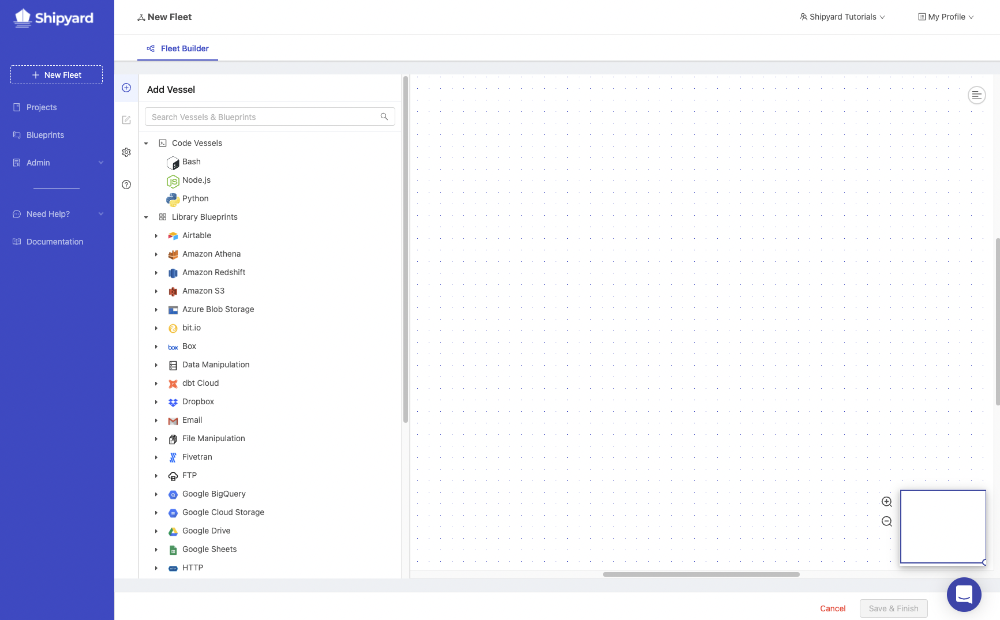

### Step 2 - Building the Fleet

There are two options for creating a new Fleet: The **Visual** editor and the **YAML** editor. This tutorial will focus on using the **Visual** method. The YAML Editor will be addressed in a different set of tutorials.

#### Build Vessel to Download File via HTTP

1. Navigate down to the **HTTP** dropdown and click it. It will expand the Blueprints that are available to use for HTTP. 
   
   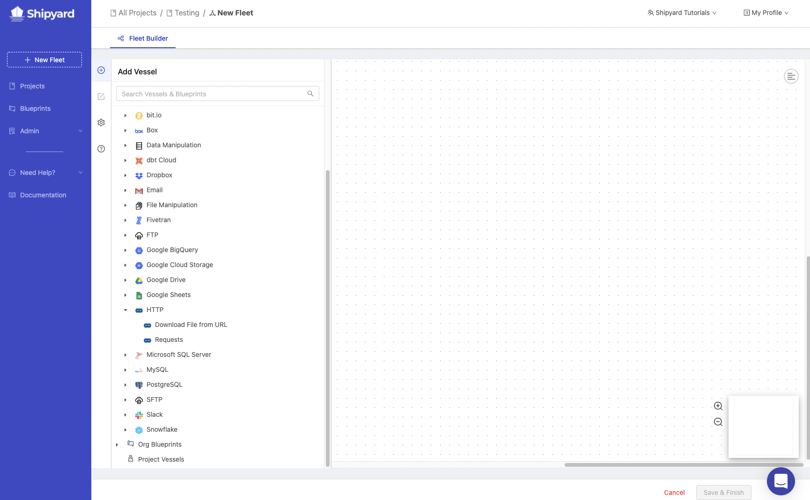

2. Click the Vessel named **Download File from URL**. This creates a New Vessel and immediately opens the edit pane for that Vessel on the left side of the screen.

    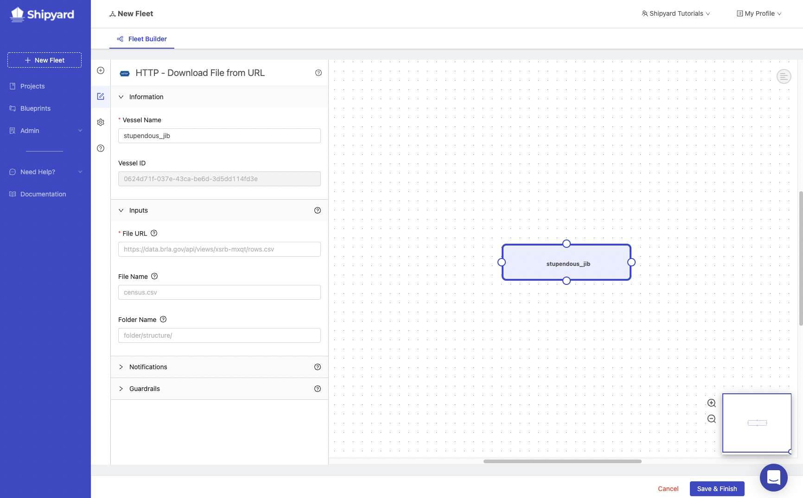

3. In the **Vessel Name** field, remove the automatically generated name and type **Download Slinky Dog Dash Ride Data**. 
4. In the **File URL** field type `https://cdn.touringplans.com/datasets/slinky_dog.csv`
5. In the **File Name** field type `slinky_dog_dash.csv`
6. In the **Folder Name** field type `disney_world_wait_times`

#### Build Vessel to Email a File

1.  Click the `+` icon in the sidebar to add another Vessel to the Fleet.
2.  Search for **email** using the search bar at the top. Click on **Send Message with File**

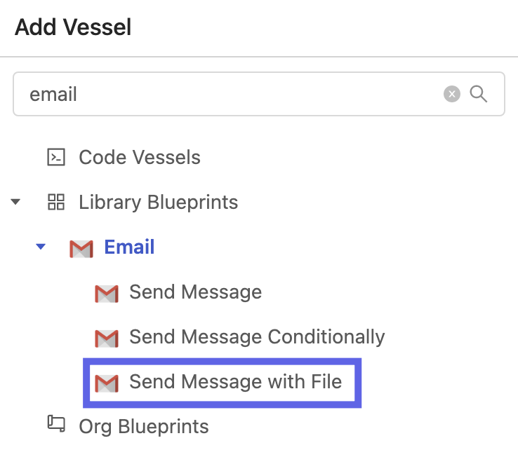

3. In the **Vessel Name** field, remove the automatically generated name and type **Send Slinky Dog Dash Data via Email**.
4. Fill out fields with the following values:

| Name | Value |
|:---|:---|
| Send Method | TLS |
| SMTP Host | smtp.gmail.com|
| SMTP Port |587 |
| Username | Leave blank and use the default |
| Password | Leave blank and use the default |
| Sender Address | Leave blank and use the default |
| Sender Name | |
| TO | YOUR EMAIL HERE |
| CC | |
| BCC | |
| Subject | Slinky Dog Dash Wait Times |
| Message | Here's the most recent wait times for Slinky Dog Dash! |
| File Name Match Type | Exact|
| File Name | slinky_dog_dash.csv |
| Folder Name | disney_world_wait_times |
| Include Shipyard Footer? | ✅|

5. Click and drag from a circle on the **Download Slinky Dog Dash Ride Data** Vessel towards a circle on the **Send Slinky Dog Dash Data via Email** Vessel. 

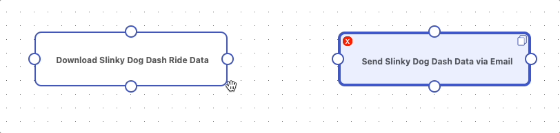

:::tip
It is possible that the Vessels are stacked on top of each other or placed in a spot that is not visually pleasing. You can always drag Vessels by holding your left mouse click button on the Vessel and moving it wherever you would like.

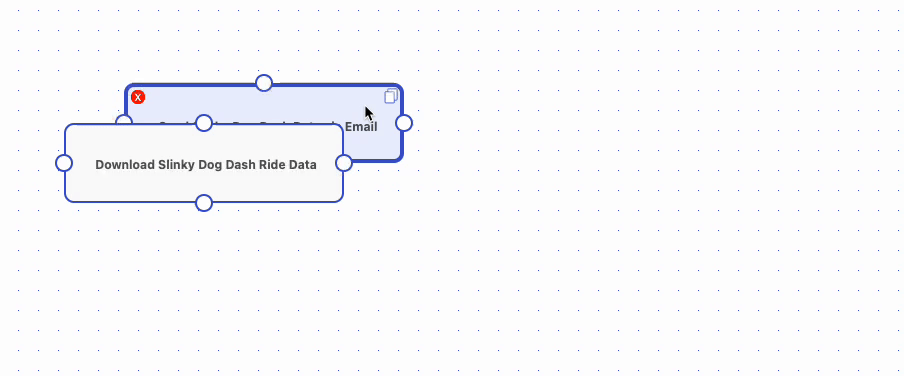
:::

:::note
This will connect the two Vessels, allowing one to be triggered by the other. Additionally, this allows files created upstream (Download Slinky Dog Dash Ride Data) to be accessed by the Vessel that lives downstream (Send Slinky Dog Dash Data via Email).
:::

### Step 3 - Adjusting Fleet Settings

1. Using the Fleet builder sidebar, click the **gear** icon to navigate to the **Fleet settings**.
    
    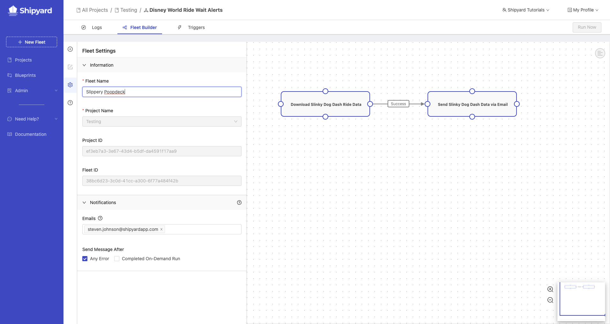

2. Select the Fleet Name field and rename your fleet to **Download File from Webpage and Email to User**. 
   
   Notice that the project is pre-selected from our actions in Step 1 above. 
3. Click the **Save & Finish** button at the bottom. You should now see the following screen:

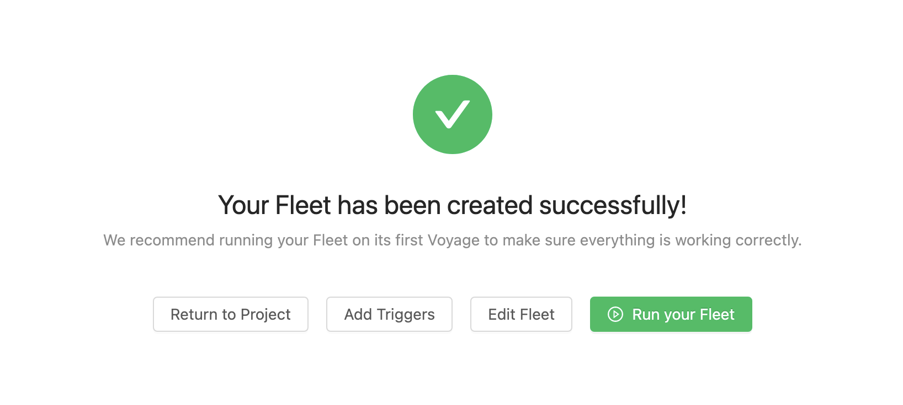

:::note
By default, every Fleet and every Vessel you create will send error notifications to your email. You can always update this as needed.
:::

:::caution
After a Vessel is added to a Fleet and saved, the project **cannot** be changed. Always make sure that the proper project is selected when creating a new Fleet
:::

### Step 4 - Running the Fleet On Demand

1. On the success page, click the **Run your Fleet** button.

2. You'll be redirected to a Fleet Log page as your Fleet runs. This page will refresh automatically as the Fleet runs. Wait until you see both Vessels as green bars, indicating that they completed successfully.

3. Click on the Log ID or the bar graph for the **Download Slinky Dog Dash Ride Data** Vessel. Your Log ID will be different than the one shown below.

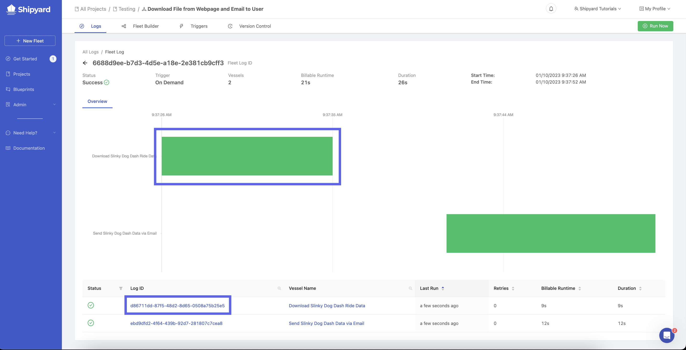

4. In the output, you should be able to see that the file was successfully downloaded and the size of the downloaded file. 

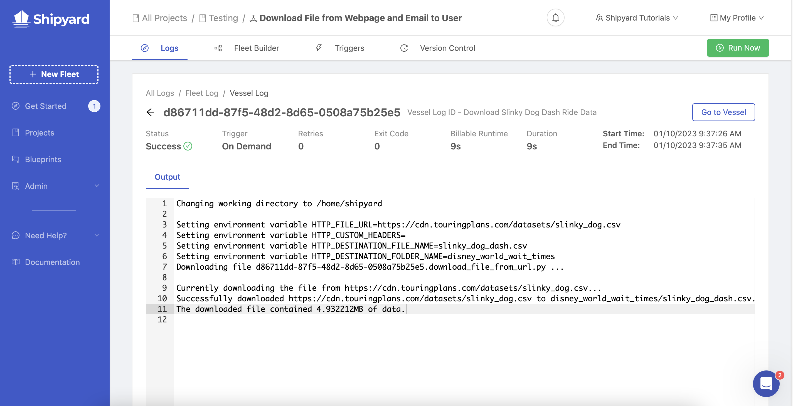

5. Go check your email. You should also see a message that contains the ride data.

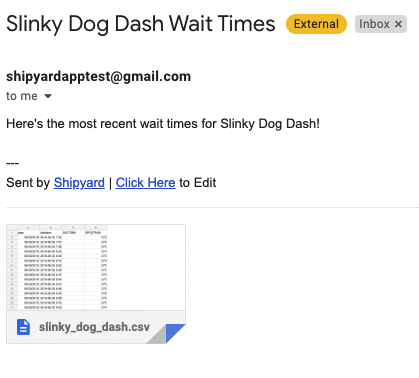

:::tip success
You've successfully created and verified a Fleet that shares files between two Vessels built with a Blueprint!
:::

:::note
A Fleet can always be run by clicking the **Run Now** button on the top right corner of the Fleet builder. 
:::

## Further Experimentation

Now that you've got the basics down, experiment on your own with a few changes to make sure you understand how Fleets allow Vessels to share files. Some suggestions to get you started:

1. Create an additional Vessel that downloads the [ride times](https://touringplans.com/walt-disney-world/crowd-calendar#DataSets) from a different ride. How will you need to set this up to ensure both files get uploaded in the same email?
2. Create an intermediary Vessel that renames the file after **Download Slinky Dog Dash Ride Data** and before **Send Slinky Dog Dash Data via Email**. How will you need to adjust things to ensure that **Send Slinky Dog Dash Data via Email** run successfully? How about if you create the file in a directory? 
3. Use the **Slack** blueprint called **Send Message** to send a message saying that the download the email process completed successfully.
4. Create a Vessel using a Blueprint from the [Blueprint Library](../reference/blueprints/blueprint-library/blueprint-library-overview.md) that uploads the file to your storage solution of choice \(S3, Google Cloud Storage, Dropbox, etc.\) at the same time the email delivers. Can you successfully get the file delivered to your own storage solution?
