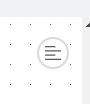

import Tabs from '@theme/Tabs';
import TabItem from '@theme/TabItem';

# Building Your First Fleet that Uses Shipyard-Created Blueprints

## Overview

In this tutorial, you'll walk through the steps required to set up a very simple Fleet that contains two Vessels.

* A Vessel, built with a Blueprint, that downloads a CSV file from a website
* A Vessel, built with a Blueprint, that emails the contents of the CSV file. 

By the end of the tutorial, you will know how to:

* Set up a Vessel with a Blueprint
* Connect Vessels together as part of a Fleet
* Use a Fleet to access files created upstream

## Step 1 - Accessing the Fleet Builder

1. Using the sidebar, click on **New Fleet** to begin building your new fleet. This will bring up a prompt that allows you to choose what project you want the fleet to go into. 
2. Using the drop down selector, choose the **Testing** project that we created in the previous tutorial. If you have not created the Testing project, we recommend you create that project for the remaining steps. The steps to create that project are located in [this tutorial](first-project.md). After clicking select project, you will be able to see the Fleet Builder.

    


## Step 2 - Building the Fleet

There are two options for creating a new Fleet: **Graph** (a visual editor) and **YAML** (a text editor).

<Tabs
groupId="fleetCreateTypes"
defaultValue="graph"
values={[
{label: 'Graph', value: 'graph'},
{label: 'YAML', value: 'yaml'},
]}>
<TabItem value="graph">

### Build HTTP Download File Vessel

1. Navigate down to the **HTTP** dropdown and click it. It will expand the blueprints that are available to use for HTTP. 
   
   

2. Double click the vessel named **Download File from URL**. This creates a New Vessel and immediately opens the edit pane for that Vessel on the left side of the screen.

    

3. In the **Vessel Name** field, remove the automatically generated name and type **Download Slinky Dog Dash Ride Data**. 
4. In the **File URL** field type `https://cdn.touringplans.com/datasets/slinky_dog.csv`
5. In the **File Name** field type `slinky_dog_dash.csv`
6. In the **Folder Name** field type `disney_world_wait_times`

### Build Send Email Message with File Vessel

1.  Click the `+` icon in the sidebar to add another Vessel to the Fleet.
2.  Search for **email** using the search bar at the top. Click on **Send Message with File**


3. In the **Vessel Name** field, remove the automatically generated name and type **Send Slinky Dog Dash Data via Email**.
4. Fill out fields with the following values:

| Name | Value |
|:---|:---|
| Send Method | TLS |
| SMTP Host | smtp.gmail.com|
| SMTP Port |587 |
| Username | Leave blank and use the default |
| Password | Leave blank and use the default |
| Sender Address | Leave blank and use the default |
| Sender Name | |
| TO | YOUR EMAIL HERE |
| CC | |
| BCC | |
| Subject | Slinky Dog Dash Wait Times |
| Message | Here's the most recent wait times for Slinky Dog Dash! |
| File Name Match Type | Exact Match|
| File Name | slinky_dog_dash.csv |
| Folder Name | disney_world_wait_times |
| Include Shipyard Footer? | ✅|

5. Click and drag from a circle on the **Download Slinky Dog Dash Ride Data** Vessel towards a circle on the **Send Slinky Dog Dash Data via Email** Vessel. 


:::note
This will connect the two Vessels, allowing one to be triggered by the other. Additionally, this allows files created upstream (Download Slinky Dog Dash Ride Data) to be accessed by the Vessel that lives downstream (Send Slinky Dog Dash Data via Email).
:::

6.  Click the **Save** button at the bottom.


</TabItem>
<TabItem value="yaml">

1. Toggle from the Graph Editor to the YAML editor with the text icon in the top right corner.



2. Replace the code in the editor with the YAML code below.

```yaml
name: Download File from Webpage and Email to User
_id: 38bc6d23-3c0d-41cc-a300-6f77a484f42b
vessels:
    Download Slinky Dog Dash Ride Data:
        _id: 0624d71f-037e-43ca-be6d-3d5dd114fd3e
        source:
            blueprint: HTTP - Download File from URL
            inputs:
                HTTP_DESTINATION_FILE_NAME: slinky_dog.csv
                HTTP_DESTINATION_FOLDER_NAME: disney_world_wait_times
                HTTP_FILE_URL: https://cdn.touringplans.com/datasets/slinky_dog.csv
            type: BLUEPRINT
        guardrails:
            retry_count: 0
            retry_wait: 0s
            runtime_cutoff: 4h0m0s
        notifications:
            emails:
                - steven.johnson@shipyardapp.com
            after_error: true
            after_on_demand: false
    Send Slinky Dog Dash Data via Email:
        _id: 5d58f255-fac1-4e23-bccf-97a6c7a503ba
        source:
            blueprint: Email - Send Message with File
            inputs:
                EMAIL_BCC: null
                EMAIL_CC: null
                EMAIL_INCLUDE_SHIPYARD_FOOTER: true
                EMAIL_MESSAGE: Here's the most recent wait times for Slinky Dog Dash!
                EMAIL_PASSWORD: SHIPYARD_HIDDEN
                EMAIL_SEND_METHOD: tls
                EMAIL_SENDER_ADDRESS: ${EMAIL_USERNAME}
                EMAIL_SENDER_NAME: null
                EMAIL_SMTP_HOST: smtp.gmail.com
                EMAIL_SMTP_PORT: "587"
                EMAIL_SOURCE_FILE_NAME: slinky_dog_dash.csv
                EMAIL_SOURCE_FILE_NAME_MATCH_TYPE: exact_match
                EMAIL_SOURCE_FOLDER_NAME: disney_world_wait_times
                EMAIL_SUBJECT: Slinky Dog Dash Wait Times
                EMAIL_TO: steven.johnson@shipyardapp.com
                EMAIL_USERNAME: shipyardapptest@gmail.com
            type: BLUEPRINT
        guardrails:
            retry_count: 0
            retry_wait: 0s
            runtime_cutoff: 4h0m0s
        notifications:
            emails:
                - steven.johnson@shipyardapp.com
            after_error: true
            after_on_demand: false
connections:
    Download Slinky Dog Dash Ride Data:
        Send Slinky Dog Dash Data via Email: SUCCESS
notifications:
    emails:
        - steven.johnson@shipyardapp.com
    after_error: true
    after_on_demand: false
```

3. Click the **Save** button at the bottom.

</TabItem>
</Tabs>

## Step 3 - Setting Up the Fleet

1. Using the fleet builder sidebar, click the **gear** icon to navigate to the **fleet settings**.
    
    

2. Rename your fleet to Download File from Webpage and Email to User. Notice that the project is pre-selected from our actions in Step 1 above. 
3. After completing the settings, navigate back to **add vessel** by using the Fleet Builder sidebar.

:::note
By default, every Fleet and every Vessel you create will send error notifications to your email. You can always update this as needed.
:::

:::caution
After a vessel is added to a fleet and saved, the project **cannot** be changed. Always make sure that the proper project is selected when creating a new fleet
:::


## Step 4 - Running the Fleet On Demand

1. Click **Run Now** on the top-right corner of the Fleet Builder.

2. You'll be redirected to a Fleet Log page as your Fleet runs. This page will refresh automatically as the Fleet runs. Wait until you see both Vessels as green bars, indicating that they completed successfully.

3. Click on the Log ID or the bar graph for the **Download Slinky Dog Dash Ride Data** Vessel. Your Log ID will be different than the one shown below.


4. In the output, you should be able to see that the file was successfully downloaded and the size of the downloaded file. 


5. Go check your email. You should also see a message that contains the ride data.


:::tip success
You've successfully created and verified a Fleet that shares files between two Vessels built with a Blueprint!
:::

## Further Experimentation

Now that you've got the basics down, experiment on your own with a few changes to make sure you understand how Fleets allow Vessels to share files. Some suggestions to get you started:

1. Create an intermediary Vessel that renames the file after **Download Slinky Dog Dash Ride Data** and before **Send Slinky Dog Dash Data via Email**. How will you need to adjust things to ensure that **Send Slinky Dog Dash Data via Email** run successfully? How about if you create the file in a directory? 
2. Use the **Slack** blueprint called **Send Message** to send a message saying that the download the email process completed successfully.
3. Create a Vessel using a Blueprint from the [Blueprint Library](../reference/blueprint-library/blueprint-library-overview.md) that uploads the file to your storage solution of choice \(S3, Google Cloud Storage, Dropbox, etc.\) at the same time the email delivers. Can you successfully get the file delivered to your own storage solution?
