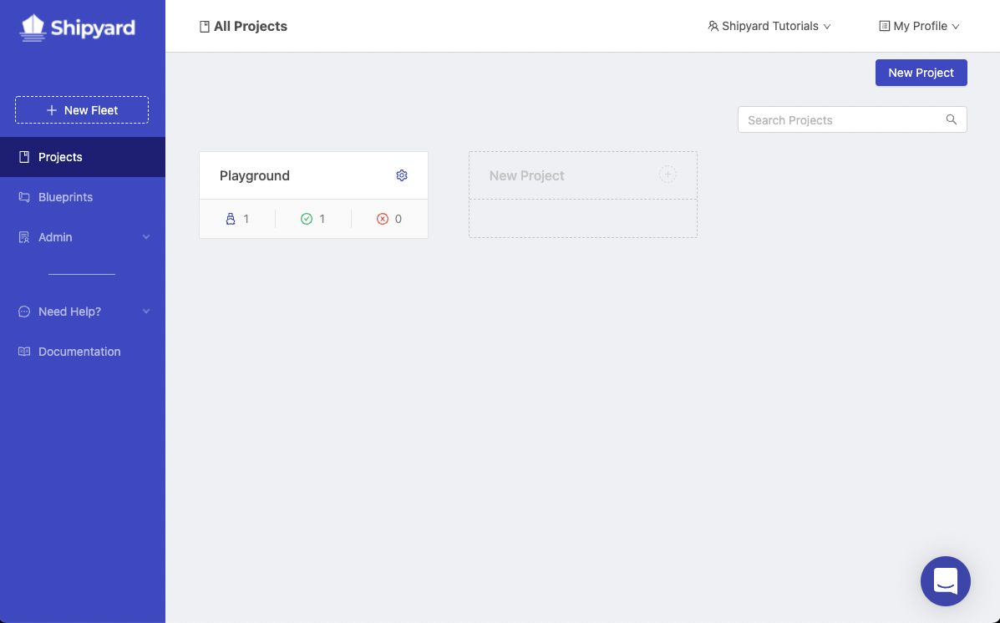
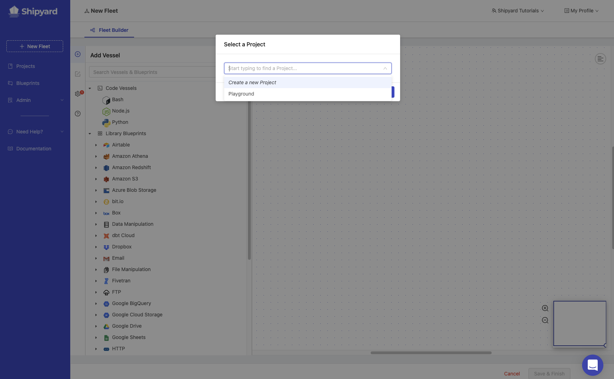
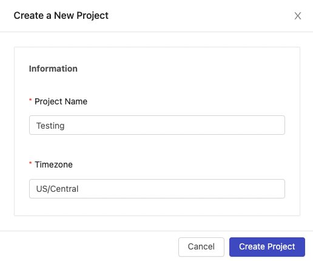
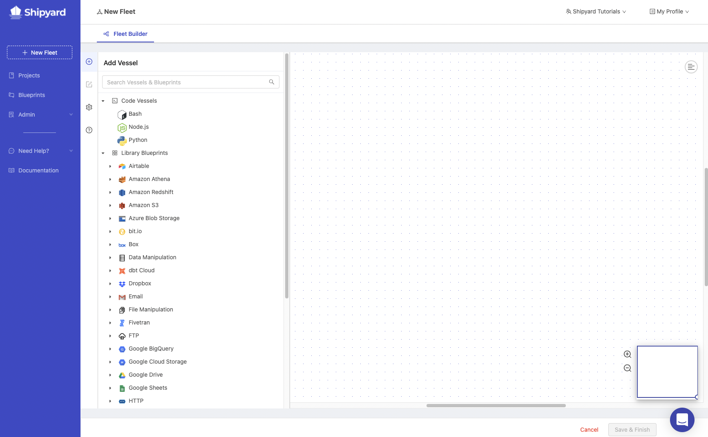

# Building Your First Project for Testing

## Overview

For the sake of all of our tutorials, we suggest creating a new Project specifically for testing. This will serve as an area for you to freely explore the functionality of Shipyard without the fear of affecting anything else in the platform.

## Creating your Testing Project

1. Using the navigation on the left-side of the screen, click on **New Fleet**. 

   

2. A prompt will appear asking you to select a Project. Click on the dropdown menu and select **Create a new Project**

   

3. Give your Project a name of *Testing*.
4. In the timezone field, start typing `Central` .
5. Select the *US/Central* time zone by clicking the name.

:::note
Feel free to search for and select your own time zone instead.
:::

Your setup should look like this:

6. Click the **Create Project** button in the bottom-right corner of the prompt.

:::tip success
You've now successfully created your first Project named Testing.
:::

After creating a Project, you'll be able to select the **Testing** Project from the Select a Project prompt. After selecting the Testing Project, you will be taken into the Fleet builder to begin building your first Fleet in the Testing Project.

