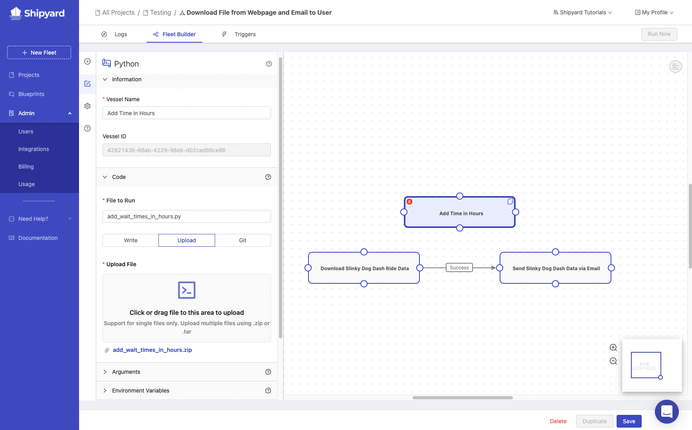
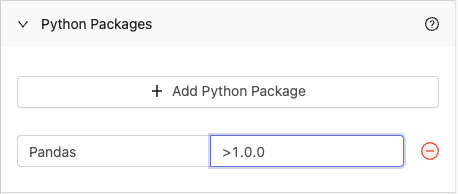
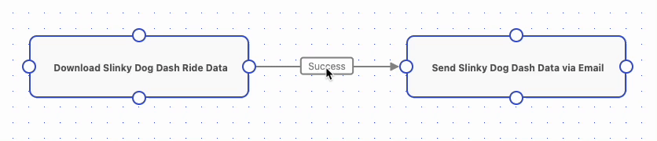

import Tabs from '@theme/Tabs';
import TabItem from '@theme/TabItem';

# Expand Your Fleet with a Code Vessel - Python + Pandas

## Overview

In this tutorial, you'll walk through the steps required to set up a Vessel using Pandas to transform data that exists in Shipyard. By the end of the tutorial, you will know how to:

- Set up a Vessel with Code.
- Write a script directly in the UI.
- Install [package dependencies](../reference/packages/external-package-dependencies.md) for your solution.
- Check to verify that a Vessel ran successfully.
- Connect Vessels together as part of a Fleet

:::caution
For the sake of the this tutorial, we suggest starting off by building the Fleet that is built using [**this tutorial** ](first-fleet.md).
:::
## Steps

### Step 1 - Initial Setup

1. Using the sidebar, click on **Projects** to navigate to the All Projects page.

  
2. Click on the **Testing** project.
3. Find the **Download File from Webpage and Email to User** Fleet and either click on the Fleet Name or hover over the Actions vertical-dot menu and select **Edit**.
   


:::tip success
You are now ready to add a code Vessel to your existing Fleet
:::

### Step 2 - Provide your Code

1. Using the Fleet Builder sidebar, click on **Python**. This will automatically add a new Vessel to your Fleet.

  

2. Name your Vessel **Add Time in Hours** under Vessel Name.

:::note
Shipyard allows you to provide code in three different ways: write the code in the UI, upload the code as a file, or clone the code from a GitHub repository. This tutorial will focus on writing the code in the UI and uploading the code as a file. Running code from GitHub is covered in [this tutorial](../tutorials/github-vessel.md).
:::

<Tabs
groupId="code-inputs"
defaultValue="write"
values={[
{label: 'Write', value: 'write'},
{label: 'Upload', value: 'upload'}
]}>
<TabItem value="write">

1. Leave Python Version as 3.9
2. Under **File to Run**, enter **add_wait_times_in_hours.py**
3. Under **Code**, paste this code block:

```python
import pandas as pd
df = pd.read_csv('disney_world_wait_times/slinky_dog_dash.csv')
df['SPOSTHR'] = round(df['SPOSTMIN'] / 60,2)
df.to_csv('disney_world_wait_times/slinky_dog_dash_with_hours.csv',index = None)
```

Your setup should look like this:

  
</TabItem>
<TabItem value="upload">

1. Leave Python Version as 3.9
2. Under **File to Run**, enter **add_wait_times_in_hours.py**
3. Change the code method from write to **upload**

  

3. Download the file **add_wait_times_in_hours.zip** from [here](https://drive.google.com/file/d/1DgqjHlQv5l7UwM1ne_Nh9Q17U1sNg33v/view?usp=sharing)
4. Under **Upload File**, click to find the file from step three and upload it. 

After upload, your setup should look like this:

  

</TabItem>
</Tabs>

### Step 3 - Install Python Packages

For this tutorial, we don't have any [environment variables](../reference/environment-variables/environment-variables-overview.md) to set up. However, we do need to install the [Python Package](../reference/packages/external-package-dependencies.md) called Pandas for our code to run. 

1. Find the **Python Packages** panel in your Vessel's settings and click on it to show the package installer.
2. Click the **Add Python Package** button.
3. In the **Name** field, enter Pandas.
4. In the **Version** field, enter >1.0.0



:::info
The version field can accept many types of arguments including: `>`, `<`, `==`, `>=`. `<=`, etc. You can use learn more about how to define package versions in our documentation [here](../reference/packages/external-package-dependencies.md) 
:::

### Step 4 - Connect Vessels

In the previous tutorial, we created two vessels: **Download Slinky Dog Dash Ride Data** and **Send Slinky Dog Dash Data via Email**. This process allowed us to download the wait time information for the Disney World ride Slinky Dog Dash and email the CSV file to our email address. The vessel that we created in this tutorial, **Add Time in Hours**, should fit in the middle of these two vessels to add the column to have the wait time in terms of hours. 

1. We will need to break the connection that currently exists between the two original Vessels. To do that, hover your mouse over the word success, then a small x will appear. Click the x to delete the connection.

  

2. Click and drag from a circle on the **Download Slinky Dog Dash Ride Data** Vessel towards a circle on the **Add Time in Hours** Vessel.
3. Click and drag from a circle on the **Add Time in Hours** Vessel towards a circle on the **Send Slinky Dog Dash Data via Email** Vessel.

  

### Step 5 - Edit Email Vessel

1. Click on the **Send Slinky Dog Dash Data via Email** Vessel to open the Vessel menu.
2. Change the **File Name** to **slinky_dog_dash_with_hours.csv**.
3. Click **Save** in the bottom right corner of the screen.

### Step 6 - Running the Vessel

In the top right corner of the Fleet builder, click the **Run Now** button. This will schedule your Fleet to run immediately and redirect you to [Fleet Log](../reference/logs/fleet-logs.md) page.

### Step 7 - Checking the Logs

You should have been redirected to the following page that shows you all of the details about the specific Log you clicked.


After your Fleet has completed running, you should have received a new email with another CSV. If you open that CSV, you are able to see the new **SPOSTHR** column that we created with our code Vessel. 

  

:::tip success
You've successfully created and run a Fleet that contains Vessels built with code and low-code Library Blueprints!
:::

