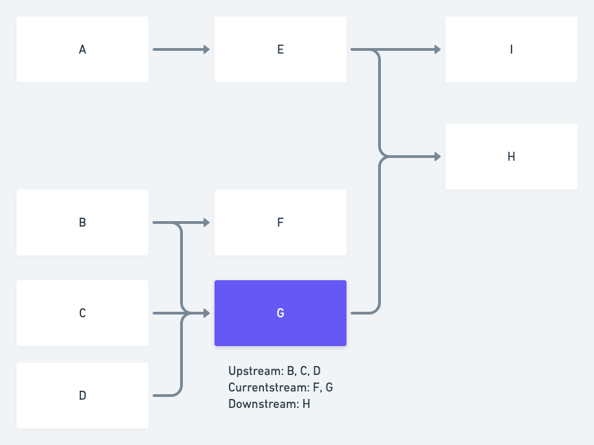
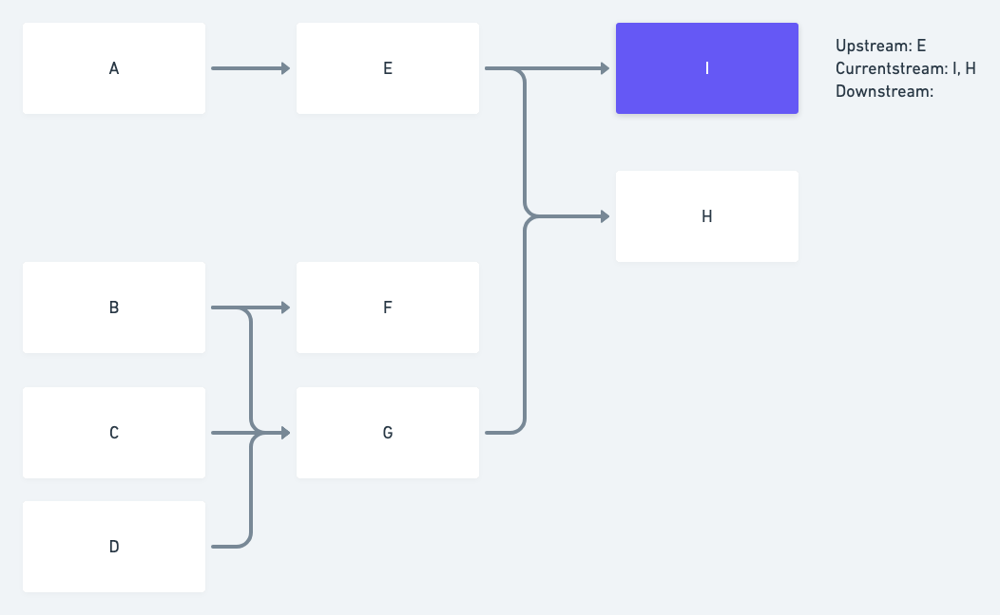

# Glossary of Terms

## Definitions

\*\*\*\*[**Blueprint Library**](blueprint-library.md) is a location for pre-made Custom Blueprints developed by Shipyard staff.

[**Blueprints**](blueprints/) \*\*\*\*are the foundation of the application. They contain the design specifications for a repeatable task. In other applications, these may be referenced as templates, macros, or operators.

\*\*\*\*[**Vessels**](vessels/) are built using either Blueprints or Code. In other applications, these may be referenced as tasks or jobs.

\*\*\*\*[**Fleets**](fleets/) are built by connecting multiple Vessels together. In other applications, these may be referenced as workflows or DAGs.

**Paths** are the lines that connect Vessels together in a Fleet, evaluating the status of the connected Vessel.

**Voyages** are a single run of a Vessel or Fleet. Data about a Voyage is stored as a Log.

\*\*\*\*[**Logs**](logs/) are a historical record of how a Fleet or Vessel ran at a specific point in time. A Fleet's log will contain multiple Vessel Logs.

[**Triggers**](triggers/) \*\*\*\*are the logic that determines when a Vessel or Fleet should begin running.

\*\*\*\*[**Projects**](projects.md) house Vessels and Fleets that you have created under them. Each project is associated with its own timezone.

\*\*\*\*[**Organizations**](what-is-an-organization.md) house all of your Projects and Blueprints. This is the highest grouping structure in the platform that users can control.

**Element** refers to any of the above bolded words.

**Platform** refers to the Shipyard application as a whole. Elements that live under the Platform level are controlled and managed by Shipyard staff.

**Upstream** refers to connected Vessels that ran immediately preceding the current Vessel.

**Currentstream** refers to Vessels that are running at the same time, due to being branched off of the immediately preceding Vessels. If two or more Vessels are running simultaneously, but were not attached to the same upstream Vessel, they are not considered to be in the same currentstream.

**Downstream** refers to connected Vessels that will run immediately after the current Vessel.

## Visuals

### Shipyard Platform Diagram

### Fleet Stream Examples

